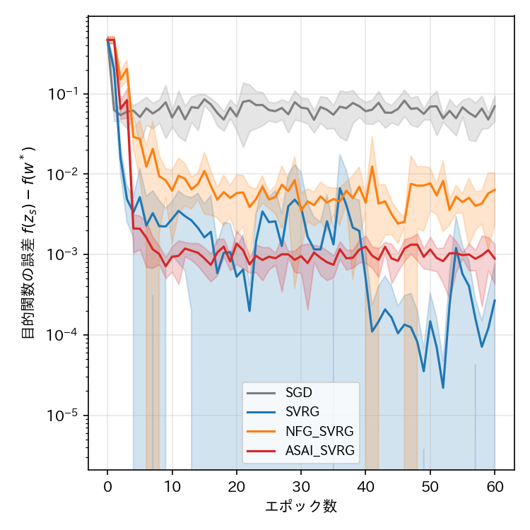
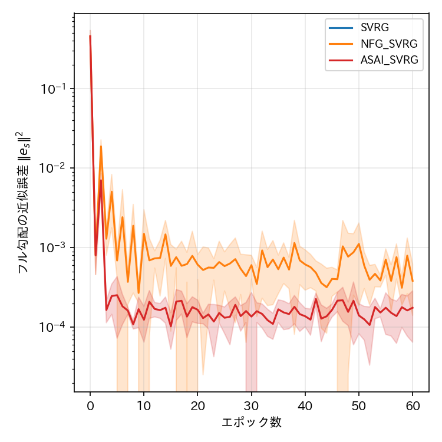
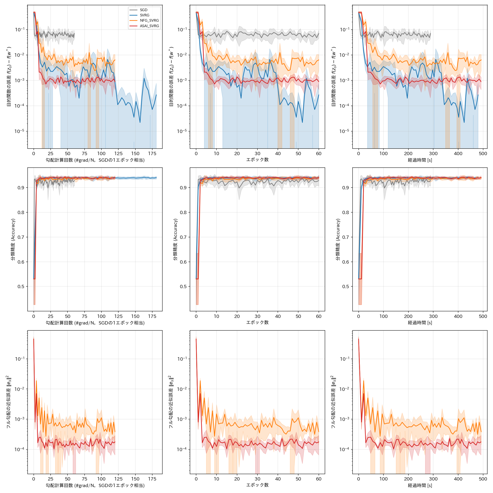

# report_001

本レポートは，`.orders/order_001.md` の指示に基づき実施した，論文『平均スナップショット近似に
基づく確率的分散削減勾配法（Averaged Snapshot Approximate Incremental SVRG，ASAI SVRG）』
（`references/ASAI_SVRG_paper.pdf`）の4.1節（マッシュルームデータセットの二値分類問題）に対応する
数値実験の実施内容と結果をまとめたものである．

## 1. 実施内容

### 1.1 作成したプログラム

- `programs/optimizers/optimizers.py`：SGD，SVRG，NFG SVRG，ASAI SVRGの4クラス
  （`SGD`，`SVRG`，`NFGSVRG`，`ASAISVRG`）．`.orders/order_002.md` の指示に基づき，いずれも
  `torch.optim.Optimizer` のサブクラスとして，共通の基底クラスへ抽出せず独立に陽実装している
  （詳細は `.reports/report_002.md` を参照）．4.2節（CNNとCIFAR-10の実験）でもそのまま
  再利用できる設計としている．
- `programs/ex001_mushroom_svrg/data.py`：UCI Mushroomデータセットの取得・前処理．
- `programs/ex001_mushroom_svrg/model.py`：L2正則化付きロジスティック回帰モデルおよび解析的
  勾配・損失・分類精度の計算関数．
- `programs/ex001_mushroom_svrg/train.py`：論文Algorithm 1〜4に忠実な学習ループの実装，
  4手法 x 5Seedの学習をマルチプロセスで並列実行するスクリプト．
- `tests/test_optimizers.py`：最適化手法クラスの単体テスト（5件，全て合格）．
- `visualize_result.ipynb`：実験結果の可視化ノートブック．

### 1.2 実験条件

**データセット**：UCI Machine Learning RepositoryのMushroomデータセット．データ数 $ N = 8124 $，
特徴量次元数 $ d = 22 $（22種類のカテゴリ特徴量を `OrdinalEncoder` により順序符号化）．
学習用・検証用データへ9:1（`sklearn.model_selection.train_test_split`，`stratify=y`）で分割し，
学習用データの統計量で標準化した．学習用データ数は $ N_{\mathrm{train}} = 7311 $，
検証用データ数は $ N_{\mathrm{test}} = 813 $ である．

**モデル・目的関数**：線形モデルによるロジスティック回帰．目的関数は論文(38)式に対応する
L2正則化付き二値交差エントロピー損失

$$
f(\mathbf{w}) = \frac{1}{N} \sum_{n=1}^{N} \ell_{\mathrm{BCE}}(y_n, \hat{y}_n(\mathbf{w})) + \frac{\lambda}{2} \|\mathbf{w}\|^2
$$

である．勾配はPyTorchの標準的な自動微分（`loss.backward()`）により取得する
（`.orders/order_003.md` の指示，詳細は `.reports/report_003.md` を参照）．

**比較手法**：SGD，SVRG，NFG SVRG，ASAI SVRGの4手法．論文がAssumption 1〜4のもとで理論解析を
行うオンライン学習の設定（ミニバッチサイズ1）に忠実に，全手法でミニバッチサイズ1（単一サンプルの
一様ランダム抽出，復元抽出）を用いた．

**ハイパーパラメータ**：論文は正則化係数 $ \lambda $，学習率 $ \eta $，内部ループ長 $ K $，
外部ループ数（エポック数）の具体的な数値を指定していない．本実験では以下の方針で決定した．

- 正則化係数：$ \lambda = 10^{-2} $．（$ \lambda = 10^{-4} $ 程度では条件数
  $ L/\mu \approx 9685 $ と非常に悪条件になり，強凸性に由来する収束特性が本実験のエポック規模内で
  観測しにくいと判断し，条件数が $ L/\mu \approx 98 $ 程度となるよう選定した．）
- 平滑性定数：標準化後の学習用データ全体から $ L = \tfrac{1}{4} \lambda_{\max}(\mathbf{X}^\top \mathbf{X} / N) + \lambda \approx 0.978 $ を計算した．
- 学習率：Theorem 1の収束条件 $ 0 < \eta < 1/(3L) $ を満たすよう，$ \eta = 0.5 / (3L) \approx 0.1698 $ を全手法・全Seedで共通に用いた．論文Algorithm 4が示す通り，SVRG，NFG SVRG，ASAI SVRGの相違点は $ g_s $ の計算方法と $ z_s $ の更新規則のみであり，$ \eta $，$ K $ は共通とすることが理論解析と整合する．
- 内部ループ長：$ K = N_{\mathrm{train}} = 7311 $（1外部ループが学習データ1周分に相当する標準的な設定）．
- エポック数（外部ループ数）：60．
- Seed：0, 1, 2, 3, 4 の5種類．

Weight Decay等，一般に収束や汎化を改善しうる付加的な工夫は一切加えていない．

**評価指標**：論文で指定される3種類の横軸（勾配計算回数 `#grad/N` 換算，エポック数，経過時間）と
3種類の縦軸（目的関数の誤差 $ f(z_s) - f(\mathbf{w}^*) $，分類精度，フル勾配の近似誤差
$ \|\mathbf{e}_s\|^2 $）を組み合わせて記録した．最適値 $ f(\mathbf{w}^*) $ は，各Seedの学習用
データに対して`scipy.optimize.minimize`（L-BFGS-B，解析的勾配）を高精度に実行して求めた
（Seedごとに学習用データの分割が異なるため，$ \mathbf{w}^* $ もSeedごとに算出している）．
フル勾配の近似誤差 $ \|\mathbf{e}_s\|^2 = \|\mathbf{g}_s - \nabla f(\mathbf{z}_s)\|^2 $ は
SGDには定義されないため，SGDでは記録していない．

勾配計算回数（オラクル呼び出し回数）は，1エポックあたりSGDが $ N_{\mathrm{train}} $ 回，
SVRGが $ 3N_{\mathrm{train}} $ 回（フル勾配1回分 + 内部ループ $ 2N_{\mathrm{train}} $ 回），
NFG SVRG・ASAI SVRGが $ 2N_{\mathrm{train}} $ 回（内部ループのみ）であり，フル勾配計算を
回避する両手法の優位性がこの計測方法に直接反映される．

## 2. 実験結果

### 2.1 目的関数の誤差・分類精度・近似誤差（横軸：エポック数）







（実線が5Seedの平均値，塗りつぶしが標準偏差．いずれの図も縦軸は対数スケール．）

### 2.2 各手法の最終エポック（60エポック目）における評価指標（5Seedの平均 ± 標準偏差）

| 手法 | 目的関数の誤差 $ f(z_s)-f(\mathbf{w}^*) $ | 分類精度 | フル勾配の近似誤差 $ \|\mathbf{e}_s\|^2 $ | 経過時間 [s] | 勾配計算回数 |
| :--- | ---: | ---: | ---: | ---: | ---: |
| SGD | $ 0.0700 \pm 0.0244 $ | $ 0.9287 \pm 0.0224 $ | （定義なし） | 71.3 | 438,660 |
| SVRG | $ 0.00027 \pm 0.00049 $ | $ 0.9405 \pm 0.0057 $ | $ 0.0 \pm 0.0 $ | 115.0 | 1,315,980 |
| NFG SVRG | $ 0.00638 \pm 0.00401 $ | $ 0.9397 \pm 0.0033 $ | $ 0.000384 \pm 0.000243 $ | 124.5 | 877,320 |
| ASAI SVRG | $ 0.00089 \pm 0.00046 $ | $ 0.9410 \pm 0.0075 $ | $ 0.000176 \pm 0.000111 $ | 129.4 | 877,320 |

（経過時間はCPU上でのマルチプロセス並列実行における各プロセスの実測値であり，ハードウェアや
プロセス数に依存する参考値である．）

## 3. 考察

**SVRGの線形収束と誤差床**：SVRGはフル勾配を用いるため $ \mathbf{e}_s = \mathbf{0} $ が常に
厳密に成り立ち（表2.2でも標準偏差込みで完全に0），目的関数の誤差はエポックを重ねるごとに
指数的に減少し，60エポック時点で $ 2.7 \times 10^{-4} $ まで到達した．これは論文Theorem 1が
述べる「$ \mathbf{e}_s = \mathbf{0} $ であるため適切な $ \eta $ の下で線形収束する」という
主張と整合する結果である．一方でフル勾配計算1回あたり $ N_{\mathrm{train}} $ 回の勾配評価を
要するため，同一エポック数でもオラクル呼び出し回数はNFG SVRG・ASAI SVRGの1.5倍
（$ 3N_{\mathrm{train}} $ 対 $ 2N_{\mathrm{train}} $）となっている．

**NFG SVRGおよびASAI SVRGの誤差床**：両手法ともフル勾配計算を回避するため近似誤差
$ \mathbf{e}_s \neq \mathbf{0} $ が残存し，目的関数の誤差はある値で下げ止まる誤差床
（NFG SVRGで約 $ 6.4 \times 10^{-3} $，ASAI SVRGで約 $ 8.9 \times 10^{-4} $）に収束する挙動が
明確に観測された．図2.1のエポック1における目的関数の誤差が，NFG SVRG・ASAI SVRGのいずれも
初期値（$ 0.474 $）から全く変化していない点も，論文3.1節が述べる「初期スナップショット勾配
$ \mathbf{g}_0 = \mathbf{0} $ であるため第1エポックでは補正勾配が常に $ \mathbf{0} $ となり，
パラメータは更新されず平均パラメータ・平均勾配の蓄積のみが行われる」という設計上の性質と正確に
一致している．

**近似誤差の理論的順序（ASAI SVRG ≤ NFG SVRG）の実証**：論文Theorem 2は，同一の内部ループ
軌跡に対して $ \mathbb{E}[\|\mathbf{e}_s^{\mathrm{ASAI}}\|^2] \leq \mathbb{E}[\|\mathbf{e}_s^{\mathrm{NFG}}\|^2] $
が成り立つことを示している．本実験でも，フル勾配の近似誤差（図2.1下段，表2.2）において
ASAI SVRGの平均値（$ 1.76 \times 10^{-4} $）がNFG SVRGの平均値（$ 3.84 \times 10^{-4} $）を
一貫して下回っており，この理論的順序が数値実験でも再現された．これに伴い，目的関数の誤差床も
ASAI SVRGがNFG SVRGよりおよそ1桁小さい値となっており，(31)式が示す「誤差床は近似誤差の大きさで
決まる」という関係とも整合する．

**SGDとの比較**：SGDは定数学習率の下で分散が抑制されないため，目的関数の誤差は
$ 0.05 \sim 0.10 $ 程度で高止まりし，SVRG系3手法のいずれよりも大きな誤差床に留まった．
これは確率的勾配の分散削減という，SVRG系手法が導入する仕組みの効果を裏付ける結果である．

**分類精度について**：4手法とも数エポック以内に $ 0.93 \sim 0.94 $ 程度の分類精度へ収束し，
手法間の差はほぼ観測されなかった．本データセットにおける線形モデルでの二値分類は比較的容易な
問題であり，目的関数の誤差や近似誤差ほど手法間の差を鋭敏に反映する指標ではないことが分かる．

**横軸の違いによる見え方の変化**：勾配計算回数を横軸に取ると，NFG SVRG・ASAI SVRGは
SVRGよりも少ないオラクル呼び出し回数で同程度の目的関数誤差水準（NFG SVRGはSVRGの誤差床には
届かないが，ASAI SVRGは同程度の誤差水準に少ないオラクル回数で到達している）に達しており，
フル勾配計算を回避する実用上の利点が確認できる．経過時間を横軸とした場合も同様の傾向であるが，
本実験は逐次的な単一サンプル更新をPythonループで実行しているため，手法間の経過時間の差は
オラクル呼び出し回数の差にほぼ比例しており，ハードウェアやベクトル化実装に依存する参考値である
点に留意する必要がある．

## 4. 未解決の論点・今後の検討候補

- 本実験のハイパーパラメータ（$ \lambda $，$ \eta $，$ K $，エポック数）は論文に具体的な指定が
  ないため，理論的制約（$ 0 < \eta < 1/(3L) $）とデータから計算した平滑性定数に基づき本レポート
  作成者が決定した．論文の著者が別のハイパーパラメータを想定している場合は，値の再検討が必要で
  ある．
- SVRGは60エポック時点でもなお目的関数の誤差が減少し続けており（図2.1でエポック40以降に急峻な
  減少が見られる），より長いエポック数で実行した場合の挙動（数値誤差の下限への到達等）は未検証
  である．
- 4.2節（CNNとCIFAR-10を用いた非凸設定の実験）は本レポートの対象外であり，未実施である．
  `programs/optimizers/` の最適化手法クラスは4.2節でも再利用できる設計としているが，非凸設定・
  ミニバッチ学習への対応（特に，本実装の `SVRG`，`NFGSVRG`，`ASAISVRG` はミニバッチサイズ1を
  前提とした設計であり，CNN実験でのミニバッチサイズの扱いは別途検討が必要）は今後の実装課題で
  ある．
- 学習率 $ \eta $ を変化させた場合の収束速度・誤差床の感度分析（論文の理論解析における
  $ \eta $ の役割の実証）は未実施である．

## 5. 実行コマンド

```bash
# 学習の実行（4手法 x 5Seed = 20条件をマルチプロセスで並列実行）
.venv_pytorch/bin/python programs/ex001_mushroom_svrg/train.py

# 単体テスト
.venv_pytorch/bin/python -m pytest tests/ -v

# 結果の可視化
.venv_pytorch/bin/jupyter nbconvert --to notebook --execute --inplace visualize_result.ipynb
```

## 6. ai-agentの実行に関する推奨

本実験（4.1節）は完了し，理論解析の主要な主張（SVRGの線形収束，NFG SVRG・ASAI SVRGの誤差床，
ASAI SVRGの近似誤差がNFG SVRG以下であること）を数値的に確認できた．次の着手候補は，本レポート
「4. 未解決の論点」に挙げた通り，4.2節（CNNとCIFAR-10の実験）の実装である．

```bash
# ai-agentの仮想環境が未構築の場合（.ai/ai-agent/.venv_agent が存在しない場合）は先に構築する
uv venv .ai/ai-agent/.venv_agent --python 3.11
uv pip install --python .ai/ai-agent/.venv_agent/bin/python -r .ai/ai-agent/requirements_agent.txt

# プロジェクトの状態から次の作業をAIエージェントに判断させる場合
.ai/ai-agent/.venv_agent/bin/python .ai/ai-agent/cli.py

# machine_learningドメインのエージェントを明示的に指定する場合
.ai/ai-agent/.venv_agent/bin/python .ai/ai-agent/cli.py --agent machine_learning
```

（本セッションの時点では `.ai/ai-agent/.venv_agent` は未構築であることを確認した．`.ai/ai-agent/`
自体の改変は`.orders/`から明示的に指示されない限り行わない方針のため，本レポートでは仮想環境の
構築は行っていない．）
