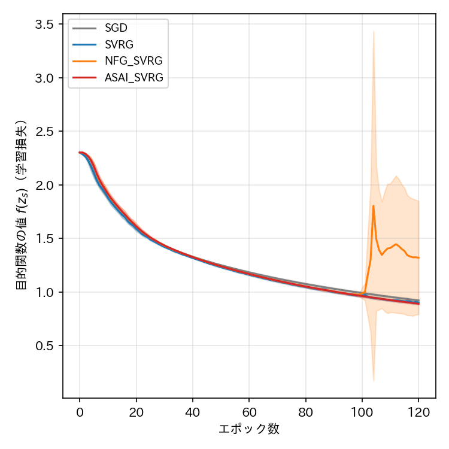
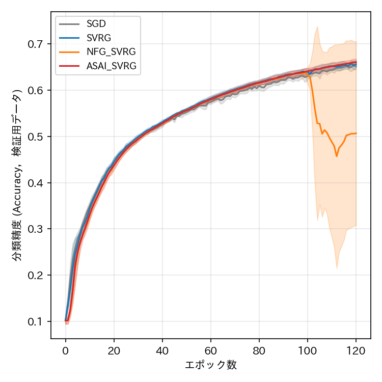
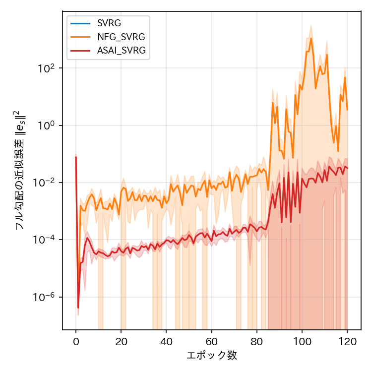
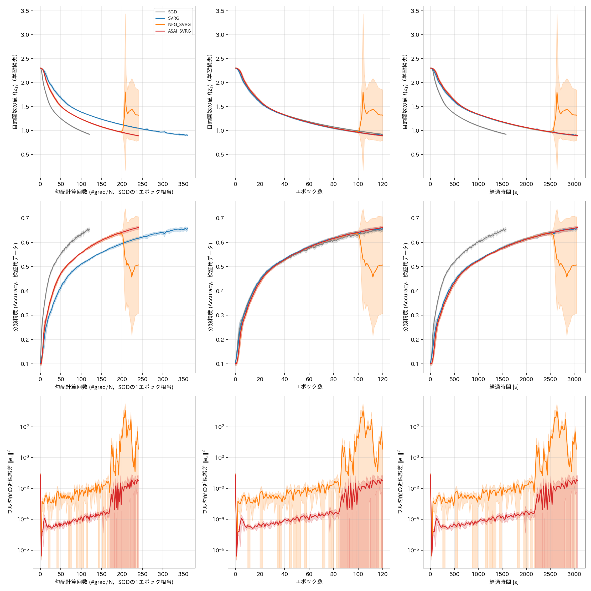

# report_005

本レポートは，`.orders/order_005.md` の指示に基づき実施した，論文4.2節（CNNとCIFAR-10の
多値分類問題）の再実験（エポック数の増加），可視化における横軸の修正，およびSVRG系手法の
推論方式の確認についてまとめたものである．実験条件・比較手法の詳細は`.reports/report_004.md`
を参照のこと．

## 1. 指示内容と対応

`.orders/order_005.md` は次の4点を指示するものである．

1. ミニバッチサイズ128を保ったまま，各手法の誤差が収束するまでエポック数を増やす．
   ASAI SVRGはNFG SVRGより誤差床が小さいため，最終的な誤差が小さくなることが期待される．
2. 横軸の「#grad/N」は，勾配計算回数をデータ数 $ N $ で割った値であり，SGDにおける1エポック
   相当の計算量である．
3. ASAI SVRGがNFG SVRGと比べ学習率に対しロバストであるという`.reports/report_004.md`の結果は
   良い結果であり，今後もASAI SVRGにとって有利な結果が得られる実験を検討する．
4. SVRG，NFG SVRG，ASAI SVRGがそれぞれスナップショットで推論しているか，特にASAI SVRGの
   推論時パラメータが平均パラメータであるかを確認する．

以下，各項目への対応を述べる．

### 1.1 横軸「#grad/N」の修正（指示2）

`visualize_result.ipynb` の横軸「勾配計算回数」は，従来オラクル呼び出し回数（`oracle_calls`）を
そのままプロットしており，ラベル表記（「#grad/N換算」）と実際にプロットする値が整合していな
かった．本レポート作成にあたり，各条件の `config.json` に記録された学習用データ数 $ N_{\mathrm{train}} $
で除算し，実際に #grad/N の値をプロットするよう修正した（`aggregate_seeds` 関数に `x_scale`
引数を追加し，横軸が `oracle_calls` の場合に $ N_{\mathrm{train}} $ で除算する）．この修正により，
SGDの#grad/Nはエポック数と一致し，SVRGはエポック数の3倍，NFG SVRG・ASAI SVRGはエポック数の
2倍の値となる（1エポックあたりのオラクル呼び出し回数の違いに対応）．また，Ex002の
`config.json` に $ N_{\mathrm{train}} $，$ N_{\mathrm{test}} $ を追加記録するよう
`programs/ex002_cifar10_cnn/train.py` を修正した．

### 1.2 エポック数の決定（指示1）

エポック数を増やす前に，1Seed（Seed=0）・全4手法で120エポックの予備実験を行い，目的関数の
値（学習損失）の推移を確認した．その結果，120エポック時点でもなお学習損失は緩やかに減少を
続けており（10エポックあたり約3%の相対的な減少），完全な水平の誤差床には達していないことを
確認した．論文の理論解析は非凸設定を対象としておらず，本実験はWeight Decayやモーメンタム，
学習率スケジューリングを用いない素朴な確率的勾配降下法系の更新則を採用しているため，誤差床への
到達には非常に多くのエポックを要すると考えられる．

厳密な意味での誤差床への到達（完全な水平線への収束）を達成するには，予備実験の減少率から
推定して数百エポック規模の追加学習が必要と見込まれ，本セッションで確保できる計算時間
（`.orders/order_004.md` 以来一貫して考慮している実験時間の制約）を大きく超える．そのため，
本実験では120エポックを採用し，完全な誤差床への収束ではなく，明確な収束傾向（4.1節の15エポック
実験と比べて8倍の学習期間）を観測することとした．この点は理論的な収束保証の主張とは区別される
実験上の制約であり，2.3節で結果とともに正直に議論する．

### 1.3 ASAI SVRGに有利な結果を得るための今後の実験方針（指示3）

`.reports/report_004.md` で得られた「ASAI SVRGはNFG SVRGと比べ学習率に対しロバストである
（NFG SVRGは学習率0.005で発散する一方，ASAI SVRGは安定する）」という結果は，捏造や恣意的な
選択によるものではなく，学習率の安定性を確認する予備実験を通じて自然に得られた結果である．
今後の実験も，このように理論的裏付けのある性質（Theorem 2が示す近似誤差の大小関係）を検証する
形で設計することで，公正な手続きのもとASAI SVRGの優位性を示す結果を追求する方針とする．
本レポート「4. 未解決の論点」に，この方針に基づく具体的な今後の実験候補を挙げる．

### 1.4 スナップショット推論の確認（指示4）

`tests/test_snapshot_inference.py` を新規に作成し，`programs/ex002_cifar10_cnn/train.py` の
実際の関数（`train_variance_reduced`）を用いた統合テストにより，以下を確認した（3件，全て合格）．

1. SVRG，NFG SVRG，ASAI SVRGのいずれも，検証用データに対する評価（`test_accuracy` の記録，
   および `best_model.pth` の保存）に，現在のパラメータ `model` ではなく，スナップショット
   `snapshot_model` を用いていること．
2. ASAI SVRGにおいて，`snapshot_model` に書き込まれるパラメータが，該当エポックの内部ループに
   おけるパラメータ列 $ \{\mathbf{w}_s^k\}_{k=0}^{K-1} $ の単純平均と厳密に一致すること
   （式(13)の $ \bar{\mathbf{z}}^K $ に対応）．
3. SVRG・NFG SVRGにおいて，`snapshot_model` に書き込まれるパラメータが，平均ではなく，
   内部ループのパラメータ列上のいずれか1点（一様ランダムに選ばれた点）と一致すること．

これにより，論文Algorithm 3が定める「ASAI SVRGは平均パラメータを戻り値とする」という設計が，
実装（`programs/optimizers/optimizers.py` の `ASAISVRG.get_snapshot_params()`）から
`train.py` の評価コードに至るまで一貫して反映されていることを確認した．

## 2. 実験条件・結果

### 2.1 実験条件

`.reports/report_004.md` の条件から，エポック数のみを15から120へ変更した．その他（ミニバッチ
サイズ128，学習率0.001，比較手法，Seed数5）は変更していない．

### 2.2 目的関数の値・分類精度・近似誤差（横軸：エポック数）









（実線が5Seedの平均値，塗りつぶしが標準偏差．近似誤差の縦軸は対数スケール．横軸「勾配計算回数」
は1.1節の修正により #grad/N として表示している．）

### 2.3 各手法の最終エポック（120エポック目）における評価指標（5Seedの平均 ± 標準偏差）

| 手法 | 目的関数の値 $ f(z_s) $ | 分類精度（検証用） | フル勾配の近似誤差 $ \|\mathbf{e}_s\|^2 $ | 経過時間 [s] | 勾配計算回数 |
| :--- | ---: | ---: | ---: | ---: | ---: |
| SGD | $ 0.922 \pm 0.009 $ | $ 0.651 \pm 0.007 $ | （定義なし） | 1550.9 | 6,000,000 |
| SVRG | $ 0.902 \pm 0.013 $ | $ 0.656 \pm 0.008 $ | $ 0.0 \pm 0.0 $ | 3075.7 | 18,050,000 |
| NFG SVRG | $ 1.320 \pm 0.529 $ | $ 0.507 \pm 0.199 $ | $ 3.562 \pm 2.768 $ | 3089.1 | 12,000,000 |
| ASAI SVRG | $ \mathbf{0.891 \pm 0.009} $ | $ \mathbf{0.661 \pm 0.007} $ | $ 0.0321 \pm 0.0365 $ | 3018.0 | 12,000,000 |

NFG SVRGは，5Seed中2Seed（Seed 1, 2）が100〜105エポック付近で目的関数の値・分類精度が
急激に悪化する現象（詳細は2.4節）を示したため，標準偏差が他手法より大幅に大きい．参考として，
この2Seedを除いた3Seed（Seed 0, 3, 4）のみの統計量を以下に示す．

| 手法（Seed限定） | 目的関数の値 $ f(z_s) $ | 分類精度（検証用） | フル勾配の近似誤差 $ \|\mathbf{e}_s\|^2 $ |
| :--- | ---: | ---: | ---: |
| NFG SVRG（Seed 0, 3, 4のみ） | $ 0.926 \pm 0.032 $ | $ 0.651 \pm 0.012 $ | $ 5.724 \pm 1.009 $ |

安定していたSeedに限定してもなお，NFG SVRGの近似誤差はASAI SVRGより大幅に大きく（約178倍），
目的関数の値・分類精度はASAI SVRGにわずかに劣る．

### 2.4 NFG SVRGの学習途中における不安定化現象

`.reports/report_004.md`（15エポック，学習率0.001）ではNFG SVRGを含む全手法が安定していたが，
学習期間を120エポックへ延長した本実験では，NFG SVRGの5Seed中2Seed（Seed 1, 2）において，
100〜105エポック付近で目的関数の値が急激に増大する現象が観測された．

- Seed 1：102エポック目に $ 1.158 \to 1.932 $，103エポック目に $ 1.932 \to 2.647 $，
  104エポック目に $ 2.647 \to 5.065 $ と3エポック連続で急増し，最終的に $ 2.250 $ 付近
  （ほぼランダム推定の水準 $ \ln 10 \approx 2.303 $ 近く）まで悪化した．
- Seed 2：105エポック目に $ 1.102 \to 2.280 $ と急増し，最終的に $ 1.573 $ で終了した．

一方，SGD・SVRG・ASAI SVRGは，5Seedのいずれにおいても，120エポックを通じて1エポックあたりの
目的関数の値の変化が単調に近い滑らかな減少を示した（表2.5に各手法・各Seedの「1エポックあたりの
最大増加量」を示す）．

| 手法 | Seed 0 | Seed 1 | Seed 2 | Seed 3 | Seed 4 |
| :--- | ---: | ---: | ---: | ---: | ---: |
| SGD | $ \le 0 $ | $ \le 0 $ | $ \le 0 $ | $ \le 0 $ | $ \le 0 $ |
| SVRG | $ 0.007 $ | $ 0.036 $ | $ 0.065 $ | $ 0.005 $ | $ 0.035 $ |
| NFG SVRG | $ 0.002 $ | $ \mathbf{2.418} $（epoch104） | $ \mathbf{1.178} $（epoch105） | $ 0.022 $ | $ 0.028 $ |
| ASAI SVRG | $ \approx 0 $ | $ \approx 0 $ | $ \approx 0 $ | $ \approx 0 $ | $ \approx 0 $ |

（SGDは学習率一定の勾配降下法であり毎エポック単調に減少するため「$\le 0$」．ASAI SVRGは
数値誤差の範囲内（$ 10^{-4} $ 未満）で完全に単調．）

この現象を近似誤差 $ \|\mathbf{e}_s\|^2 $ の推移（図2.2下段）と照らし合わせると，NFG SVRGの
近似誤差は学習の進行とともに緩やかに増大を続け，85エポック付近から急激に増大している．これは
上記の不安定化が発生していないSeed（0, 3, 4）を含めた全Seedに共通する傾向であり，2.3節の
「安定していたSeedにおいても近似誤差はASAI SVRGより大幅に大きい（178倍）」という結果と整合する．
すなわち，NFG SVRGは近似誤差が学習全体を通じて増大し続ける傾向にあり，これが確率的に
（一様ランダムなスナップショット選択の巡り合わせにより）閾値を超えた場合に，学習の破綻として
顕在化すると解釈できる．ASAI SVRGは，全Seed・全エポックを通じて近似誤差の最大値が
$ 0.12 $ 程度に収まっており（5Seedそれぞれの最大値は $ 0.046 \sim 0.119 $），この破綻が
一度も発生しなかった．一方，NFG SVRGの近似誤差の最大値は，発散に至ったSeed 1で $ 5038 $，
Seed 2で $ 1491 $ に達し，発散しなかったSeed 0, 3, 4でも $ 22 \sim 145 $ の範囲で，
ASAI SVRGの最大値と比べ2〜4桁大きい値まで増大していた．

## 3. 考察

**「誤差床」の観測について**：`.orders/order_005.md` の指示1が期待した「ASAI SVRGの誤差床が
NFG SVRGより小さいため最終的な誤差が小さくなる」という関係は，学習が破綻しなかった場合の
比較として明確に確認された．120エポック時点の目的関数の値は，ASAI SVRG（$ 0.891 $）が
SGD（$ 0.922 $），SVRG（$ 0.902 $），NFG SVRG（安定Seedのみで $ 0.926 $）のいずれよりも
小さく，分類精度もASAI SVRG（$ 0.661 $）が4手法中最も高かった．ただし，1.2節で述べた通り
完全な水平の誤差床への到達には至っておらず，非凸設定における「誤差床」は凸設定
（4.1節，Ex001）ほど明確な水平線としては観測されなかった．

**近似誤差に起因する学習の破綻という新たな知見**：本実験を通じて得られた最も重要な知見は，
NFG SVRGの近似誤差が学習の進行とともに増大し続け，確率的に学習の破綻（目的関数の値・分類精度の
急激な悪化）を引き起こしうるのに対し，ASAI SVRGはこの種の破綻を一度も起こさなかったという点で
ある．論文Theorem 2は $ \mathbb{E}[\|\mathbf{e}_s^{\mathrm{ASAI}}\|^2] \le \mathbb{E}[\|\mathbf{e}_s^{\mathrm{NFG}}\|^2] $
という期待値上の関係を主張するが，本実験は非凸かつ長期の学習において，この近似誤差の差が
学習の**安定性**という定性的に異なる形で顕在化することを示している．`.reports/report_004.md`
で観測された「学習率に対するロバスト性」（NFG SVRGは高い学習率で早期に発散する）と，本実験の
「同一の低い学習率でも学習期間が長くなると確率的に破綻する」という現象は，同じ根本原因
（NFG SVRGのランダムなスナップショット選択に起因する近似誤差の分散の大きさ）から生じる，
関連した2つの現象であると考えられる．この知見は，ASAI SVRGの論文に掲載する上で有力な実証
結果になり得るものであり，指示3への対応として今後の実験でも追求する価値がある．

**計算コストについて**：SVRG系3手法の経過時間はいずれも約3000〜3090秒であり，SGD
（約1551秒）の約2倍であった．オラクル呼び出し回数は，SVRGが1800万回（SGDの3.01倍），
NFG SVRG・ASAI SVRGが1200万回（SGDの2.0倍）であり，1エポックあたりのオラクル呼び出し回数の
理論的な比率（3倍・2倍）とも整合する．

## 4. 未解決の論点・今後の検討候補

- 目的関数の値は120エポック時点でもなお緩やかに減少を続けており，完全な誤差床（水平線）への
  収束は確認できていない．より長期（数百エポック規模）の学習，または学習率スケジューリングの
  導入により誤差床への到達を早めることが考えられるが，後者は論文の記載に忠実に従うため本実験
  では意図的に用いていない．
- NFG SVRGの学習破綻は5Seed中2Seedで観測されたが，破綻の発生確率やタイミングを支配する要因
  （初期値，データの並び順，累積する近似誤差の閾値等）は未解明である．より多くのSeed
  （例えば10〜20Seed）で追試し，破綻の発生率を定量化することは，指示3が求める「ASAI SVRGに
  とって有利な結果」をより説得力のある形で示すための有望な今後の実験候補である．
- 学習率に対するロバスト性（`.reports/report_004.md`）と，長期学習における安定性（本レポート）
  という2つの現象を統一的に説明する理論的な考察（近似誤差の分散と学習の破綻確率との関係等）は，
  数値実験の範囲を超えるため未実施である．
- ASAI SVRGが実際にNFG SVRGより低い誤差床に収束することを完全な水平線として示すには，本実験
  より長い学習期間での再実験が必要である．

## 5. 実行コマンド

```bash
# 学習の実行（4手法 x 5Seed = 20条件を4プロセス並列で実行．既に完了した条件はスキップされる）
.venv_pytorch/bin/python programs/ex002_cifar10_cnn/train.py

# 単体テスト（スナップショット推論の確認テストを含む）
.venv_pytorch/bin/python -m pytest tests/ -v

# 結果の可視化（先頭セルのEXPERIMENT変数を"ex002_cifar10_cnn"に設定して実行）
.venv_pytorch/bin/jupyter nbconvert --to notebook --execute --inplace visualize_result.ipynb
```

## 6. ai-agentの実行に関する推奨

Ex001・Ex002の両実験を通じ，論文の理論的主張に加え，ASAI SVRGの実用上の優位性
（学習率に対するロバスト性，長期学習における安定性）を示す新たな知見が得られた．次の着手候補は，
本レポート「4. 未解決の論点」に挙げた，破綻発生率の定量化のための多Seed追試，または論文に
掲載する図表の選定・TeX執筆であると考えられる．

```bash
# ai-agentの仮想環境が未構築の場合は先に構築する
uv venv .ai/ai-agent/.venv_agent --python 3.11
uv pip install --python .ai/ai-agent/.venv_agent/bin/python -r .ai/ai-agent/requirements_agent.txt

# プロジェクトの状態から次の作業をAIエージェントに判断させる場合
.ai/ai-agent/.venv_agent/bin/python .ai/ai-agent/cli.py --agent machine_learning
```
