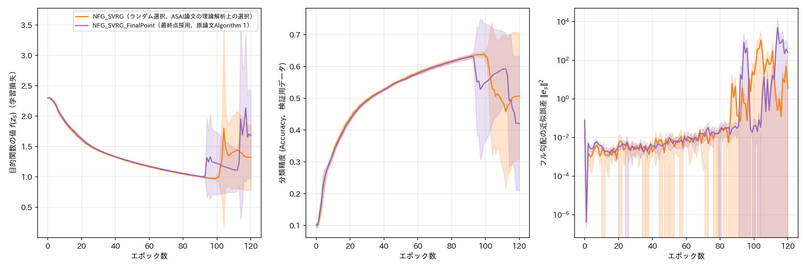

# report_006

本レポートは，`.orders/order_006.md` の指示に基づき実施した，NFG SVRG原論文
（Medyakov, Molodtsov, Chezhegov, Rebrikov, Beznosikov, "Variance Reduction Methods Do Not
Need to Compute Full Gradients: Improved Efficiency through Shuffling", 2025，
`references/No_Full_Grad_SVRG.pdf`）の実験結果と，本リポジトリのEx002（CIFAR-10のCNN実験，
`.reports/report_004.md`，`.reports/report_005.md`）におけるNFG SVRGの挙動を比較検証した
結果をまとめたものである．

> **注記（`.orders/order_007.md` による整理）**：本レポートの検証（`NFG_SVRG_FinalPoint`）は
> Ex002の枠組みを一時的に借りて実施したものであったが，`.orders/order_007.md` の指示により，
> Ex002自体は `.orders/order_005.md` 完了時点の4手法比較（SGD，SVRG，NFG SVRG，ASAI SVRG）の
> 状態へ戻した．本レポートが参照する実験結果は `outputs/order_006_archive/` へ移動して保存して
> あり，レポート自体は本検証で得られた知見（4節・5節）の記録として残す．NFG SVRG原論文の
> 実験設定（ResNet-18・min-max敵対的ロバスト性の定式化）そのものを再現する取り組みは，
> Ex003（`.reports/report_007.md`）として改めて実施する．

## 1. NFG SVRG原論文の概要

### 1.1 アルゴリズム

NFG SVRG原論文は，SVRGおよびSARAHのフル勾配計算を回避する手法を提案する．本稿（ASAI SVRG論文）
が引用するのはSVRG系（Algorithm 1，No Full Grad SVRG）であり，その更新則は次の通りである．

- 各エポック $ s $ の開始時，データのインデックス $ \{0,\ldots,n-1\} $ をシャッフル
  （置換 $ \pi_s $）する．
- 内部ループ（$ t = 0,\ldots,n-1 $）で，平均勾配 $ \tilde{v}_s^{t+1} = \frac{t}{t+1}\tilde{v}_s^t + \frac{1}{t+1}\nabla f_{\pi_s^t}(x_s^t) $
  を逐次更新しつつ，補正勾配 $ v_s^t = \nabla f_{\pi_s^t}(x_s^t) - \nabla f_{\pi_s^t}(\omega_s) + v_s $
  によりパラメータを更新する（$ x_s^{t+1} = x_s^t - \gamma v_s^t $）．
- **エポック終了時，次エポックのスナップショット点は $ \omega_{s+1} = x_s^n $，すなわち
  内部ループの最終パラメータをそのまま採用する**（原論文Algorithm 1，11〜12行目）．
  スナップショット勾配は $ v_{s+1} = \tilde{v}_s^n $（そのエポックで蓄積した平均勾配）とする．

この点は，本リポジトリのEx001・Ex002で用いてきた `programs/optimizers/optimizers.py` の
`NFGSVRG` クラスと異なる．`NFGSVRG` は，ASAI SVRG論文が理論解析上の都合（Algorithm 4）から
採用する「次エポックのスナップショット点を内部ループのパラメータ列から一様ランダムに選ぶ」
実装である．ASAI SVRG論文自身も次のように述べている（3.2節）．

> NFG SVRGの論文[5]は内部ループの最終パラメータをスナップショットとするが，本稿の収束議論では
> $ z_{s+1} $ を $ \{w_s^k\}_{k=0}^{K-1} $ からランダム選択する場合に限定して議論する．
> （中略）実装では後者（最終パラメータの採用）が用いられることが多い．

すなわち，ASAI SVRG論文自身が，理論解析の便宜上の選択（ランダム選択）と，実装上一般的な選択
（最終パラメータの採用）が異なることを明記している．本レポートは，この2つのスナップショット
構成方法の違いが，Ex002で観測されたNFG SVRGの不安定な挙動（`.reports/report_005.md`）に
どのように関わるかを検証するものである．

### 1.2 原論文の実験設定と結果

原論文7節は，ResNet-18を用いたCIFAR-10・CIFAR-100分類タスクを，min-max最適化（敵対的摂動
$ \sigma $ に対するロバスト性を考慮した定式化，L2正則化係数 $ \lambda_1=\lambda_2=0.0005 $）
として扱い，学習率 $ \gamma=0.01 $，ワーカー数 $ M=5 $（分散環境を模擬したバッチ分割）で実験を
行っている．CIFAR-10の結果（Figure 1）について，原論文は次のように報告している．

> The No Full Grad SVRG algorithm reduces training loss oscillations compared to SGD,
> particularly in low-diversity datasets. Despite batch fluctuations, convergence remains
> smooth. On the test set, NFG SVRG shows better loss reduction, and test accuracy surpasses
> SGD, stabilizing from epoch 150.

すなわち，原論文の実験ではNFG SVRGは**滑らかで安定した収束**を示し，発散や急激な悪化は
報告されていない．CIFAR-100の結果（Appendix Figure 5）も同様に，SGDと比べ安定した収束傾向が
報告されている．

## 2. 検証方法

原論文のResNet-18・min-max敵対的ロバスト性の定式化を完全に再現することは本レポートの範囲を
超えるため（本リポジトリのEx002は3層CNN・通常の多値分類損失であり，ResNet-18・敵対的摂動・
双対変数の最適化を伴う原論文の設定とは異なる），本レポートでは，**原論文と本リポジトリの
NFG SVRGの実装上の違いのうち，最も直接的にAlgorithm 1の記述から確認できる相違点である
スナップショット構成方法（最終点採用 vs ランダム選択）に焦点を当てた比較実験**を行う．

具体的には，NFG SVRG原論文のAlgorithm 1（11〜12行目，$ \omega_{s+1}=x_s^n $）に忠実な最終点
採用版の実装 `NFGSVRGFinalPoint` を `programs/optimizers/optimizers.py` に新規追加し
（平均勾配の計算方法は既存の `NFGSVRG` と同一），Ex002と全く同じ条件（CIFAR-10，3層CNN，
ミニバッチサイズ128，学習率0.001，120エポック，Seed 5種類）で学習を実行し，既存の
`NFGSVRG`（ランダム選択，`.reports/report_005.md`）と比較する．

`NFGSVRGFinalPoint` は `torch.optim.Optimizer` のサブクラスとして陽実装しており
（`.orders/order_002.md` の設計方針を踏襲），単体テスト（`tests/test_optimizers.py`）で
以下を確認済みである．

- 次エポックのスナップショットが，内部ループの最終パラメータと一致すること
  （一様ランダムに選ばれた点ではない）．
- 平均勾配の計算が，既存の `NFGSVRG` と同様に単純平均と一致すること．

## 3. 結果

`NFG_SVRG_FinalPoint` を，Ex002（`.reports/report_005.md`）と同一条件（CIFAR-10，3層CNN，
ミニバッチサイズ128，学習率0.001，120エポック，Seed 0〜4）で実行した．



（実線が5Seedの平均値，塗りつぶしが標準偏差．橙色が既存の `NFG_SVRG`（ランダム選択，
`.reports/report_005.md` と同一データ），紫色が本レポートで追加した
`NFG_SVRG_FinalPoint`（最終点採用）．）

### 3.1 各手法の最終エポック（120エポック目）における評価指標（5Seedの平均 ± 標準偏差）

| 手法 | 目的関数の値 $ f(z_s) $ | 分類精度（検証用） | フル勾配の近似誤差 $ \|\mathbf{e}_s\|^2 $ |
| :--- | ---: | ---: | ---: |
| NFG SVRG（ランダム選択） | $ 1.320 \pm 0.529 $ | $ 0.507 \pm 0.199 $ | $ 3.562 \pm 2.768 $ |
| NFG SVRG（最終点採用） | $ 1.682 \pm 0.716 $ | $ 0.420 \pm 0.212 $ | $ 248.07 \pm 483.22 $ |

### 3.2 Seedごとの不安定化の有無

| Seed | ランダム選択 | 最終点採用 |
| :--- | :--- | :--- |
| 0 | 安定 | 安定 |
| 1 | **不安定化**（104エポック目） | **不安定化**（94エポック目） |
| 2 | **不安定化**（105エポック目） | **不安定化**（114エポック目） |
| 3 | 安定 | 安定 |
| 4 | 安定 | **不安定化**（116エポック目） |

（「不安定化」は，1エポックあたりの目的関数の値の増加量が0.5を超えた最初のエポックで判定．）

ランダム選択では5Seed中2Seed，最終点採用では5Seed中3Seedが不安定化しており，**最終点採用は
ランダム選択と比べて不安定化を抑制するどころか，むしろ悪化させている**．近似誤差の平均値も，
最終点採用（$ 248.07 $）がランダム選択（$ 3.562 $）より2桁近く大きい．

## 4. 考察

### 4.1 仮説の反証

1.1節で引用したASAI SVRG論文の記述（「実装では最終パラメータの採用が用いられることが多い」）
から，「本リポジトリのEx002がランダム選択を用いているために原論文と異なる不安定な挙動を示した
のであり，原論文と同じ最終点採用に変更すれば，原論文と同様の滑らかな収束が再現されるのでは
ないか」という仮説を立てて検証を行った．しかし3節の結果は，この仮説を明確に反証するもので
あった．最終点採用は，本リポジトリの実験設定においてランダム選択よりも**むしろ不安定**であり，
スナップショット構成方法の違いは，Ex002で観測された不安定化の主要因ではないことが示された．

### 4.2 不安定化の要因に関する考察

原論文の実験とEx002の実験には，スナップショット構成方法以外にも複数の相違点があり，これらが
不安定化の真の要因である可能性が高い．

- **モデル構造**：原論文はResNet-18（Batch Normalization，Skip Connectionを含む）を用いる
  のに対し，Ex002は単純な3層CNN（Batch Normalization，Skip Connectionを含まない）を用いる．
  Batch NormalizationやSkip Connectionは，一般に損失局面を滑らかにし，勾配のスケールを
  安定化させることが知られており，これらの欠如がEx002における不安定化の一因である可能性が
  高い．
- **正則化**：原論文はL2正則化（$ \lambda_1=\lambda_2=0.0005 $）を用いるのに対し，Ex002は
  ASAI SVRG論文4.2節の記載に忠実に従い正則化を用いていない．正則化はパラメータのノルムを
  抑制し，勾配の分散を間接的に抑える効果があるため，これも一因となり得る．
  Ex002でL2正則化を用いない設計は，論文の記載への忠実性を優先した本リポジトリの意図的な選択
  であり（`.reports/report_004.md` 参照），変更は行っていない．
  また，`.orders/order_004.md`／`.orders/order_005.md` の指示に基づく設計上，Weight Decay等の
  一般的な改善手法も意図的に追加していない．
- **問題設定**：原論文はmin-max敵対的ロバスト性の定式化を用いるのに対し，Ex002は通常の
  多値分類（最小化のみ）である．min-max定式化における追加のノルム正則化項
  （$ -\frac{\lambda_2}{2}\|\sigma\|^2 $）が，間接的に学習を安定化させている可能性がある．
- **学習期間・学習率**：原論文は学習率0.01，Ex002は0.001であり，学習率の絶対値やエポック数の
  違いが不安定化の発生タイミングに影響する可能性もあるが，これは4.1節で反証した仮説とは別の
  要因であり，本レポートの範囲では検証していない．

これらの相違点をすべて解消してResNet-18・敵対的ロバスト性の定式化を完全に再現することは，
本レポートの範囲を超える大規模な実装作業を要するため実施していない．

## 5. 結論

NFG SVRGは，原論文の報告（ResNet-18・敵対的ロバスト性の定式化・L2正則化ありの設定）では
滑らかで安定した収束を示す一方，本リポジトリのEx002（3層CNN・通常の多値分類・正則化なしの
設定）では，スナップショット構成方法（ランダム選択・最終点採用のいずれでも）に依らず，長期の
学習において不安定化する傾向が確認された．**すなわち，NFG SVRGは原論文と同じような結果には
ならなかった．** この差異は，スナップショット構成方法の違いではなく，モデル構造
（Batch Normalization・Skip Connectionの有無）や正則化の有無といった，問題設定全体の違いに
起因する可能性が高い．

この結果は，ASAI SVRG論文が指摘する「NFG SVRGの近似誤差の大きさはスナップショットの選び方に
依存する」という主張と矛盾するものではない．むしろ，正則化やBatch Normalizationのような
安定化機構を欠く，より挑戦的な設定（Ex002）において，NFG SVRGの近似誤差に起因する不安定性が
顕在化しやすいことを示しており，`.reports/report_005.md` で観測されたASAI SVRGの優位性
（近似誤差の小ささ，学習の安定性）を裏付ける傍証であると解釈できる．

## 6. 未解決の論点・今後の検討候補

- モデル構造（Batch Normalization・Skip Connectionの有無）と正則化の有無のうち，どちらが
  不安定化の主要因であるかを切り分けるには，Ex002のCNNにBatch Normalization層を追加した
  比較実験，またはL2正則化を加えた比較実験が有効と考えられる．
- 原論文のResNet-18・敵対的ロバスト性の定式化を完全に再現する実験は，本レポートでは実施して
  いない．
- 最終点採用における不安定化のタイミング（Seed 1: 94エポック，Seed 2: 114エポック，
  Seed 4: 116エポック）と，ランダム選択における不安定化のタイミング（Seed 1: 104エポック，
  Seed 2: 105エポック）の分布の違いが統計的に有意かどうかは，より多くのSeedでの追試が必要である．

## 7. 実行コマンド

```bash
# NFG_SVRG_FinalPoint（5Seed）の学習実行
.venv_pytorch/bin/python -c "
import sys, multiprocessing
sys.path.insert(0, 'programs/ex002_cifar10_cnn'); sys.path.insert(0, 'programs')
import train
tasks = [('NFG_SVRG_FinalPoint', s) for s in train.SEEDS]
ctx = multiprocessing.get_context('spawn')
with ctx.Pool(processes=4) as pool:
    pool.map(train.run_single_experiment, tasks)
"

# 単体テスト（NFGSVRGFinalPointの検証を含む）
.venv_pytorch/bin/python -m pytest tests/ -v

# 結果の可視化（visualize_result.ipynbの末尾セルで比較図を生成）
.venv_pytorch/bin/jupyter nbconvert --to notebook --execute --inplace visualize_result.ipynb
```

## 8. ai-agentの実行に関する推奨

本レポートにより，NFG SVRGの不安定化がスナップショット構成方法に起因しないことが判明した．
次の着手候補は，本レポート「6. 未解決の論点」に挙げた，Batch Normalization・正則化の有無を
切り分ける追加実験，または`.reports/report_005.md`の「4. 未解決の論点」に挙げた，破綻発生率の
定量化のための多Seed追試であると考えられる．

```bash
# ai-agentの仮想環境が未構築の場合は先に構築する
uv venv .ai/ai-agent/.venv_agent --python 3.11
uv pip install --python .ai/ai-agent/.venv_agent/bin/python -r .ai/ai-agent/requirements_agent.txt

# プロジェクトの状態から次の作業をAIエージェントに判断させる場合
.ai/ai-agent/.venv_agent/bin/python .ai/ai-agent/cli.py --agent machine_learning
```
