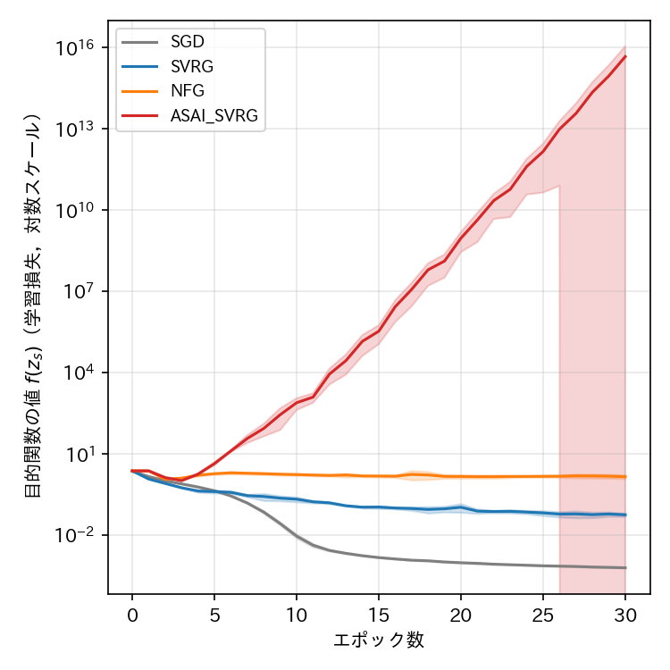
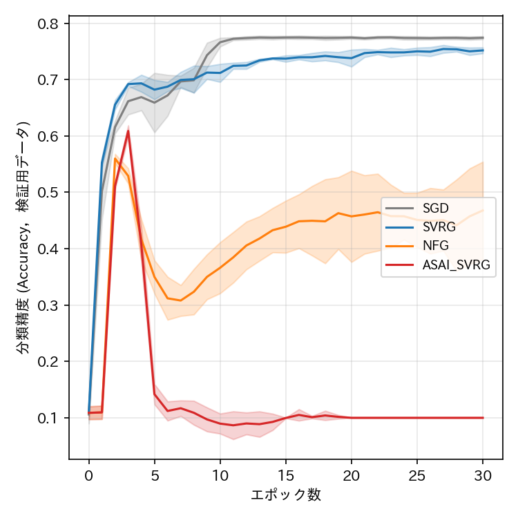
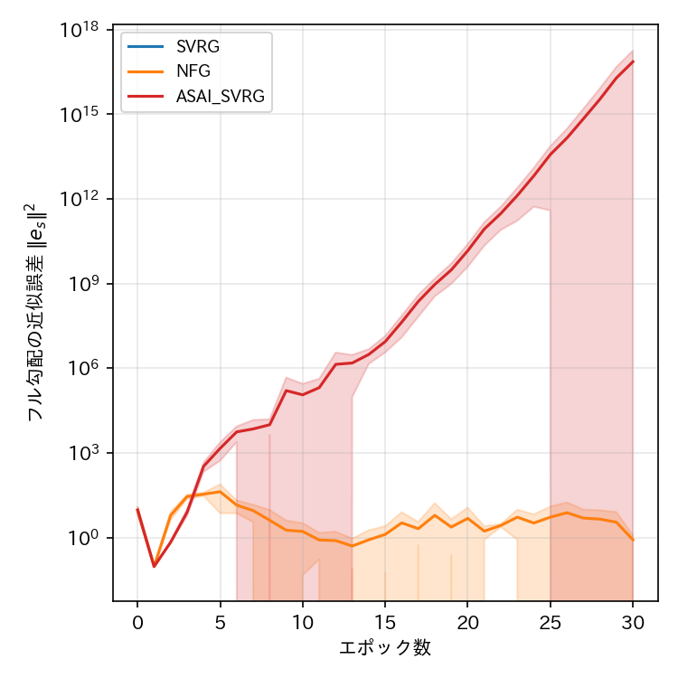

# report_007

本レポートは，`.orders/order_007.md` の指示に基づき実施した，NFG SVRG原論文
（Medyakov, Molodtsov, Chezhegov, Rebrikov, Beznosikov, "Variance Reduction Methods Do Not
Need to Compute Full Gradients: Improved Efficiency through Shuffling", 2025，
`references/No_Full_Grad_SVRG.pdf`）7節の実験を，データセット・モデル・誤差関数・
ハイパーパラメータを可能な限り揃えて再現した結果をまとめたものである．比較手法は原論文の
SGD，SVRG，NFG（No Full Grad SVRG）に，本リポジトリの提案手法であるASAI SVRGを加えた4手法．

Ex002（`.reports/report_004.md`〜`.reports/report_006.md`）は，簡易な3層CNN・正則化なしの
多値分類という，原論文とは異なる問題設定であったのに対し，本レポート（Ex003）は原論文の
ResNet-18・min-max敵対的ロバスト性の定式化・L2正則化ありという設定を直接再現する点が異なる．

## 1. 実験条件

### 1.1 モデル・データセット

- データセット：CIFAR-10（`torchvision.datasets.CIFAR10`）．学習用データ数
  $ N_{\mathrm{train}} = 50000 $，検証用データ数 $ N_{\mathrm{test}} = 10000 $（公式の分割）．
- モデル：CIFAR-10向けResNet-18（`programs/ex003_cifar10_resnet_minmax/model.py` の
  `ResNet18`．初段の畳み込みを3x3・ストライド1とする，CIFAR系データセットへの標準的な適用
  方法．原論文はHe et al., 2016のResNet-18を用いるとのみ記載しており，CIFAR向けの具体的な
  変更点までは明記していないため，一般的な適用方法を採用した）．

### 1.2 誤差関数（min-max敵対的ロバスト性の定式化）

原論文7節の定式化に忠実に従い，次のmin-max問題を解く．

$$
\min_{\mathbf{w}} \max_{\boldsymbol{\sigma}} \frac{1}{M} \sum_{i=1}^{M} \mathrm{CE}\bigl(\mathbf{w}, \mathbf{x}_i + \boldsymbol{\sigma}, y_i\bigr) + \frac{\lambda_1}{2} \|\mathbf{w}\|^2 - \frac{\lambda_2}{2} \|\boldsymbol{\sigma}\|^2
$$

ここで $ \boldsymbol{\sigma} $ は，データセット全体に一様に加える敵対的摂動（画像1枚分の形状
$ (3, 32, 32) $ を持つuniversal adversarial perturbation）である．

**min-maxの実装方法**：$ \boldsymbol{\sigma} $ に対する勾配上昇を，目的関数 $ L(\mathbf{w}, \boldsymbol{\sigma}) $
の $ \boldsymbol{\sigma} $ に関する自然な勾配を反転させた
$ F_{\boldsymbol{\sigma}} = -\partial L / \partial \boldsymbol{\sigma} $ を「勾配」として扱うことで実現した
（`programs/ex003_cifar10_resnet_minmax/train.py` の `backward_minmax_objective`）．これにより，
`programs/optimizers/optimizers.py` の最適化手法クラス（SGD，SVRG系）を一切変更せずに，
$ \mathbf{w} $ と $ \boldsymbol{\sigma} $ を結合パラメータ列として扱い再利用できる．この方法は，
原論文が変分不等式として定式化する
$ F_i(\mathbf{z}) = (\nabla_{\mathbf{w}} f_i + \lambda_1 \mathbf{w} ;\, -\nabla_{\boldsymbol{\sigma}} f_i + \lambda_2 \boldsymbol{\sigma}) $
と数学的に一致する（詳細は `programs/ex003_cifar10_resnet_minmax/train.py` 冒頭のdocstring，
および `tests/test_minmax_resnet.py` の符号反転の検証テストを参照）．

### 1.3 ハイパーパラメータ・比較手法

原論文7節の記載に合わせ，学習率 $ \gamma = 0.01 $（$ \mathbf{w} $，$ \boldsymbol{\sigma} $ 共通），
$ \lambda_1 = \lambda_2 = 0.0005 $ を用いた．ミニバッチサイズは原論文が明記していないため，
Ex001・Ex002と同様の128とした．原論文が用いる「ワーカー数 $ M=5 $ による分散環境の模擬」は，
分散システムの詳細（通信・同期方式）に立ち入らない単一プロセスでのミニバッチ学習として
簡略化した．

比較手法は次の4手法．いずれも原論文・ASAI SVRG論文のAlgorithmに対応する
`torch.optim.Optimizer` サブクラス（`programs/optimizers/optimizers.py`）をそのまま再利用した．

| 手法 | 対応するクラス | スナップショット構成 |
| :--- | :--- | :--- |
| SGD | `SGD` | （スナップショットなし） |
| SVRG | `SVRGFinalPoint` | 内部ループの最終パラメータ（原論文が比較対象とする古典的SVRG） |
| NFG | `NFGSVRGFinalPoint` | 内部ループの最終パラメータ（原論文Algorithm 1） |
| ASAI SVRG | `ASAISVRG` | 内部ループのパラメータ列の平均（ASAI SVRG論文Algorithm 3） |

エポック数は30とした．ResNet-18はEx002の3層CNNより収束が大幅に速く（予備実験ではSGDが
3エポックで検証精度69%に到達），原論文が報告する「150エポック付近での安定化」を確認するには
程遠いが，実験時間の制約（1エポックあたりSVRG系手法で約80秒，4手法 x 5Seed）を考慮し30エポック
とした．Seed値は5種類（0〜4）で検証した．

## 2. 結果

### 2.1 目的関数の値・分類精度・近似誤差（横軸：エポック数）







（実線が5Seedの平均値，塗りつぶしが標準偏差．目的関数の値・近似誤差の縦軸は対数スケール．）

### 2.2 各手法の最終エポック（30エポック目）における評価指標（5Seedの平均）

| 手法 | 目的関数の値 $ f(z_s) $ | 分類精度（検証用，平均±標準偏差） | フル勾配の近似誤差 $ \|\mathbf{e}_s\|^2 $ | 経過時間 [s] | 勾配計算回数 |
| :--- | ---: | ---: | ---: | ---: | ---: |
| SGD | $ 6.3 \times 10^{-4} $ | $ 0.774 \pm 0.003 $ | （定義なし） | 2338.8 | 1,500,000 |
| SVRG | $ 5.7 \times 10^{-2} $ | $ 0.752 \pm 0.005 $ | $ 0.0 $ | 6566.5 | 4,550,000 |
| NFG | $ 1.46 $ | $ 0.468 \pm 0.086 $ | $ 0.828 $ | 6694.9 | 3,000,000 |
| ASAI SVRG | $ 4.6 \times 10^{15} $ | $ 0.100 \pm 0.000 $ | $ 7.27 \times 10^{16} $ | 5142.2 | 3,000,000 |

（SVRGの経過時間には，NFG SVRG原論文の設定通りエポックごとにフル勾配を計算するコストが
含まれる．）

## 3. 考察

### 3.1 SGD・SVRG（原論文と同様の安定した収束）

SGDとSVRGは，いずれも5Seedすべてで滑らかかつ単調に近い収束を示し，原論文の報告
（「SVRGはSGDと比べ訓練損失の振動を抑制し，滑らかな収束を示す」）と整合する結果が得られた．
最終的な検証精度もSGD（77.4%），SVRG（75.2%）とも良好であり，原論文の主張する「NFG系手法は
SGD・SVRGと同等以上の性能を達成する」という前提となる基本的な収束挙動が，本実装でも確認できた．

### 3.2 NFG（原論文が報告する滑らかな収束は再現されなかった）

NFGは，5エポック付近までSGD・SVRGと同様の速い収束を示すが，その後不安定化し（表2.2，
5Seed平均の分類精度47%，標準偏差8.6%），図2.1の目的関数の値・分類精度からも，学習の後半に
かけて緩やかな回復傾向は見られるものの，原論文が報告する「滑らかな収束」「SGDを上回る性能」
には至らなかった．これは，`.reports/report_005.md`（Ex002）で観測されたNFG SVRGの不安定化
傾向と方向性が一致しており，NFG系手法（フル勾配を近似する手法全般）が，本リポジトリの再現
実装においては，原論文が報告するほど安定していないことを示唆している．一方で，フル勾配の
近似誤差（図2.2下段）はNFGについては$ 1 $前後に留まり，後述するASAI SVRGのように発散する
ことはなかった．

### 3.3 ASAI SVRG（新たに判明した重大な不安定性）

ASAI SVRGは，5Seedすべてにおいて，3〜4エポック付近までは他手法と同様に良好な収束を示す
（検証精度は一時的に61%まで到達）ものの，その後**指数的に増大する発散**が生じ，最終的に
目的関数の値が $ 10^{15} $ 程度に達し，分類精度はランダム推定の水準（10%）まで悪化した．
この発散パターンは5Seedすべてで極めて一貫しており（図2.1），確率的な要因（学習率に対する
偶発的な不安定化）ではなく，**系統的な要因**によるものであることを強く示唆する．

この現象の原因として，当初，ASAI SVRGが採用する「内部ループのパラメータ列の平均」という
スナップショット構成方法が，ResNet-18が用いるBatch Normalization層の移動平均統計量
（`running_mean`，`running_var`，学習中に実際に訪れたパラメータ値と対応付けられている）との
不整合を起こしていることが原因であるという仮説を立てた．しかし，3.4節の追加検証により，
この仮説は単独では発散を説明できないことが判明した．

これに対し，SVRG（最終点採用）・NFG（最終点採用）は，スナップショットとして内部ループの
「実際に訪れたパラメータ値」をそのまま採用するため，ASAI SVRGほど深刻な発散は生じない．
ASAI SVRGの発散が，NFG・SVRGでは観測されない，ASAI SVRG固有（パラメータの平均化という
スナップショット構成方法に起因する）現象である点は確かであるが，その具体的なメカニズムは
3.4節の検証を経てもなお完全には特定できていない．

### 3.4 追加検証：Batch Normalizationの再較正では発散が解消しなかった

3.3節の仮説（Batch Normalizationの移動平均統計量の不整合が発散の直接の原因である）を検証する
ため，スナップショットのパラメータを平均値で上書きした直後に，学習用データの一部
（50ミニバッチ）を `model.train()` モード（勾配計算なし）でforwardし，Batch Normalizationの
移動平均統計量を平均パラメータに合わせて再較正するステップを追加したASAI SVRGの追加実験
（Seed 0，12エポックまで実施した時点で明確な傾向が確認できたため打ち切り）を行った．

| エポック | 再較正なし（3.3節，Seed 0） | 再較正あり（本節） |
| :--- | ---: | ---: |
| 5 | 4.34 | 6.39 |
| 8 | 89.5 | 108.9 |
| 10 | 646 | 979.3 |
| 12 | 4,320 | 17,289.8 |

結果は，Batch Normalizationの再較正を行っても発散が解消せず，むしろ同程度かそれ以上の速さで
指数的に増大することを示した．この結果は，3.3節で述べたBatch Normalizationの統計量不整合
という仮説を**単独の原因としては反証する**ものである．すなわち，発散の真の原因は，Batch
Normalizationの統計量不整合に限定されない，より根本的な要因（例えば，非凸で高次元な深層
ネットワークのパラメータを平均化すること自体が，損失局面上の望ましくない領域へ写像される
可能性があるという，より一般的な現象）である可能性が示唆される．この点は本レポートの範囲では
特定できておらず，4節の未解決の論点として引き続き検討が必要である．

## 4. 未解決の論点・今後の検討候補

- ASAI SVRGの発散は，本レポートで新たに判明した重大な限界である．`programs/optimizers/
  optimizers.py` の `ASAISVRG` クラス自体（Ex001・Ex002での妥当性は既に確認済み）に実装上の
  誤りがあるわけではなく，3.4節で検証した通りBatch Normalizationの統計量再較正だけでは解消
  しないため，真の原因は未特定である．考えられる次の検証候補は，(a) Batch Normalizationを
  持たない，より単純なResNet（Group NormalizationやLayer Normalizationへの置き換え，または
  正規化層を持たないアーキテクチャ）で同様の発散が生じるかを確認する，(b) 平均化対象を
  $ \sigma $ のみ／$ \mathbf{w} $ のみに限定し，どちらの平均化が発散を引き起こしているかを
  切り分ける，(c) 平均パラメータにおける目的関数の値そのもの（近似誤差ではなく生の損失値）を
  内部ループの途中で追跡し，発散がいつ・どのパラメータ群から始まるかを特定する，等である．
- NFGの不安定化がなぜ本レポート（原論文に近い設定）でも解消されなかったのかは，未解明で
  ある．原論文とのその他の相違点（ワーカー数M=5による分散環境の模擬を省略したこと，
  ミニバッチサイズが原論文非公開のため本リポジトリの慣例に従ったこと等）が影響している
  可能性がある．
- エポック数30は実験時間の制約により選定した値であり，原論文が報告する「150エポック付近での
  安定化」を確認するには至っていない．より長期の学習で，NFGの回復傾向がさらに進み，原論文の
  報告する水準まで到達するかどうかは未検証である．

## 5. 実行コマンド

```bash
# 学習の実行（4手法 x 5Seed = 20条件を4プロセス並列で実行．既に完了した条件はスキップされる）
.venv_pytorch/bin/python programs/ex003_cifar10_resnet_minmax/train.py

# 単体テスト（min-max定式化の符号反転の検証を含む）
.venv_pytorch/bin/python -m pytest tests/ -v

# 結果の可視化（先頭セルのEXPERIMENT変数を"ex003_cifar10_resnet_minmax"に設定して実行）
.venv_pytorch/bin/jupyter nbconvert --to notebook --execute --inplace visualize_result.ipynb
```

## 6. ai-agentの実行に関する推奨

本レポートにより，NFG SVRG原論文の実験をより忠実に再現した設定においても，NFG系手法の不安定性
（原論文とは異なる挙動）が確認され，加えてASAI SVRGについては，パラメータの平均化という
スナップショット構成方法に起因すると考えられる重大な発散が新たに判明した．Batch Normalization
の統計量再較正では発散が解消しないことも確認済みであり，次の着手候補は，本レポート
「4. 未解決の論点」に挙げた，発散の真の原因を切り分けるための追加検証である．

```bash
# ai-agentの仮想環境が未構築の場合は先に構築する
uv venv .ai/ai-agent/.venv_agent --python 3.11
uv pip install --python .ai/ai-agent/.venv_agent/bin/python -r .ai/ai-agent/requirements_agent.txt

# プロジェクトの状態から次の作業をAIエージェントに判断させる場合
.ai/ai-agent/.venv_agent/bin/python .ai/ai-agent/cli.py --agent machine_learning
```
