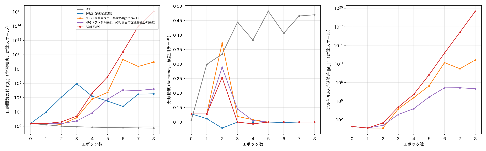

# report_008

本レポートは，`.orders/order_008.md` の指示に基づき実施した，NFG SVRG原論文
（`references/No_Full_Grad_SVRG.pdf`）の実験（Ex003，`.reports/report_007.md`）を
ミニバッチサイズ1（オンライン学習）に変更して再検証した結果をまとめたものである．

## 1. 指示内容と検証の背景

`.reports/report_007.md` では，NFG（原論文Algorithm 1に忠実な最終点採用版），ASAI SVRGとも
に，原論文が報告する滑らかな収束を再現できなかった．この差異の原因として，ユーザーは次の点を
指摘した．NFG SVRG原論文のAlgorithm 1は，内部ループを

$$
\text{for } t = 0, 1, \ldots, n-1 \text{ do} \quad (\text{各ステップで単一のインデックス } \pi_s^t \text{ を抽出})
$$

と記述しており，ミニバッチサイズには明示的に言及していない．この記法は，Ex001
（マッシュルームデータセット，オンライン学習）と同じであり，原論文が実際にはミニバッチサイズ
1（単一サンプルのオンライン学習）を想定している可能性を示唆する．Ex003（`.reports/report_007.md`）
ではミニバッチサイズ128を用いていたため，本レポートではミニバッチサイズを1に変更し，同一の
モデル・誤差関数・ハイパーパラメータで再実験を行った．

比較手法は，スナップショット構成方法が異なる2種類のNFG SVRG（原論文Algorithm 1に忠実な
最終点採用版 `NFG`，およびASAI SVRG論文の理論解析上の都合による一様ランダム選択版
`NFG_SVRG`），SVRG（最終点採用版），ASAI SVRG，SGDの計5手法とする．

## 2. 実験規模に関する制約

ミニバッチサイズ1でのResNet-18学習は，ミニバッチサイズ128と比べ1エポックあたり約75〜80倍の
時間を要することが予備ベンチマークで判明した（バッチサイズ1ではGPUの並列演算能力をほぼ
活用できないため）．プロセスを並列化することである程度緩和できる（ベンチマークでは8並列で
約5倍の高速化）が，それでも`.reports/report_007.md`と同一の規模（5手法 x 5Seed x 30エポック）
では実行に11日以上を要すると見積もられた．そのため，ユーザーと相談の上，Seed数を1（Seed 0の
み），エポック数を8に縮小して実施した．この制約により，本レポートの結果は統計的な平均・標準
偏差の評価はできず，単一Seedにおける定性的な比較にとどまる．

## 3. 実験条件

`.reports/report_007.md` の条件から，ミニバッチサイズを128から1へ変更し，比較手法にNFG SVRG
（ランダム選択版）を追加した．その他（モデル：ResNet-18，誤差関数：min-max敵対的ロバスト性の
定式化，学習率0.01，$ \lambda_1=\lambda_2=0.0005 $）は変更していない．また，フル勾配
（SVRGの真の勾配，NFG・ASAI SVRGの近似誤差診断）の計算には，計算効率のため，内部ループとは
独立に大きいミニバッチサイズ（512）を用いた（数学的には全サンプルの勾配の平均であり，
ミニバッチ分割の方法によらず同一の結果になるため，内部ループの確率的勾配計算の忠実性には
影響しない）．

## 4. 結果



（1Seedのみのため，平均・標準偏差ではなく単一Seedの値をそのまま示す．目的関数の値・近似誤差の
縦軸は対数スケール．）

### 4.1 各手法の最終エポック（8エポック目）における評価指標（Seed 0）

| 手法 | 目的関数の値 $ f(z_s) $ | 分類精度（検証用） | フル勾配の近似誤差 $ \|\mathbf{e}_s\|^2 $ | 経過時間 [s] |
| :--- | ---: | ---: | ---: | ---: |
| SGD | $ 0.539 $ | $ 0.470 $ | （定義なし） | 30,548 |
| SVRG（最終点採用） | $ 3.38 \times 10^{4} $ | $ 0.100 $ | $ 0.0 $ | 57,048 |
| NFG（最終点採用） | $ 9.28 \times 10^{8} $ | $ 0.100 $ | $ 4.41 \times 10^{11} $ | 57,279 |
| NFG（ランダム選択） | $ 1.55 \times 10^{5} $ | $ 0.100 $ | $ 1.00 \times 10^{7} $ | 55,895 |
| ASAI SVRG | $ 1.20 \times 10^{16} $ | $ 0.100 $ | $ 3.22 \times 10^{19} $ | 57,753 |

### 4.2 発散の発生タイミング（1エポックあたりの目的関数の値の増加が0.5を超えた最初のエポック）

| 手法 | 発散開始エポック |
| :--- | :--- |
| SGD | （発散なし） |
| SVRG（最終点採用） | 1エポック目 |
| ASAI SVRG | 2エポック目 |
| NFG（最終点採用） | 3エポック目 |
| NFG（ランダム選択） | 3エポック目 |

## 5. 考察

### 5.1 仮説の反証：ミニバッチサイズ1は原論文との差異を解消しなかった

当初の仮説は「原論文はミニバッチサイズ1（オンライン学習）を想定しており，Ex003
（ミニバッチサイズ128）がこれと異なっていたために原論文と異なる不安定な挙動を示した」という
ものであった．しかし本レポートの結果は，この仮説を明確に反証するものであった．ミニバッチ
サイズを1に変更した結果，**Ex003（ミニバッチサイズ128）では安定して収束していたSVRG
（最終点採用，真のフル勾配を用いる古典的SVRG）までもが，1エポック目から発散**した．
これは，ミニバッチサイズを1にすることが原論文の挙動に近づくどころか，むしろ全ての
SVRG系手法（近似誤差の有無によらず）を不安定化させることを示している．

この結果から，SGDのみが引き続き安定した収束を示した点は特筆に値する（表4.1，
最終分類精度47.0%．ミニバッチサイズ128のSGD（77.4%，`.reports/report_007.md`）と比べると
精度は下がるものの，これはミニバッチサイズ1の確率的勾配のノイズの大きさによるものであり，
発散ではない）．

### 5.2 近似誤差の有無によらない発散：補正勾配の分散が本質的要因

SVRG（最終点採用，$ \mathbf{e}_s = \mathbf{0} $ が常に厳密に成り立つ）が，NFG・ASAI SVRG
より**早く**（1エポック目から）発散した点は重要である．これは，発散の原因がNFG・ASAI SVRGの
近似誤差（フル勾配の近似の悪さ）にあるのではなく，SVRG系手法に共通する補正勾配

$$
\mathbf{v}_s^k = \nabla f_n(\mathbf{w}_s^k) - \nabla f_n(\mathbf{z}_s) + \mathbf{g}_s
$$

**自体の分散**が原因であることを強く示唆する．ミニバッチサイズ1では，単一サンプル $ n $ に
対する勾配 $ \nabla f_n(\mathbf{w}_s^k) $ と $ \nabla f_n(\mathbf{z}_s) $ の差分は，
理論上は「$ \mathbf{w}_s^k $ と $ \mathbf{z}_s $ が近いほど小さくなる」ことが期待されるが，
ResNet-18のような高次元・非凸なネットワークでは，単一サンプルに対する勾配がパラメータの
わずかな変化に対しても大きく変動しうるため，この差分の分散が実用上非常に大きくなり得る．
ミニバッチサイズ128では，128サンプルにわたる平均化によりこの分散が大幅に抑制されるため，
SVRG（真のフル勾配を用いる）は安定するが，ASAI SVRG・NFGは平均化しきれない近似誤差により
なお不安定化する，という`.reports/report_007.md`の結果と整合する．

### 5.3 発散タイミングの順序について

表4.2に示す発散開始エポックの順序（SVRG：1エポック目 < ASAI SVRG：2エポック目 < NFG：
3エポック目）は，`.reports/report_007.md`（ミニバッチサイズ128）で観測された順序
（NFGが先に不安定化し，ASAI SVRGはより長く安定した後に発散する）とは**逆転している**．
この逆転の理由は本レポートの範囲では特定できていないが，1Seedのみの結果であるため，
Seed依存のばらつきである可能性も否定できない．

### 5.4 「M=5ワーカー」の役割に関する新たな仮説

原論文が付録で言及する「ワーカー数M=5による分散環境の模擬」（`.reports/report_007.md`
1.3節で本リポジトリが簡略化した設定）について，本レポートの結果を踏まえると，次の仮説が
考えられる．すなわち，各ワーカーが単一サンプルの勾配を計算しつつ，複数ワーカー（M=5）の
結果を同期・平均化する分散環境が実質的に「ミニバッチサイズ5相当」の分散削減効果を
Algorithm 1の記法（単一インデックスの抽出）を保ったまま実現しており，これが原論文の実験に
おける安定性の一因となっている可能性がある．この仮説は本レポートの範囲では検証しておらず，
今後の検討課題である．

## 6. 結論

ミニバッチサイズを1（オンライン学習）に変更しても，NFG SVRG原論文が報告する滑らかな収束は
再現されず，むしろSVRG（真のフル勾配を用いる古典的手法）までもが不安定化するという，
より深刻な結果が得られた．この結果は，Ex003・Ex002を通じて観測されてきたNFG・ASAI SVRGの
不安定性が，近似誤差そのものよりも，**SVRG系手法の補正勾配が単一サンプル・高次元非凸
ネットワークにおいて本質的に高い分散を持つこと**に起因する可能性を強く示唆する．
ミニバッチサイズ128（`.reports/report_007.md`）の方が，本リポジトリの再現実装においては
原論文の挙動に近い（少なくともSGD・SVRGは安定する）結果を与えており，**原論文との差異の
原因はミニバッチサイズではなかった**．

## 7. 未解決の論点・今後の検討候補

- 5.4節で述べた「M=5ワーカーによる平均化」仮説の検証（ミニバッチサイズ1のまま，5サンプル
  ごとに勾配を平均化する疑似分散環境を実装し，安定性が回復するか確認する）は，原論文との
  差異の真因を特定する上で有望な次の一歩である．
- 本レポートはSeed 0のみの結果であり，発散タイミングの順序（5.3節）がSeed依存の偶然である
  可能性を否定するには，複数Seedでの追試が必要である．ただし，ミニバッチサイズ1では
  1Seedあたり約8〜16時間を要するため，追試には長時間の計算資源が必要である．
- SVRG系手法の補正勾配の分散を直接測定し，ミニバッチサイズおよびネットワーク構造との関係を
  定量的に明らかにすることは，本レポートの考察（5.2節）を実証的に裏付ける上で有用である．

## 8. 実行コマンド

本レポートの実験は，`programs/ex003_cifar10_resnet_minmax/train.py` の `SEEDS`／`METHODS`／
`BATCH_SIZE`／`EPOCHS`／`main()`内の並列プロセス数を一時的に変更して実行し，実験終了後に
Ex003の正式な設定（`.reports/report_007.md` の条件）へ戻した．

```bash
# （train.py内の設定を SEEDS=[0], METHODS=["SGD","SVRG","NFG","NFG_SVRG","ASAI_SVRG"],
#   BATCH_SIZE=1, EPOCHS=8 に変更した上で）学習を実行
.venv_pytorch/bin/python programs/ex003_cifar10_resnet_minmax/train.py

# 単体テスト
.venv_pytorch/bin/python -m pytest tests/ -v
```

## 9. ai-agentの実行に関する推奨

本レポートにより，ミニバッチサイズは原論文との差異の原因ではなく，むしろSVRG系手法の補正勾配
自体が単一サンプル勾配において高い分散を持つことが不安定性の本質的な要因である可能性が
浮かび上がった．次の着手候補は，本レポート「7. 未解決の論点」に挙げた，「M=5ワーカーによる
平均化」仮説の検証である．

```bash
# ai-agentの仮想環境が未構築の場合は先に構築する
uv venv .ai/ai-agent/.venv_agent --python 3.11
uv pip install --python .ai/ai-agent/.venv_agent/bin/python -r .ai/ai-agent/requirements_agent.txt

# プロジェクトの状態から次の作業をAIエージェントに判断させる場合
.ai/ai-agent/.venv_agent/bin/python .ai/ai-agent/cli.py --agent machine_learning
```
