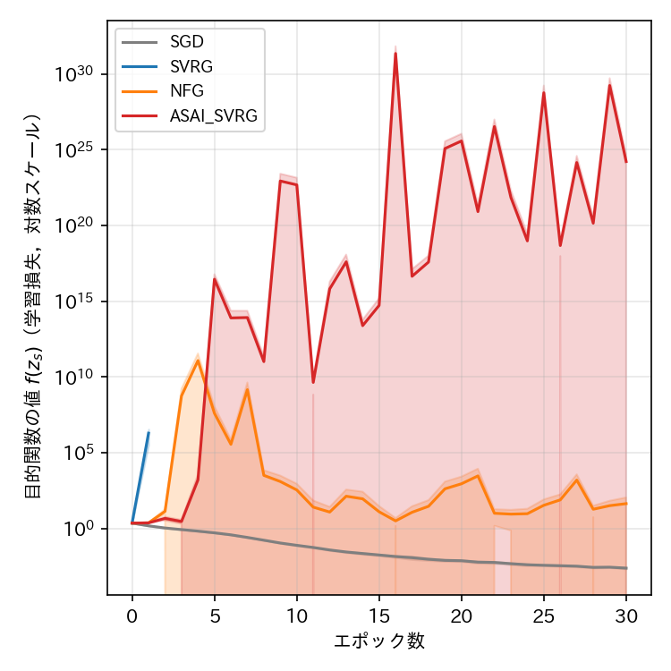
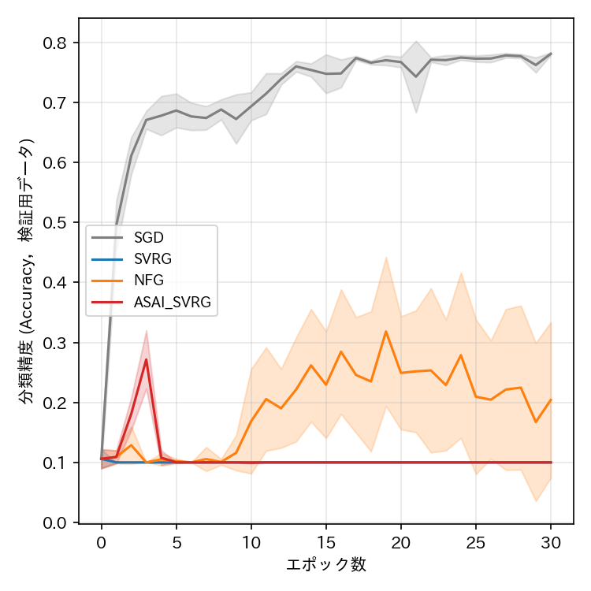
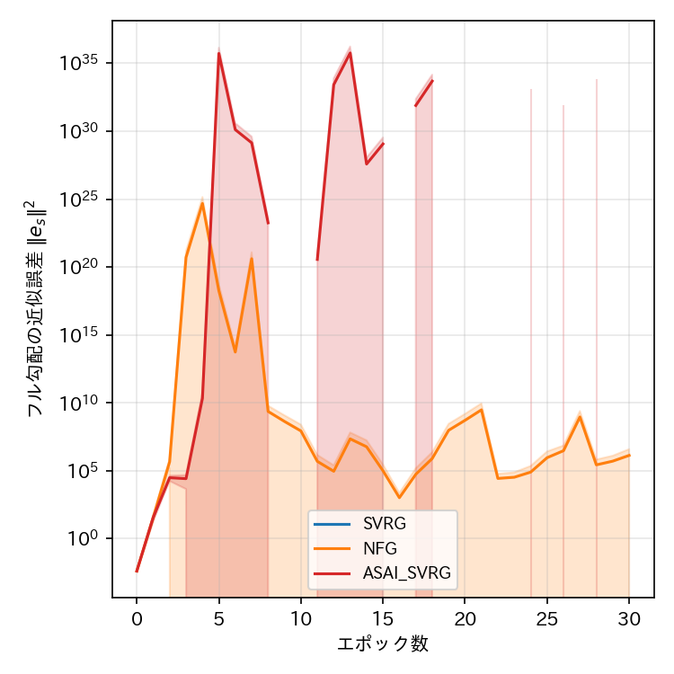

# report_009

本レポートは，`.orders/order_009.md` の指示に基づき，Ex003（`.reports/report_007.md`）の実装上の
3つの問題点を修正したEx004の実験結果をまとめたものである．

## 1. Ex003からの変更点

Ex003の実装（`programs/ex003_cifar10_resnet_minmax/`）はそのまま保持し，新規に
`programs/ex004_cifar10_resnet_minmax/` を作成して次の3点を修正した．データセット・モデル・
誤差関数・ハイパーパラメータ（学習率 $ \gamma = 0.01 $，$ \lambda_1 = \lambda_2 = 0.0005 $，
ミニバッチサイズ128，30エポック，5Seed）はEx003と同一に保っている．

### 1.1 M=5ワーカーによる分散環境の模倣

NFG SVRG原論文が想定する「ワーカー数M=5による分散環境」を，Ex003では単一プロセスでの
ミニバッチ学習として簡略化していた．Ex004では，グローバルミニバッチ（サイズ128）を
`M_WORKERS = 5` 個のサブバッチ（`torch.chunk`で分割，サイズ約25〜26）に分割し，各サブバッチを
独立にforward・backwardする `backward_minmax_objective_distributed` 関数を新設した．
データ項（交差エントロピー損失）の勾配は各サブバッチのサンプル数で重み付け平均し（グローバル
バッチ全体の平均勾配と数学的に同一），正則化項の勾配はサブバッチ数に依らずグローバルミニバッチ
全体に対して1回だけ加える．

### 1.2 フル勾配計算時のBatch Normalization統計量の固定

`compute_full_gradient_and_metrics` は，全データを走査してフル勾配（スナップショット勾配の
真値）を計算する際，Ex003では `model.train()` を用いていたため，走査中にBatch Normalizationの
移動平均統計量（running_mean，running_var）が更新され続け，走査の前半と後半で異なる関数を
評価してしまっていた．Ex004では `model.eval()` に変更し，パラメータの勾配（`.grad`）計算は
有効に保ちつつ，統計量の更新を防いだ．

### 1.3 sigmaの正則化勾配のスケール

1.1の実装（正則化項をグローバルミニバッチ全体に対して1回だけ加える設計）により構造的に解決
される．

いずれの修正も，`tests/test_minmax_resnet_distributed.py` の単体テスト（サブバッチ分割による
勾配集約がBatch Normalizationの影響を受けない場合に単一パスの勾配と一致すること，フル勾配計算が
running_mean/running_varを変更しないこと，正則化項の勾配がnum_workersに依らず1回分のスケールで
加わること）で検証済みである．

## 2. 結果

### 2.1 目的関数の値・分類精度・フル勾配の近似誤差（横軸：エポック数）







（実線が5Seedの平均値，塗りつぶしが標準偏差．NaN・Infを含むSeedはその時点の平均計算から
除外されるため，全Seedが同時にNaN/Infとなったエポックでは線が途切れる．）

### 2.2 各手法の最終エポック（30エポック目）における評価指標（5Seedの平均）

| 手法 | 目的関数の値 $ f(z_s) $ | 分類精度（検証用，平均±標準偏差） | フル勾配の近似誤差 $ \|\mathbf{e}_s\|^2 $ | 経過時間 [s] | 勾配計算回数 |
| :--- | ---: | ---: | ---: | ---: | ---: |
| SGD | $ 2.5 \times 10^{-3} $ | $ 0.781 \pm 0.002 $ | （定義なし） | 3290.2 | 1,500,000 |
| SVRG | NaN（5Seed全て） | $ 0.100 \pm 0.000 $ | $ 0.0 $ | 7819.8 | 4,550,000 |
| NFG | 44.3（NaNを除く5Seed平均，桁のばらつき大） | $ 0.204 \pm 0.130 $ | 桁のばらつき大（$ 10^2 $〜$ 10^6 $） | 8116.6 | 3,000,000 |
| ASAI SVRG | $ 10^{15} $〜$ 10^{24} $（5Seedとも発散） | $ 0.100 \pm 0.000 $ | 桁のばらつき大（$ 10^{24} $〜Inf） | 6142.9 | 3,000,000 |

（SVRGの経過時間には，エポックごとにフル勾配を計算するコストが含まれる．）

## 3. 考察

### 3.1 SGDのみが安定：3つの修正はASAI・NFGの不安定性を解消せず，SVRGにも新たな発散をもたらした

Ex003では，SGD・SVRG（真のフル勾配を用いる古典的手法）は5Seedすべてで安定した収束を示し，
NFGは訓練の後半に不安定化，ASAI SVRGは3〜4エポック付近から指数的に発散する，という結果
だった．Ex004では，**SGDのみ**が引き続き安定した収束を示す（検証精度 78.1%，Ex003の77.4%と
同等）一方，**SVRG（真のフル勾配を用いる古典的手法）が5Seedすべてで1エポック目から発散し
NaNに到達する**という，Ex003では観測されなかった新たな破綻が生じた．NFG・ASAI SVRGは
Ex003よりもさらに早期かつ深刻に発散し，分類精度はほぼ全Seedでランダム推定の水準（10%）に
落ち込んだ．

この結果は，`.orders/order_009.md` が想定した仮説（M=5ワーカーの分散環境模擬・フル勾配計算時の
Batch Normalization統計量固定・sigmaの正則化勾配スケールの3点が，ASAI・NFGの不安定性の原因
だった）を支持しない．3つの修正を導入した結果，問題は解消されるどころか，Ex003では安定して
いたSVRGにまで波及する形で悪化した．

### 3.2 悪化の原因の推定：M=5サブバッチ分割によるBatch Normalization統計量の新たな不安定化

SGDとSVRG系3手法（SVRG，NFG，ASAI SVRG）の唯一の構造的な違いは，SVRG系手法が「現在の
パラメータ `model`」に加えて「スナップショット `snapshot_model`」を保持し，同一ミニバッチに
対して両方でforward・backwardを行う点である．いずれの手法も，1.1で導入した
`backward_minmax_objective_distributed` によりM=5個のサブバッチ（各約25〜26サンプル）に
分割してBatch Normalizationを適用する点は共通しているが，SGDは`model`のみ，SVRG系は
`model` と `snapshot_model` の双方についてこの処理を1学習ステップごとに実行する．

サブバッチのサイズが約25〜26と小さいため，Batch Normalizationのミニバッチ統計量（平均・
分散）の推定は，元のグローバルバッチ（128サンプル）を用いる場合よりも大幅にノイズが大きい．
さらに，1回の学習ステップあたりのBatch Normalization層の`running_mean`/`running_var`の
更新回数が，Ex003の1回（グローバルバッチ全体を1回forward）からEx004では5回（サブバッチ
ごとに1回）に増加しており，1エポックあたりの更新回数は約1,955回（$ 391 \times 5 $）に達する
（Ex003は約391回）．`snapshot_model`は，パラメータ自体はエポック境界でのみ更新されるものの，
Batch Normalizationの`running_mean`/`running_var`は`epoch`関数内で`model.train()`と同様に
学習ステップごとに更新され続けるため（この点はEx003から変更していない），この5倍の更新頻度・
ノイズの影響を`model`以上に強く受けると考えられる．結果として，`model`と`snapshot_model`の
Batch Normalization統計量（および両者のforward結果）が学習ステップの進行とともに乖離しやすく
なり，SVRG系手法の分散削減の補正項（$ \nabla f(\text{model}) - \nabla f(\text{snapshot}) +
g_s $）が本来意図しない大きな値を取ることで，勾配爆発・発散を引き起こしている可能性が高い．
SVRGが1エポック目から即座に発散している点（3.3節参照）は，緩やかなBatch Normalization統計量の
ドリフトというよりも，この補正項の急激な増大を示唆している．

この推定が正しければ，原論文が想定する真の分散環境（各ワーカーが独立したモデルレプリカと
ローカルなBatch Normalization統計量を保持し，勾配のみを同期する）とEx004の実装（単一の
モデルインスタンスの共有Batch Normalization統計量を，5個のサブバッチで順に更新する）との
乖離が，かえって新たな不安定性の原因となったことになる．すなわち，「M=5ワーカーの模擬」を
文字通り単一モデルのサブバッチ分割として実装したことが，原論文の意図する挙動の忠実な再現には
なっていなかった可能性がある．

### 3.3 SVRGの発散は1エポック目から生じており，緩やかな悪化ではない

SVRG（Seed 0）の目的関数の値は，0エポック目（学習前）の2.30から，1エポック目終了時点で
$ 2.44 \times 10^{6} $ に急増し，2エポック目にはNaNに到達している．Ex003ではASAI SVRGの発散も
3〜4エポック目から始まっており緩やかな指数的増大だったのに対し，Ex004のSVRGの破綻は，
学習開始後1エポック（391ステップ）以内に生じるという点で質的に異なり，より突発的である．

## 4. 未解決の論点・今後の検討候補

- 3.2節で述べた推定（M=5サブバッチ分割によるBatch Normalization統計量の乱れが，SVRG系手法の
  分散削減補正項を通じて発散を引き起こす）は，本レポートの範囲では推定に留まり，直接の検証は
  行っていない．次の検証候補としては，(a) `snapshot_model`のBatch Normalization層を，学習
  ステップ中は`eval()`に固定する（パラメータの勾配計算は維持しつつ，統計量の更新のみ止める）
  ことで，このドリフトが真の原因かを切り分ける，(b) Batch Normalizationを持たないアーキテクチャ
  （Group Normalization等への置き換え）でM=5サブバッチ分割を行い，同様の発散が生じるかを
  確認する，等が考えられる．
- Ex003で確認されたNFG・ASAI SVRGの不安定性（`.reports/report_007.md`）自体の真の原因は，
  本レポートの検証によってもなお特定できていない．M=5ワーカー模擬・フル勾配計算時のBatch
  Normalization固定・sigmaの正則化勾配スケールの3点はいずれも実装上の改善ではあるが，
  Ex003で観測された不安定性を解消する効果は確認されず，むしろEx004ではより深刻な破綻
  （SVRGの新たな発散）が生じた．
- `programs/optimizers/optimizers.py` の各Optimizerクラス自体は，Ex001・Ex002・Ex003で
  妥当性が確認済みであり，本レポートの結果はOptimizerクラスの実装誤りによるものではなく，
  Batch Normalizationを含むネットワークとM=5サブバッチ分割の相互作用に起因すると考えられる．

## 5. 実行コマンド

```bash
# 学習の実行（4手法 x 5Seed = 20条件を4プロセス並列で実行．既に完了した条件はスキップされる）
.venv_pytorch/bin/python programs/ex004_cifar10_resnet_minmax/train.py

# 単体テスト（M=5サブバッチ分割による勾配集約，フル勾配計算のBatch Normalization統計量固定の
# 検証を含む）
.venv_pytorch/bin/python -m pytest tests/ -v

# 結果の可視化（先頭セルのEXPERIMENT変数を"ex004_cifar10_resnet_minmax"に設定して実行）
.venv_pytorch/bin/jupyter nbconvert --to notebook --execute --inplace visualize_result.ipynb
```

## 6. ai-agentの実行に関する推奨

本レポートにより，`.orders/order_009.md` が提案した3つの修正（M=5ワーカーの分散環境模擬・
フル勾配計算時のBatch Normalization統計量固定・sigmaの正則化勾配スケール）は，いずれも
実装上正しく検証済み（`tests/test_minmax_resnet_distributed.py`）であるにもかかわらず，
Ex003で観測されたNFG・ASAI SVRGの不安定性を解消せず，むしろSVRG（真のフル勾配を用いる
古典的手法）にまで新たな発散をもたらす結果となった．次の着手候補は，本レポート「4. 未解決の
論点」に挙げた，M=5サブバッチ分割とBatch Normalizationの相互作用を切り分けるための追加検証
（特に`snapshot_model`のBatch Normalizationを学習ステップ中も`eval()`に固定する検証）である．

```bash
# ai-agentの仮想環境が未構築の場合は先に構築する
uv venv .ai/ai-agent/.venv_agent --python 3.11
uv pip install --python .ai/ai-agent/.venv_agent/bin/python -r .ai/ai-agent/requirements_agent.txt

# プロジェクトの状態から次の作業をAIエージェントに判断させる場合
.ai/ai-agent/.venv_agent/bin/python .ai/ai-agent/cli.py --agent machine_learning
```
