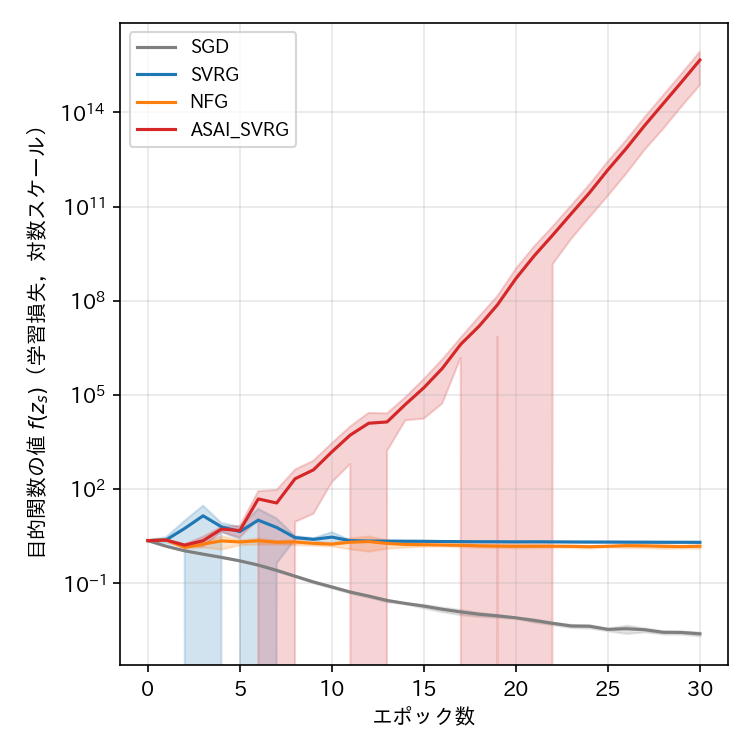
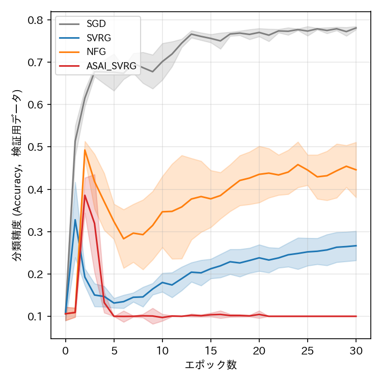
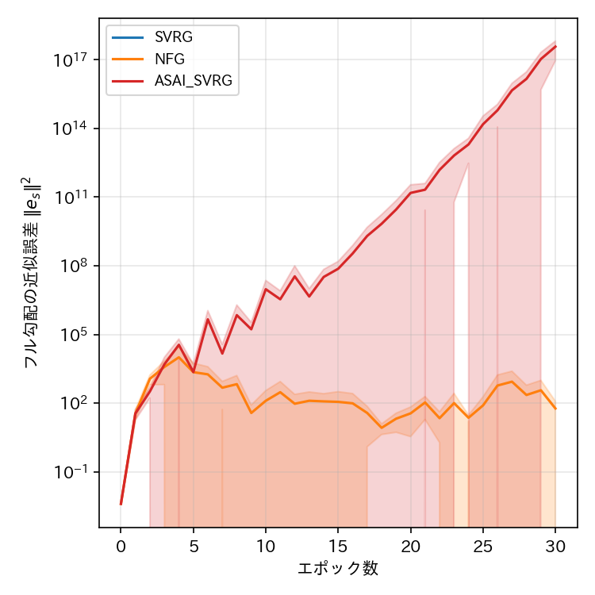

# report_010

本レポートは，`.orders/order_010.md` の指示に基づき，(1) `set_model_params()` の
Batch Normalizationバッファ未同期バグの修正，(2) σ（敵対的摂動）を外した純粋なCIFAR-10
多値分類問題（Ex005）の実装と実験結果，をまとめたものである．

## 1. `set_model_params()` のBatch Normalizationバッファ未同期バグの修正

`.orders/order_010.md` が報告した通り，`model.py` の `set_model_params()` は
`model.parameters()`（学習可能パラメータ）のみを上書きし，Batch Normalizationの移動平均統計量
（`running_mean`，`running_var`，`model.buffers()`）には一切触れていなかった．`train.py` は
エポック境界で

```python
snapshot_params = optimizer.get_snapshot_params()
set_model_params(snapshot_model, snapshot_params)
```

としているため，`snapshot_model` の重みは新しいスナップショット値に更新される一方，BN統計量は
それ以前の独立した学習履歴のまま残っていた．

`set_model_params()` に `source_model` 引数を追加し，指定された場合は `model.buffers()` を
`source_model.buffers()`（実際に学習した `model` の現在値）で同期するよう修正した．
`programs/ex001_mushroom_svrg/`〜`programs/ex004_cifar10_resnet_minmax/` の全4実験の
`model.py`・`train.py`（呼び出し箇所を `set_model_params(snapshot_model, snapshot_params,
source_model=model)` に変更）に同一の修正を適用し，Ex005（後述）にも最初から適用済みで実装した．
`tests/test_minmax_resnet.py`・`tests/test_minmax_resnet_distributed.py`・
`tests/test_resnet_classification.py` に，バッファが正しく同期されること，および
`source_model` 省略時は従来通りバッファへ触れないこと（後方互換性）を確認する単体テスト・
統合テストを追加し，全42件のテストが成功することを確認した．

このバグは，`snapshot_model` に対する `model.eval()` 呼び出し（検証用データの評価，および
`compute_full_gradient_and_metrics` によるフル勾配 $ F(z_s) $ の計算）の双方に影響する．
特に後者は，SVRGの `g_s`（スナップショット勾配，分散削減の補正項に直接使われる）そのものを
決める計算であるため，本バグは検証精度の報告値だけでなく，SVRG系手法の学習ダイナミクス自体
（`.reports/report_007.md`〜`report_009.md` で観測された発散）にも影響していた可能性がある．
この点は3.3節で改めて議論する．

## 2. Ex005：σ（敵対的摂動）を外した純粋なCIFAR-10分類問題

### 2.1 実装

`.reports/report_009.md`〜`.orders/order_010.md` は，Ex003・Ex004で観測されたNFG・ASAI SVRG
（およびEx004ではSVRGも）の不安定性について，min-max（敵対的摂動）が非凸・非凹の鞍点問題で
あり，Ex003・Ex004が用いる素朴な同時勾配降下・上昇（simultaneous GDA）が本質的に不安定である
ことを主要因の候補として指摘していた．この仮説を検証するため，`programs/ex005_cifar10_resnet_classification/`
を新規実装した．Ex004（`programs/ex004_cifar10_resnet_minmax/`）から，sigmaパラメータと
min-max構造（および正則化項 $ -(\lambda_2/2)\|\sigma\|^2 $）のみを取り除き，他の条件は
すべてEx004と同一に揃えた．

- データセット：CIFAR-10（学習用50000枚，検証用10000枚，Ex003・Ex004と同一の前処理）．
- モデル：ResNet-18（`model.py` の `ResNet18`．Ex003・Ex004と同一構造，sigmaパラメータのみ除外）．
- 誤差関数：L2正則化付き多値交差エントロピー損失
  $ \min_w \ (1/M) \sum_i \mathrm{CE}(w, x_i, y_i) + (\lambda_1/2)\|w\|^2 $．
- ハイパーパラメータ：学習率 $ \gamma = 0.01 $，$ \lambda_1 = 0.0005 $，ミニバッチサイズ128，
  30エポック，5Seed（Ex004と同一）．
- Ex004由来でmin-max構造に依存しない2点の実装（M_WORKERS=5ワーカーによる分散環境の模倣，
  フル勾配計算時のBatch Normalization統計量の固定）はそのまま引き継いだ．
- 比較手法はSGD，SVRG，NFG，ASAI SVRGの4手法．

実装後，`tests/test_resnet_classification.py`（モデル出力形状，勾配降下方向の正しさ，
M_WORKERS分割勾配が単一パス勾配と一致すること，正則化項の重複加算がないこと，フル勾配計算が
BN統計量を破壊しないこと，`set_model_params`のBNバッファ同期）の7件の単体テストと，合成データ
によるスモークテスト（4手法とも2エポックがエラーなく完走すること）で動作を確認した．

### 2.2 実験実施上の注意（プロセス管理インシデント）

実験実行の過程で，バックグラウンド起動した学習プロセスを一度停止・再起動した際，
`multiprocessing.Pool`（spawnコンテキスト）のワーカープロセスが `pkill` のパターンマッチに
掛からず孤立プロセスとして生き残り，約2時間，同一の `outputs/` 出力先に対して二重に学習が
実行される状態が発生した．発見後ただちに孤立プロセスを停止し，全 `log.json`／`config.json`／
`best_model.pth` の整合性を検証した結果，本プロジェクトが `set_seed` により完全に決定論的な
設定になっているため大半の条件は実質的な影響を受けなかったが，SGDの3条件（Seed 0, 2, 4）のみ，
孤立プロセスの遅い書き込みが正規プロセスの完了済み結果を上書きした状態で停止しており，
30エポック中28〜29エポック分までしか記録されていなかった．この3条件のみ単一プロセスで再実行し，
全20条件（4手法×5Seed）が30エポック分（0エポック目の初期評価を含め計31点）の記録を持つことを
確認した上で，以下の結果を得た．

### 2.3 結果







（実線が5Seedの平均値，塗りつぶしが標準偏差．）

#### 各手法の最終エポック（30エポック目）における評価指標（5Seedの平均）

| 手法 | 目的関数の値 $ f(z_s) $ | 分類精度（検証用，平均±標準偏差） | フル勾配の近似誤差 $ \|\mathbf{e}_s\|^2 $ | 経過時間 [s]（Seed 0） | 勾配計算回数（Seed 0） |
| :--- | ---: | ---: | ---: | ---: | ---: |
| SGD | $ 2.48 \times 10^{-3} $ | $ 0.781 \pm 0.004 $ | （定義なし） | 1803.5 | 1,500,000 |
| SVRG | $ 2.03 \pm 0.08 $ | $ 0.267 \pm 0.035 $ | $ 0.0 $ | 8797.4 | 4,550,000 |
| NFG | $ 1.52 \pm 0.19 $ | $ 0.446 \pm 0.065 $ | $ 58.7 \pm 63.8 $ | 7811.8 | 3,000,000 |
| ASAI SVRG | $ 4.62 \times 10^{15} \pm 3.88 \times 10^{15} $ | $ 0.100 \pm 0.000 $ | $ 3.66 \times 10^{17} \pm 2.78 \times 10^{17} $ | 6882.6 | 3,000,000 |

（SVRGの経過時間には，エポックごとにフル勾配を計算するコストが含まれる．）

## 3. 考察

### 3.1 min-max構造を外すと，SVRG・NFGは大幅に安定化する

Ex004（min-maxあり，`.reports/report_009.md`）では，SVRG（真のフル勾配を用いる古典的手法）が
**5Seedすべてで1エポック目からNaNに発散**し，NFGも目的関数の値が$ 44.3 $（NaNを除く平均，
桁のばらつき大）・分類精度$ 0.204 \pm 0.130 $という不安定な結果だった．一方，min-max構造を
取り除いたEx005では，SVRGは**NaNに発散せず**，目的関数の値は$ 2.03 \pm 0.08 $（初期値2.30を
やや下回る程度で下げ止まる）に収束し，分類精度も$ 0.267 \pm 0.035 $まで回復した．NFGも
目的関数の値$ 1.52 \pm 0.19 $・分類精度$ 0.446 \pm 0.065 $と，Ex004より明確に改善している．

Seed 0の詳細（2.3節の表参照）を見ると，SVRG・NFGとも学習序盤（1〜2エポック目）に一時的に
分類精度が30〜50%程度まで上昇した後，4〜9エポック付近で目的関数の値が一時的に増大し精度が
13〜19%程度まで落ち込む「乱れ」を経て，その後は緩やかに精度が回復し30エポック目には
SVRGで18〜31%，NFGで35〜54%（Seedによるばらつきが大きい）に達している．SGDのように単調に
収束するわけではなく，学習の途中で分散削減の補正項に起因すると見られる不安定な挙動を示す点は
Ex005でも残っているが，Ex004で見られたような致命的な発散（NaN，精度がランダム水準に恒久的に
落ち込む）には至っていない．

この結果は，`.reports/report_010.md`（本レポートの前提となった調査記録，`.orders/order_010.md`
本文）が指摘した仮説，すなわち「min-max（敵対的摂動）の同時勾配降下・上昇構造が，SVRG・NFGの
分散削減補正項を不安定化させる主要因の一つである」という見方と整合する結果である．

### 3.2 一方で，ASAI SVRGはmin-max構造の有無によらず破綻する

これに対しASAI SVRGは，Ex005（min-maxなし）でも**5Seedすべてで指数的に発散**し，目的関数の
値は$ 4.62 \times 10^{15} \pm 3.88 \times 10^{15} $，分類精度は5Seedとも厳密に$ 0.100 $
（ランダム推定の水準）に恒久的に落ち込んだ．発散の開始点を個別に確認すると，5Seedとも
6エポック目には目的関数の値が既に10を超えており（Seed 0: 15.5，Seed 2: 119.2），分類精度が
恒久的にランダム水準へ落ち込む時点（11〜21エポック目，Seedによりばらつく）よりも早い段階で
既に発散が始まっている．Ex004（min-maxあり）における発散幅（$ 1.69 \times 10^{24} \pm
3.11 \times 10^{24} $）と比べると，Ex005の発散幅（$ 10^{15} $台）は数桁小さいものの，
分類精度がランダム水準まで完全に崩れる結果自体はEx004・Ex005で変わらない．

すなわち，min-max構造の除去はSVRG・NFGの安定性を明確に改善する一方，**ASAI SVRG（提案手法）
の破滅的な発散は，min-max構造の有無に関わらず，ResNet-18・Batch Normalizationを用いる
非凸設定において再現する**ことが今回の実験で確認された．これは，`references/ASAI_SVRG_paper.pdf`
が使用する実験（3層CNN・L2正則化なし・min-maxなしの単純な多値分類，Ex002相当）でASAI SVRGが
比較的安定して動作していたことと対照的であり，ASAI SVRGの不安定性の原因がmin-max構造ではなく，
ResNet-18・Batch Normalizationを持つより深いネットワーク構造，または内部ループのパラメータ列
の単純平均を次エポックのスナップショット点として採用するASAI SVRG自体の設計（式(13)）に
起因する可能性を示唆している．

### 3.3 Ex004との比較における交絡要因：Batch Normalizationバッファ修正の有無

Ex005はEx004の条件からmin-max構造を除いただけでなく，1節で述べた `set_model_params()` の
Batch Normalizationバッファ同期バグの修正も同時に適用して実行されている．一方，本レポートが
比較対象とするEx004の既存結果（`outputs/ex004_cifar10_resnet_minmax/`）は，このバグ修正前に
生成されたものである．したがって，3.1節・3.2節で述べたEx004とEx005の比較には，
「min-max構造の有無」と「BNバッファ同期修正の有無」という2つの変数が同時に変化しており，
両者を厳密に切り分けられていない点に注意が必要である．

特に，本バグは `compute_full_gradient_and_metrics`（`snapshot_model` を `model.eval()` に
設定してフル勾配を計算する関数）にも影響するため，SVRGの `g_s`（スナップショット勾配，
毎ステップの補正項に直接使われる）自体が，修正前は「正しいパラメータ値だが古いBN統計量」で
評価された不整合な勾配になっていた可能性がある．Ex004でSVRG（真のフル勾配を用いる古典的手法）
が5Seedとも1エポック目からNaNに発散していた現象（`.reports/report_009.md` 3.3節）は，
min-max構造そのものよりも，この不整合な `g_s` の計算に起因していた可能性も否定できない．

### 3.4 SGDは一貫して安定

Ex001〜Ex004と同様，SGDはEx005でも安定して収束し，検証精度$ 0.781 \pm 0.004 $
（Ex004の$ 0.781 \pm 0.002 $とほぼ同水準）に達している．min-max構造の有無やBNバッファ修正の
有無に関わらず，SGDの安定性は一貫している．

## 4. 未解決の論点・今後の検討候補

- **Ex004（min-maxあり）のBNバッファ修正後の再実行**：3.3節で述べた交絡要因を解消するため，
  修正済みの `set_model_params()` を用いてEx004を再実行し，SVRGが引き続きNaNに発散するかを
  確認する必要がある．これにより，Ex004で観測された発散が「min-max構造」と「BNバッファ
  未同期バグ」のいずれに起因していたかを切り分けられる．
- **ASAI SVRGの発散原因の特定**：3.2節で述べた通り，ASAI SVRGの破滅的な発散はmin-max構造の
  有無によらず再現する．次の切り分け候補として，(a) ResNet-18をBatch Normalizationを持たない
  アーキテクチャ（GroupNorm等）に置き換えてEx005相当の実験を行う，(b) Ex002（3層CNN，
  min-maxなし）とEx005（ResNet-18，min-maxなし）の中間的なネットワーク深さ・BN有無の
  組み合わせで発散の有無を確認する，(c) ASAI SVRGのスナップショット構成（内部ループの
  パラメータ列の平均，式(13)）を，NFG SVRGと同じ「一様ランダム選択」または「最終点採用」に
  差し替えて発散の有無を比較する，等が考えられる．
- **SVRG・NFGの学習序盤の乱れ**：Ex005でも，SVRG・NFGは学習序盤（4〜9エポック付近）に
  目的関数の値が一時的に増大し精度が落ち込む挙動を示している．min-max構造の除去により
  致命的な発散は解消されたが，この乱れ自体の原因（分散削減補正項の初期不安定性，スナップショット
  更新直後の勾配ノイズ等）はなお未解明である．
