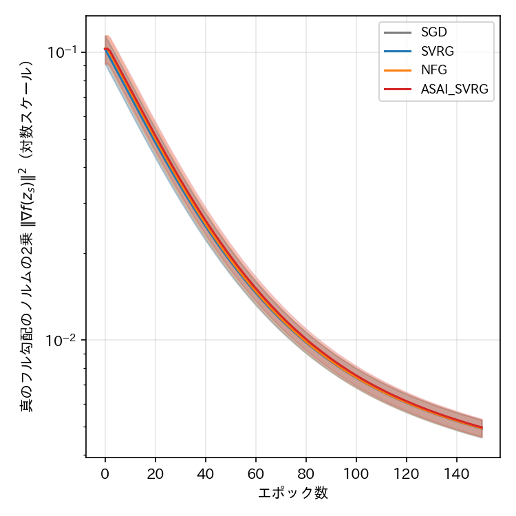
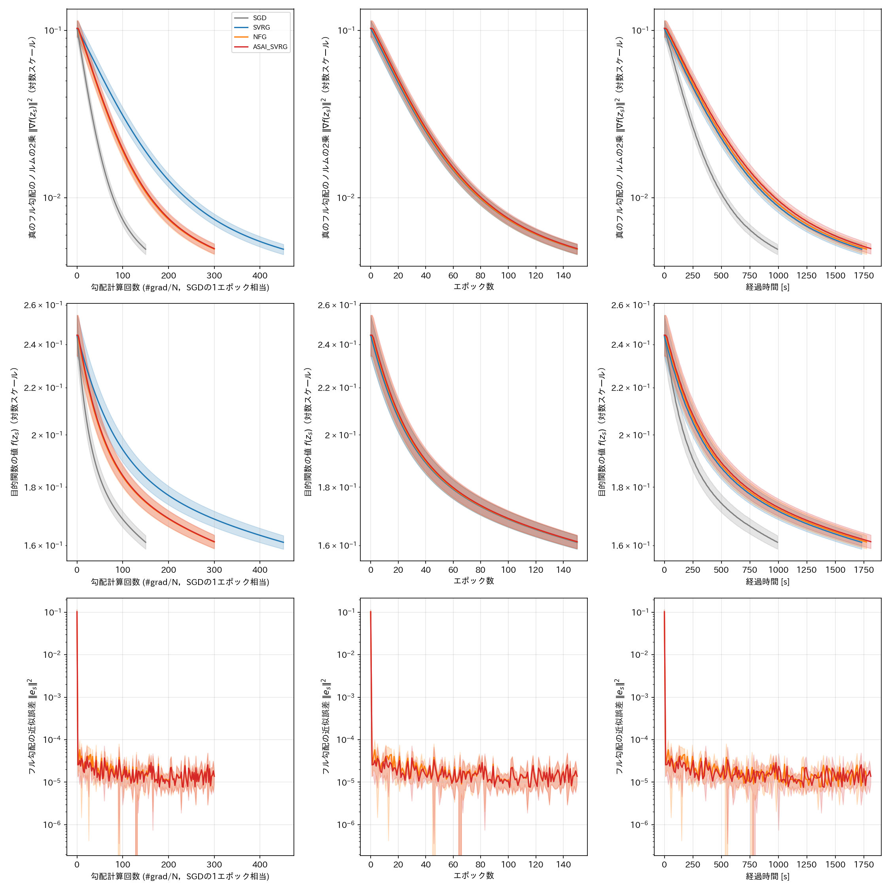
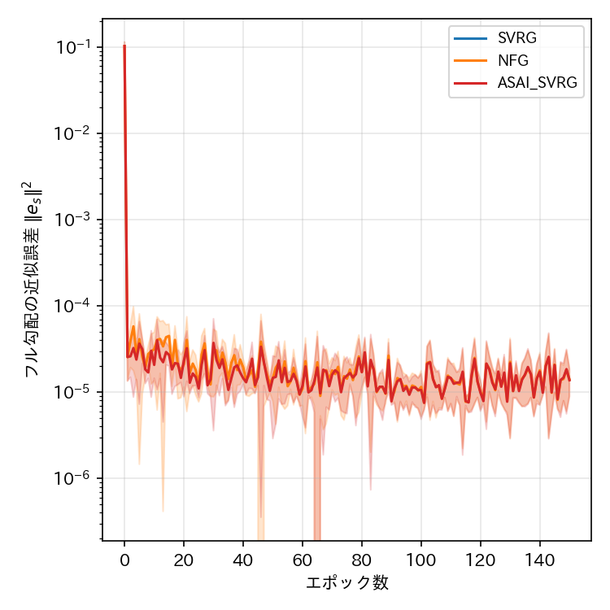

# report_011

本レポートは，`.orders/order_011.md` の指示に基づき実施した，NFG SVRG原論文
（Medyakov, Molodtsov, Chezhegov, Rebrikov, Beznosikov, "Variance Reduction Methods Do Not
Need to Compute Full Gradients: Improved Efficiency through Shuffling", 2025，
`references/No_Full_Grad_SVRG.pdf`）付録A.1（LEAST SQUARES REGRESSION）の再現実験（Ex006）の
実装内容と実験結果をまとめたものである．`.orders/order_011.md` は，同論文7節（ResNet-18・
CIFAR-10）の再現は実装上の不明な条件が多いため断念し，新たな実験として付録A.1を再現することを
指示している．

## 1. 実験条件の調査

原論文付録A.1は，非線形最小二乗損失

```text
f(x) = (1/n) Σ_i (y_i - h_i)^2，h_i = 1/(1+exp(-z_i))，z_i = A_i・x
```

（式(8)）を，ijcnn1・a9a（いずれもLIBSVM Dataの二値分類データセット）の2つのデータセット上で
最小化する数値実験であり，SO NFG-SVRG／RR NFG-SVRG／SVRG（理論ステップ幅）と，各手法の
チューニング済みステップ幅版（tuned）を比較している．評価指標は真のフル勾配のノルムの2乗
`||∇f(x^k)||^2`（対数スケール），横軸は「フル勾配の計算回数」である．原論文は，理論的な
ステップ幅を用いた場合，チューニング済みステップ幅と比べて収束が劣ることをあらかじめ予想して
おり（"Based on our theoretical estimates, which suggest inferior performance compared to
standard SVRG and SARAH, we expect less favorable convergence"），実際の図（Figure 3・4）でも
理論ステップ幅の3手法（SO NFG-SVRG，RR NFG-SVRG，SVRG）はほぼ重なる収束曲線を示す一方，
チューニング済みの2手法（tuned）は大幅に速く収束する．

`.orders/order_011.md` の指示に基づき，本実験では次の3点を原論文から変更する．

1. **tuned版は実装しない**．理論ステップ幅（原論文Theorem 1）による4手法比較のみを行う．
2. **比較手法は，本リポジトリの従来の実験（Ex001・Ex003〜Ex005）と同様にSGD，SVRG，NFG，
   ASAI SVRGの4手法とする**．原論文自身のA.1節はSGDおよびASAI SVRGを比較対象に含まないため，
   SGD・ASAI SVRGのハイパーパラメータは，SVRG・NFGに対して原論文が与える学習率上界を流用する
   形で妥当に定める（4節参照）．
3. **データセットはa9aのみを用いる**（ijcnn1は実装しない）．

## 2. 実装

### 2.1 データセット（`programs/ex006_a9a_least_squares/data.py`）

LIBSVM Data（`https://www.csie.ntu.edu.tw/~cjlin/libsvmtools/datasets/binary/a9a`）からa9a
データセット（32561サンプル，特徴量次元数 $ d=123 $，各成分は0/1のOne-Hotベクトル，1サンプル
あたりの非ゼロ成分数は平均13.9）を取得する．元データのラベル（-1/+1）は，式(8)の $ h_i \in
(0,1) $ と直接比較するため $ \{0, 1\} $ へ写像する．9:1に分割し（学習用29304サンプル，検証用
3257サンプル），式(8)が標準化に言及していないことから，Ex001（マッシュルームデータセット）とは
異なり `StandardScaler` 等の前処理は行わず特徴量を無加工のまま用いる．

### 2.2 モデル（`programs/ex006_a9a_least_squares/model.py`）

`LeastSquaresSigmoidModel` は，式(8)の $ z_i = A_i \cdot x $（切片なし，`nn.Linear(...,
bias=False)`）にシグモイド関数を適用し，二乗誤差を損失とする．式(8)に正則化項は現れないため，
Ex001のロジスティック回帰（L2正則化あり）とは異なり正則化を行わない．勾配はPyTorchの自動微分
（`loss.backward()`）により計算する．

### 2.3 学習ループとハイパーパラメータ（`programs/ex006_a9a_least_squares/train.py`）

比較手法4手法のうちSVRG・NFGは，原論文Algorithm 1（No Full Grad SVRG）の記述（次エポックの
スナップショットとして内部ループの最終パラメータ $ \omega_{s+1} = x_s^n $ をそのまま採用する）
に忠実な `programs/optimizers/optimizers.py` の `SVRGFinalPoint`／`NFGSVRGFinalPoint`
（Ex003〜Ex005で確立した，本原論文の再現実験における標準的な選択）を用いる．ASAI SVRGは
ASAI SVRG論文自身のスナップショット構成（内部ループのパラメータ列の平均）を用いる `ASAISVRG`
をそのまま用いる．内部ループ長 $ K $ は，原論文Algorithm 1のサンプル数 $ n $ に対応させ
$ K = N_{\text{train}} = 29304 $ とした．

学習率は，原論文Theorem 1（非凸設定，Algorithm 1 = NFG SVRG）が与える上界
$ \gamma \le 1/(20Ln) $ の半分の値 $ \eta = 0.5/(20Ln) $ を，SVRG・NFGに加えSGD・ASAI SVRGにも
共通して用いた．平滑性定数 $ L $ は，1サンプル分の損失 $ l_i(x) = (y_i - \sigma(A_i \cdot
x))^2 $ のヘッセ行列が $ \kappa_{\max} \cdot A_i A_i^\top $（$ \kappa_{\max} $ は
$ l_i $ の $ z $ に関する2階微分の絶対値の上界）で上から抑えられることを用い，
$ L = \kappa_{\max} \cdot \lambda_{\max}(A^\top A / N) $ として計算した．$ \kappa_{\max} $ は
解析的に $ l''(z, y) = 2\sigma'(z)^2 + 2(\sigma(z)-y)\sigma''(z) $ と表せることを用い，
$ z \in [-30, 30] $ の格子上で数値的に最大化して求めた（$ \kappa_{\max} \approx 0.1541 $）．
実際に計算された値は次の通りである．

| 記号 | 値 |
| :--- | ---: |
| $ N_{\text{train}} $ | 29304 |
| $ \kappa_{\max} $ | 0.1541 |
| $ \lambda_{\max}(A^\top A / N) $ | 6.288 |
| $ L $ | 0.9687 |
| $ \eta = 0.5/(20LN_{\text{train}}) $ | $ 8.807 \times 10^{-7} $ |

エポック数は150とした．評価指標として，原論文Figure 3・4と同じ「真のフル勾配のノルムの2乗
$ \|\nabla f(z_s)\|^2 $」（`grad_norm_sq`）を主軸に記録し，そのほか目的関数の値 $ f(z_s) $
（`objective_value`），分類精度（`accuracy`，原論文には無い補助指標），NFG・ASAI SVRGのフル
勾配の近似誤差 $ \|e_s\|^2 $（`approx_error`）も記録した．目的関数は非凸であるため，
`scipy.optimize.minimize`（L-BFGS-B）で求めた参考値 $ f(x^*) \approx 0.1033 $ は大域的最適値の
保証がなく，`config.json`に記録するのみでグラフの縦軸には用いていない．Seed数は5（0〜4）．

### 2.4 単体テスト

`tests/test_least_squares_regression.py` に，自動微分による勾配が式(8)の閉形式勾配と一致する
こと，モデルが切片を持たないこと，平滑性定数計算が正の有限値を返すこと，4手法が合成データ上で
エラーなく完走すること（スモークテスト）を確認する7件の単体テストを追加し，既存の42件と合わせて
全49件が成功することを確認した．

## 3. 結果







（実線が5Seedの平均値，塗りつぶしが標準偏差．）

### 3.1 各手法の最終エポック（150エポック目）における評価指標（5Seedの平均 ± 標準偏差）

| 手法 | 目的関数の値 $ f(z_s) $ | 分類精度（検証用） | フル勾配のノルムの2乗 $ \|\nabla f(z_s)\|^2 $ | フル勾配の近似誤差 $ \|e_s\|^2 $ | 経過時間[s]（Seed 0） | 勾配計算回数（Seed 0） | #grad/N（Seed 0） |
| :--- | ---: | ---: | ---: | ---: | ---: | ---: | ---: |
| SGD | $ 0.1610 \pm 0.0022 $ | $ 0.7599 \pm 0.0008 $ | $ 4.937 \times 10^{-3} \pm 3.459 \times 10^{-4} $ | なし | 992.1 | 4,395,600 | 150.0 |
| SVRG | $ 0.1610 \pm 0.0022 $ | $ 0.7599 \pm 0.0008 $ | $ 4.938 \times 10^{-3} \pm 3.448 \times 10^{-4} $ | $ 0.0 $（定義上） | 1732.6 | 13,216,104 | 451.0 |
| NFG | $ 0.1611 \pm 0.0022 $ | $ 0.7599 \pm 0.0008 $ | $ 4.946 \times 10^{-3} \pm 3.463 \times 10^{-4} $ | $ 1.406 \times 10^{-5} \pm 5.174 \times 10^{-6} $ | 1774.2 | 8,791,200 | 300.0 |
| ASAI SVRG | $ 0.1612 \pm 0.0022 $ | $ 0.7599 \pm 0.0008 $ | $ 4.979 \times 10^{-3} \pm 3.485 \times 10^{-4} $ | $ 1.377 \times 10^{-5} \pm 4.847 \times 10^{-6} $ | 1812.0 | 8,791,200 | 300.0 |

初期値（0エポック目，全手法共通）は $ f(z_0) = 0.2560 $，$ \|\nabla f(z_0)\|^2 = 0.1123 $，
分類精度 $ 0.7592 $ であり，150エポックで目的関数の値は約1.59倍，フル勾配のノルムの2乗は
約22.7倍（SGD基準）減少した．いずれの手法も5Seedすべてで発散せず，単調に近い滑らかな減少
曲線を示した（Ex003〜Ex005のResNet-18・min-max実験で観測されたNFG SVRG・ASAI SVRGの発散は，
本実験では一切見られなかった）．

## 4. 考察

### 4.1 エポック軸では4手法がほぼ完全に重なる

図（`comparison_all_axes.png` 中央列，エポック数を横軸としたもの）が示す通り，SGD・SVRG・NFG・
ASAI SVRGの目的関数の値・フル勾配のノルムの2乗は，エポック数を横軸とするとほぼ完全に重なる
曲線を描く．これは，4手法に共通の学習率 $ \eta \approx 8.8 \times 10^{-7} $ が非常に小さく
（原論文Theorem 1の理論的な上界に基づく保守的な値であるため），1エポック（$ K = N_{\text{train}}
$ 回の内部ループ）あたりの実質的なパラメータの移動量が，分散削減の補正項の有無によらずほぼ
同一になっていることを示唆する．すなわち，本実験の学習率の下では，SVRG系手法の分散削減効果
（より大きな学習率でも安定して収束できること）を積極的に活用できておらず，SGDとほぼ同じ速さで
（1エポックあたりの進捗という意味で）収束している．

### 4.2 勾配計算回数軸では，NFG・ASAI SVRGがSVRGより効率的，SGDと同等

一方，横軸を勾配計算回数（#grad/N）に取ると，4手法の間に明確な差が現れる（図左列，および
3.1節の表の「#grad/N」列）．SVRGは，各エポックでスナップショット勾配 $ g_s $ を求めるための
フル勾配計算（$ N_{\text{train}} $ 回のオラクル呼び出し）を必要とするため，1エポックあたり
$ 3N_{\text{train}} $ 回（内部ループの $ 2N_{\text{train}} $ 回 + フル勾配の
$ N_{\text{train}} $ 回）のオラクル呼び出しを要するのに対し，NFG・ASAI SVRGはフル勾配計算を
回避するため $ 2N_{\text{train}} $ 回で済む．SGDはさらに少なく $ N_{\text{train}} $ 回である．
150エポック終了時点で，SGDは150 #grad/N，NFG・ASAI SVRGは300 #grad/N，SVRGは451 #grad/N を
要しており，4.1節で示した「エポックあたりの進捗がほぼ同一」という結果と組み合わせると，
**同じオラクル呼び出し回数で比較した場合，NFG・ASAI SVRGはSVRGよりも約1.5倍効率的であり，
SGDとほぼ同等の効率を示す**．これは，原論文の主題である「分散削減法はフル勾配の計算を必要と
しない（Variance Reduction Methods Do Not Need to Compute Full Gradients）」という主張と
方向性が一致する結果である．

### 4.3 NFG・ASAI SVRGの近似誤差は小さく安定している

3.1節の表および図（`approx_error_vs_epoch.png`）が示す通り，NFG・ASAI SVRGのスナップショット
勾配 $ g_s $ と真のフル勾配 $ \nabla f(z_s) $ の近似誤差 $ \|e_s\|^2 $ は，初期値（0エポック目，
$ g_0 = 0 $ のため $ \|e_0\|^2 = \|\nabla f(z_0)\|^2 = 0.1123 $）から1エポックで急激に減少し，
以降は $ 10^{-5} $ 台の小さい値で安定して推移する．これは，Ex003・Ex004（ResNet-18・min-max
設定）でNFG・ASAI SVRGの近似誤差が学習の途中で急激に増大し発散に至った挙動（`.reports/
report_009.md`）とは対照的であり，非線形最小二乗回帰という比較的単純で滑らかな問題設定では，
NFG・ASAI SVRGのスナップショット近似が安定して機能することを示している．NFGとASAI SVRGの
近似誤差はほぼ同水準（$ 1.406 \times 10^{-5} $ と $ 1.377 \times 10^{-5} $）であり，本実験では
スナップショット構成方法（最終点採用 vs 平均パラメータ）の違いによる明確な差は確認できなかった．

### 4.4 原論文との比較：理論ステップ幅による「収束は劣るが安定」という予想と整合

原論文付録A.1は，理論ステップ幅を用いた場合の収束が，チューニング済みステップ幅と比べて劣ると
あらかじめ予想しており（1節参照），実際にFigure 3・4では理論ステップ幅の3手法（SO NFG-SVRG，
RR NFG-SVRG，SVRG）がほぼ重なる緩やかな収束曲線を示す．本実験でも，4手法がエポック軸でほぼ
重なる緩やかな収束を示し（4.1節），150エポック終了時点でも目的関数の値は参考値
$ f(x^*) \approx 0.1033 $（L-BFGS-Bによる局所最適解，大域的最適性の保証はない）まで届いておらず
（$ f(z_{150}) \approx 0.161 $），収束が「遅い」という原論文の予想と整合する結果が得られた．
ただし，原論文Figure 3のy軸（フル勾配のノルムの2乗）は $ 10^{1} $ から $ 10^{-15} $ 程度まで
15桁以上減少しているのに対し，本実験では初期値 $ 0.112 $ から最終値 $ 4.9\times10^{-3} $
までの約1.3桁の減少にとどまっている．この差異は，(a) データセット（本実験はa9aのみ，ijcnn1は
未実施），(b) 特徴量の前処理（本実験は無加工，原論文の前処理方法は論文に明記されていない），
(c) 平滑性定数 $ L $ の推定方法（本実験は $ \kappa_{\max}\cdot\lambda_{\max}(A^\top A/N) $ に
基づく数値的な上界であり，原論文が実際に使用した具体的な $ L $ の値は論文に明記されていない）
など，理論ステップ幅を決定する具体的な数値の違いに起因すると考えられ，同じ150エポック
（あるいは同じオラクル呼び出し回数）でより長時間学習を続ければ，原論文により近い減少幅に
至る可能性がある．

### 4.5 4手法の発散のなさ

Ex003〜Ex005（ResNet-18・CIFAR-10）で観測されたSVRG系手法の発散・不安定化（`.reports/
report_007.md`〜`report_010.md`）は，本実験では5Seedすべて・4手法すべてで一切見られなかった．
本実験の目的関数はEx003〜Ex005とは異なり，min-max構造やBatch Normalizationを含まない，
滑らかな非線形最小二乗損失（次元数123の線形結合+シグモイド）であり，かつ理論的に保守的な
学習率を用いていることから，SVRG系手法の補正勾配が不安定化する要因（`.reports/report_010.md`
の考察）が本実験には存在しないことと整合する．

## 5. 未解決の論点・今後の検討候補

- **ijcnn1データセットでの追試**：`.orders/order_011.md` の指示により本実験ではa9aのみを
  実施した．ijcnn1（49990サンプル，特徴量次元数22）は特徴量次元数がa9aより小さく，異なる
  平滑性定数・収束の挙動を示す可能性がある．
- **より長時間の学習，またはチューニング済みステップ幅の追加実験**：4.4節で述べた通り，本実験の
  理論ステップ幅では原論文Figure 3ほどの減少幅（15桁以上）には至っていない．エポック数を
  大幅に増やす，または`.orders/order_011.md`が対象外とした「tuned」ステップ幅（原論文と同様に
  グリッドサーチ等でチューニングする）を追加実装すれば，より原論文に近い収束曲線が得られるか
  検証できる．
- **原論文が実際に用いた特徴量の前処理・平滑性定数の特定**：4.4節で述べた通り，原論文は
  特徴量の前処理方法や理論ステップ幅の具体的な数値を明記していない．原論文の著者実装
  （公開されていれば）を確認できれば，本実験との定量的な差異の要因をより正確に特定できる．
- **NFG・ASAI SVRGのスナップショット構成方法の違いによる近似誤差の差の検証**：4.3節で述べた
  通り，本実験ではNFGとASAI SVRGの近似誤差に明確な差が見られなかった．これがEx003〜Ex005
  （ResNet-18）と異なる本実験特有の傾向か，あるいはより多くのSeedやより長いエポック数で
  差が顕在化するかは，本レポートの範囲では検証していない．

## 6. 実行コマンド

```bash
# Ex006の学習実行（4手法 x 5Seed = 20条件をマルチプロセスで並列実行．既に完了した条件はスキップ）
.venv_pytorch/bin/python programs/ex006_a9a_least_squares/train.py

# 単体テスト
.venv_pytorch/bin/python -m pytest tests/ -v

# 結果の可視化（visualize_result.ipynbの先頭セルでEXPERIMENT = "ex006_a9a_least_squares" を選択）
.venv_pytorch/bin/jupyter nbconvert --to notebook --execute --inplace visualize_result.ipynb
```

## 7. ai-agentの実行に関する推奨

本レポートにより，非線形最小二乗回帰という滑らかな問題設定ではNFG SVRG・ASAI SVRGが安定して
動作し，フル勾配計算を回避しながらもSVRGと同等の収束をより少ないオラクル呼び出し回数で達成する
ことが確認できた．次の着手候補は，本レポート「5. 未解決の論点」に挙げた，ijcnn1データセットでの
追試，またはチューニング済みステップ幅の追加実験であると考えられる．

```bash
# ai-agentの仮想環境が未構築の場合は先に構築する
uv venv .ai/ai-agent/.venv_agent --python 3.11
uv pip install --python .ai/ai-agent/.venv_agent/bin/python -r .ai/ai-agent/requirements_agent.txt

# プロジェクトの状態から次の作業をAIエージェントに判断させる場合
.ai/ai-agent/.venv_agent/bin/python .ai/ai-agent/cli.py --agent machine_learning
```
