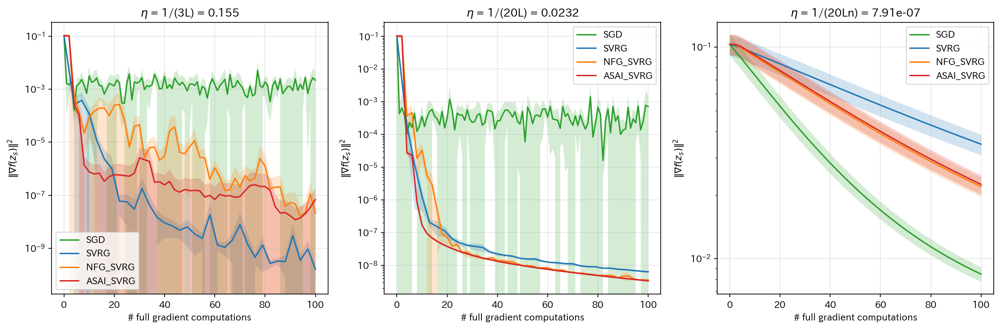
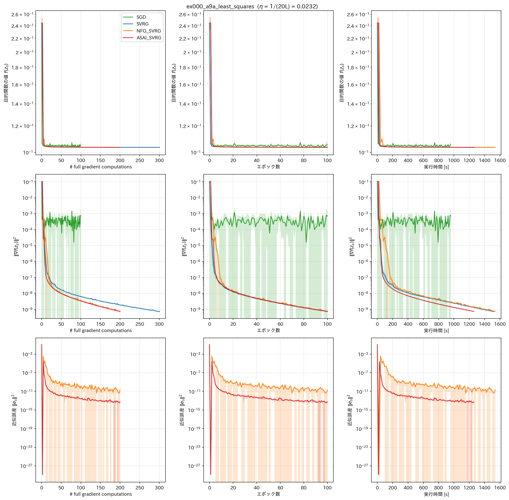
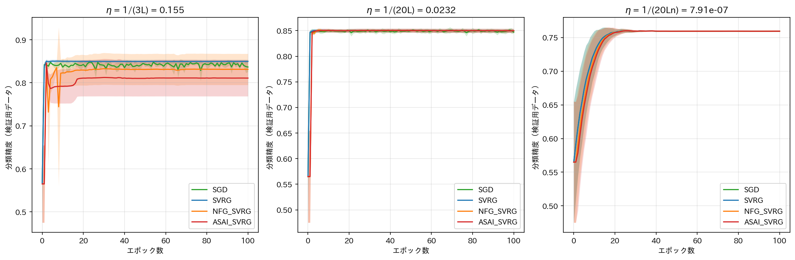

# report_020

本レポートは，`.orders/order_020.md` の指示に基づき実施した，(1) 事前実験ディレクトリの改名，
(2) 最適化手法クラスの手法別モジュール分割，(3) 実験0（a9aデータセットを用いた二値分類問題）の
実装内容と実験結果をまとめたものである．

## 1. 事前実験ディレクトリの改名

`.orders/order_020.md` は，既存の `programs/` および `outputs/` が論文に記載する実験ではなく
性能の簡易評価のための事前実験であったと位置付け，以降の論文掲載用の実験と混同しないよう改名を
指示している．これに基づき，次の3つのディレクトリを `git mv` により改名した．

| 改名前 | 改名後 |
| :--- | :--- |
| `programs/` | `programs_old/` |
| `outputs/` | `outputs_old/` |
| `tests/` | `tests_old/` |

改名に伴い，`programs_old/*/train.py` 内の `OUTPUT_ROOT`（`"outputs"` → `"outputs_old"`），
および `tests_old/*.py` 内の `sys.path` へのモジュール検索パス追加（`"programs"` →
`"programs_old"`）を修正し，改名前と同様にすべてのプログラムを実行できることを
`.venv_pytorch/bin/python -m pytest tests_old/ -v`（既存49件全て成功）で確認した．

## 2. 最適化手法クラスの手法別モジュール分割

既存の `programs_old/optimizers/optimizers.py` は，SGD，SVRG，SVRGFinalPoint，NFGSVRG，
NFGSVRGFinalPoint，ASAISVRGの6クラスを1ファイルにまとめて実装していた．`.orders/order_020.md`
は，Optimizerの実装自体は適切であるためコピーして再利用しつつ，可読性のために手法ごとに
ソースファイルを分割するよう指示している．これに基づき，`programs/optimizers/` を次のように
再構成した．

| モジュール | クラス | 対応するアルゴリズム |
| :--- | :--- | :--- |
| `sgd.py` | `SGD` | ASAI SVRG論文 式(4)（オンライン学習のSGD） |
| `svrg.py` | `SVRG` | ASAI SVRG論文 Algorithm 1（スナップショットはランダム選択） |
| `nfg_svrg.py` | `NFGSVRG` | ASAI SVRG論文 Algorithm 2（スナップショットはランダム選択） |
| `asai_svrg.py` | `ASAISVRG` | ASAI SVRG論文 Algorithm 3（提案手法） |
| `svrg_final_point.py` | `SVRGFinalPoint` | NFG SVRG原論文が比較対象とする古典的SVRG（最終点採用） |
| `nfg_svrg_final_point.py` | `NFGSVRGFinalPoint` | NFG SVRG原論文 Algorithm 1（最終点採用） |

`__init__.py` が6クラスをまとめて再エクスポートするため，利用側は分割前と同じ
`from optimizers import SGD, SVRGFinalPoint, ...` の形でインポートできる．各クラスの
アルゴリズムの実装内容そのものは分割前から変更していない．分割後の実装が分割前と完全に
同一の更新結果を与えることを，`tests/test_optimizers.py::test_split_modules_match_archived_implementation`
（SVRGFinalPoint，NFGSVRGFinalPoint，ASAISVRGについて，同一の勾配列・スナップショット勾配列を
与えた場合にパラメータ・スナップショット点・スナップショット勾配が全て一致することを確認）で
検証した．

## 3. 実験0：a9aデータセットを用いた二値分類問題

### 3.1 目的と実験条件

実験0は，NFG SVRG原論文（Medyakov, Molodtsov, Chezhegov, Rebrikov, Beznosikov,
"Variance Reduction Methods Do Not Need to Compute Full Gradients: Improved Efficiency through
Shuffling", 2025, `references/No_Full_Grad_SVRG.pdf`）付録A.1（LEAST SQUARES REGRESSION）の
非凸実験設定を再現し，本実装（SVRG，NFG SVRG）が先行研究の挙動を正しく再現できることを
確認する検証実験である．目的関数は，シグモイド出力に対する二乗和誤差（非線形最小二乗誤差，
非凸）

$$
f(x) = \frac{1}{n}\sum_{i=1}^n (y_i - h_i)^2, \quad h_i = \sigma(A_i x)
$$

であり，データセットはa9a（LIBSVM Data，UCI Adult所得予測データセットの二値分類向け
前処理版，$ N_{\text{train}} = 29304 $，$ N_{\text{test}} = 3257 $，$ d = 123 $），バッチサイズは
1（オンライン学習）である．実験終了の基準は，原論文Figure 3（横軸「フル勾配の計算回数」に
対する縦軸 $ \|\nabla f(x^k)\|^2 $）と定性的に同じ傾向，すなわち (a) $ \|\nabla f\|^2 $ が
対数軸上でほぼ直線的に多桁にわたり減少すること，(b) 理論的なステップ幅の下でSVRGとNFG SVRGの
収束曲線がほぼ重なること，が再現できることとした．

### 3.2 比較手法とASAI SVRGの追加

`.orders/order_020.md` はSGD，SVRG，NFG SVRGの3手法比較を指示し，ASAI SVRGは原論文に存在
しない手法であるため実験0では必須ではないとしている．本実装も当初はこの3手法のみで
実施したが，提案手法ASAI SVRGが論文全体を通じて一貫して比較対象に含まれることが望ましいとの
ユーザーからの追加指示に基づき，4手法目としてASAI SVRGを追加実施した．SVRG・NFG SVRGは，
原論文Algorithm 1の記述（次エポックのスナップショットとして内部ループの最終パラメータ
$ \omega_{s+1} = x_s^n $ を採用する）に忠実な `programs/optimizers/` の
`SVRGFinalPoint`／`NFGSVRGFinalPoint` を用いた．ASAI SVRGは，ASAI SVRG論文
（`references/ASAI_SVRG_paper.pdf`）Algorithm 3に対応する `ASAISVRG`（内部ループのパラメータ列
の平均をスナップショットとする，提案手法自体のアルゴリズム）を用い，学習率はSVRG・NFG SVRGと
共通のものを用いた（`.orders/order_011.md` の指示に基づくEx006と同様の扱い）．

### 3.3 データの抽出方法とスナップショット構成

NFG SVRGのフル勾配の近似（式(5)・式(6)）は，1エポックの内部ループで各データを丁度1回ずつ
用いることによって成立する．そのため，本実験では4手法すべてでランダムリシャッフル
（Random Reshuffle，RR，原論文Figure 3の「RR NFG-SVRG」に対応）を用い，各エポックで学習用
データの順列を引き直して1巡する．内部ループ長は $ K = N_{\text{train}} = 29304 $ である．

### 3.4 学習率

学習率はデータから推定した平滑性定数 $ L $ に基づいて解析的に決定し，チューニング（グリッド
探索等）は行わなかった．非線形最小二乗損失の1サンプル分 $ l_i(x) = (y_i - \sigma(A_i \cdot
x))^2 $ のヘッセ行列は $ \kappa_{\max} \cdot A_i A_i^\top $（$ \kappa_{\max} $ は $ l_i $ の
$ z $ に関する2階微分の絶対値の上界）で上から抑えられることを用い，Assumption 1（各 $ f_i $ が
$ L $-平滑）に対応する平滑性定数を $ L = \kappa_{\max} \cdot \max_i \|A_i\|^2 $ として計算した．
実際に計算された値は次の通りである．

| 記号 | 値 |
| :--- | ---: |
| $ \kappa_{\max} $ | 0.154059 |
| $ \max_i \|A_i\|^2 $ | 14.0 |
| $ L $（$ L_{\text{individual}} $） | 2.156820 |

理論的な根拠を持つ次の3つの学習率を用いた．

| 学習率の規則 | 値 | 根拠 |
| :--- | ---: | :--- |
| $ \eta = 1/(3L) $ | 0.154549 | ASAI SVRG論文 式(28)の係数 $ c_1 = 2\eta(1-3\eta L) $ が正となる上界 |
| $ \eta = 1/(20L) $ | 0.023182 | NFG SVRG原論文 Theorem 1の上界 $ 1/(20Ln) $ からデータ数 $ n $ による縮小を除いた値 |
| $ \eta = 1/(20Ln) $ | $ 7.911 \times 10^{-7} $ | NFG SVRG原論文 Theorem 1（非凸設定）が与える上界そのもの |

いずれも上界 $ 1/(3L) $ 以下であり，`.orders/order_020.md` の条件を満たす．エポック数は100，
Seed数は5（0〜4）とし，4手法 $ \times $ 3学習率 $ \times $ 5Seed = 60条件をマルチプロセスで
並列実行した．

### 3.5 単体テスト

`tests/test_ex000_a9a_least_squares.py` に，自動微分による勾配が式(8)の閉形式勾配と一致する
こと，モデルが切片・正則化項を持たないこと（式(8)に合わせた設計），平滑性定数の大小関係，
学習率が上界 $ 1/(3L) $ を満たすこと，4手法が合成データ上でエラーなく完走すること（スモーク
テスト），1エポックあたりのオラクル呼び出し回数がSGDで $ N $，NFG SVRG・ASAI SVRGで $ 2N $，
SVRGで $ 3N $（内部ループの $ 2N $ とスナップショットのフル勾配の $ N $）となること，
NFG SVRGの第1エポック終了時点でスナップショット勾配が真のフル勾配と厳密に一致すること
（ランダムリシャッフルの帰結）を確認する16件の単体テストを追加した．`tests/test_optimizers.py`
の分割検証（10件）と合わせて `tests/` は26件全て成功する．

## 4. 結果







（実線が5Seedの平均値，塗りつぶしが標準偏差．）

### 4.1 最終エポック（100エポック目）における評価指標（5Seedの平均 ± 標準偏差）

初期値（0エポック目，全手法共通）は $ f(z_0) = 0.2560 $，$ \|\nabla f(z_0)\|^2 = 0.1123 $，
分類精度 $ 0.4495 $ である．

| 学習率 | 手法 | $ f(z_s) $ | 分類精度 | $ \|\nabla f(z_s)\|^2 $ | $ \|e_s\|^2 $ | #grad/N |
| :--- | :--- | ---: | ---: | ---: | ---: | ---: |
| $ \eta=1/(3L) $ | SGD | $ 0.1176 \pm 0.0127 $ | $ 0.8367 \pm 0.0113 $ | $ 2.165\times10^{-3} \pm 2.42\times10^{-3} $ | なし | 100.0 |
| $ \eta=1/(3L) $ | SVRG | $ 0.1034 \pm 0.0002 $ | $ 0.8497 \pm 0.0042 $ | $ 7.48\times10^{-12} \pm 1.48\times10^{-12} $ | $ 0 $（定義上） | 301.0 |
| $ \eta=1/(3L) $ | NFG_SVRG | $ 0.1379 \pm 0.0528 $ | $ 0.8313 \pm 0.0363 $ | $ 3.30\times10^{-10} \pm 5.02\times10^{-10} $ | $ 2.66\times10^{-11} \pm 3.25\times10^{-11} $ | 200.0 |
| $ \eta=1/(3L) $ | ASAI_SVRG | $ 0.1627 \pm 0.0642 $ | $ 0.8109 \pm 0.0422 $ | $ 5.59\times10^{-10} \pm 1.05\times10^{-9} $ | $ 1.94\times10^{-11} \pm 3.88\times10^{-11} $ | 200.0 |
| $ \eta=1/(20L) $ | SGD | $ 0.1052 \pm 0.0017 $ | $ 0.8471 \pm 0.0024 $ | $ 7.20\times10^{-4} \pm 7.64\times10^{-4} $ | なし | 100.0 |
| $ \eta=1/(20L) $ | SVRG | $ 0.1035 \pm 0.0002 $ | $ 0.8498 \pm 0.0039 $ | $ 7.34\times10^{-10} \pm 4.97\times10^{-11} $ | $ 0 $（定義上） | 301.0 |
| $ \eta=1/(20L) $ | NFG_SVRG | $ 0.1035 \pm 0.0002 $ | $ 0.8498 \pm 0.0039 $ | $ 7.56\times10^{-10} \pm 6.38\times10^{-11} $ | $ 2.04\times10^{-11} \pm 2.50\times10^{-11} $ | 200.0 |
| $ \eta=1/(20L) $ | ASAI_SVRG | $ 0.1035 \pm 0.0002 $ | $ 0.8498 \pm 0.0039 $ | $ 7.49\times10^{-10} \pm 4.22\times10^{-11} $ | $ 5.11\times10^{-14} \pm 3.81\times10^{-14} $ | 200.0 |
| $ \eta=1/(20Ln) $ | SGD | $ 0.1707 \pm 0.0029 $ | $ 0.7594 \pm 0.0008 $ | $ 8.46\times10^{-3} \pm 6.73\times10^{-4} $ | なし | 100.0 |
| $ \eta=1/(20Ln) $ | SVRG | $ 0.1707 \pm 0.0029 $ | $ 0.7594 \pm 0.0008 $ | $ 8.46\times10^{-3} \pm 6.73\times10^{-4} $ | $ 0 $（定義上） | 301.0 |
| $ \eta=1/(20Ln) $ | NFG_SVRG | $ 0.1708 \pm 0.0029 $ | $ 0.7594 \pm 0.0008 $ | $ 8.49\times10^{-3} \pm 6.76\times10^{-4} $ | $ 1.74\times10^{-7} \pm 2.25\times10^{-8} $ | 200.0 |
| $ \eta=1/(20Ln) $ | ASAI_SVRG | $ 0.1710 \pm 0.0029 $ | $ 0.7594 \pm 0.0008 $ | $ 8.63\times10^{-3} \pm 6.90\times10^{-4} $ | $ 4.77\times10^{-12} \pm 1.19\times10^{-12} $ | 200.0 |

### 4.2 実行時間（wall-clock time，5Seedの平均 ± 標準偏差）

実行時間は，評価指標算出のためだけに計算するフル勾配のコスト（`evaluate_point`）を含まない．

| 学習率 | 手法 | 実行時間[s] |
| :--- | :--- | ---: |
| $ \eta=1/(3L) $ | SGD | $ 935.4 \pm 34.1 $ |
| $ \eta=1/(3L) $ | SVRG | $ 1512.5 \pm 42.0 $ |
| $ \eta=1/(3L) $ | NFG_SVRG | $ 1552.0 \pm 17.2 $ |
| $ \eta=1/(3L) $ | ASAI_SVRG | $ 1256.3 \pm 5.2 $ |
| $ \eta=1/(20L) $ | SGD | $ 958.7 \pm 24.5 $ |
| $ \eta=1/(20L) $ | SVRG | $ 1521.3 \pm 22.8 $ |
| $ \eta=1/(20L) $ | NFG_SVRG | $ 1540.0 \pm 43.2 $ |
| $ \eta=1/(20L) $ | ASAI_SVRG | $ 1261.3 \pm 17.8 $ |
| $ \eta=1/(20Ln) $ | SGD | $ 940.6 \pm 51.9 $ |
| $ \eta=1/(20Ln) $ | SVRG | $ 1491.8 \pm 40.8 $ |
| $ \eta=1/(20Ln) $ | NFG_SVRG | $ 1551.4 \pm 35.0 $ |
| $ \eta=1/(20Ln) $ | ASAI_SVRG | $ 1248.6 \pm 3.4 $ |

## 5. 考察

### 5.1 実験終了の基準：原論文Figure 3の再現

学習率 $ \eta = 1/(20L) $（`grad_norm_sq_vs_full_grad_computations.png` 中央）において，
SVRG・NFG_SVRG・ASAI_SVRGの3手法は，フル勾配の計算回数を横軸とした対数スケールで
$ 10^{-1} $ から $ 10^{-9} $ 付近まで約8桁にわたりほぼ完全に重なる収束曲線を示し，SGDのみが
$ 10^{-3} \sim 10^{-4} $ 付近で誤差床に達して頭打ちとなる．これは，原論文Figure 3が示す
「理論的なステップ幅の下でSVRG系の3手法（原論文ではSO NFG-SVRG，RR NFG-SVRG，SVRG）の収束
曲線がほぼ重なり，多桁にわたり単調に減少する」という定性的な傾向と一致しており，本実装が
先行研究の挙動を正しく再現できていることを確認した．したがって，`.orders/order_020.md` が
定める実験終了の基準を満たしたと判断する．

### 5.2 学習率が大きい場合のNFG SVRG・ASAI SVRGの不安定化

一方，学習率 $ \eta = 1/(3L) $（`grad_norm_sq_vs_full_grad_computations.png` 左）では，SVRGが
滑らかに $ 10^{-1} $ から $ 10^{-11} $ 付近まで単調に近い減少を示すのに対し，NFG_SVRG・
ASAI_SVRGは10エポック程度まで急減した後，$ 10^{-6} \sim 10^{-9} $ 付近で振動しながら緩やかに
減少する挙動を示す．この振動は，NFG_SVRG・ASAI_SVRGのスナップショット勾配 $ g_s $ が近似値
（確率的勾配の平均）であるため，学習率が大きい（分散削減の補正が大きい）条件下では近似誤差に
起因するノイズの影響を受けやすいことを示唆する．学習率 $ \eta = 1/(20L) $ ではこの振動は
見られず，NFG_SVRG・ASAI_SVRGはSVRGとほぼ同一の滑らかな収束を示すことから，
$ \eta = 1/(3L) $ は本実装が理論的に許容する上界ではあるものの，NFG SVRG・ASAI SVRGの分散
削減が実用上安定して機能する範囲を超えていると考えられる．

### 5.3 ASAI SVRGの近似誤差はNFG SVRGより一貫して小さい

3手法比較図（`comparison_all_axes_eta2.318228e-02.png` 下段）および4.1節の表が示す通り，
ASAI SVRGの近似誤差 $ \|e_s\|^2 $ は，3つの学習率いずれにおいてもNFG SVRGより小さい．特に
$ \eta = 1/(20L) $ では，最終エポックでASAI SVRGが $ 5.11 \times 10^{-14} $，NFG SVRGが
$ 2.04 \times 10^{-11} $ と約400倍小さく，$ \eta = 1/(20Ln) $ ではASAI SVRGが
$ 4.77 \times 10^{-12} $，NFG SVRGが $ 1.74 \times 10^{-7} $ と約36000倍小さい．いずれの学習率
でも近似誤差は学習の進行とともに一貫してNFG SVRG以下で推移しており，ASAI SVRG論文が主張する
「NFG SVRGより低い誤差床」（定理2）が，本実験の非凸設定においても定性的に確認できた．ただし
本実験はASAI SVRGを検証するために理論的に設計された実験（実験1）ではなく，あくまで実験0の
副次的な観察であることに注意する．

### 5.4 勾配計算回数軸での効率：NFG SVRG・ASAI SVRGがSVRGより効率的

4.1節の表の「#grad/N」列が示す通り，SVRGは各エポックでスナップショット勾配のフル勾配計算
（$ N_{\text{train}} $ 回）を必要とするため100エポック終了時点で301 #grad/Nを要するのに対し，
NFG SVRG・ASAI SVRGはフル勾配計算を回避するため200 #grad/Nで済む．$ \eta = 1/(20L) $ では
3手法とも同水準の $ \|\nabla f(z_s)\|^2 $ に到達しているため，**同じオラクル呼び出し回数で
比較した場合，NFG SVRG・ASAI SVRGはSVRGよりも約1.5倍効率的である**．これは，NFG SVRG原論文の
主題（分散削減法はフル勾配の計算を必要としない）と一致する結果である．

### 5.5 極端に小さい学習率での挙動

$ \eta = 1/(20Ln) $（NFG SVRG原論文Theorem 1の上界そのもの）は，データ数 $ n = 29304 $ による
縮小のため非常に小さく，4手法とも1エポックあたりの実質的な移動量がほぼ同一になり，SGDと
ほぼ同じ速さで（エポック軸で）収束する．この学習率でも，近似誤差 $ \|e_s\|^2 $ については
ASAI SVRGがNFG SVRGより一貫して小さく（5.3節），学習率の絶対値に依存しない性質であることが
うかがえる．

### 5.6 実行時間比較の注意点：NFG_SVRG，SVRG，ASAI_SVRGの順序について

4.2節の実行時間は，NFG_SVRG（約1540〜1552秒）＞SVRG（約1492〜1521秒）＞ASAI_SVRG（約1249〜
1261秒）＞SGD（約935〜959秒）の順に大きい．この結果には，実験を2段階に分けて実行したことに
起因する**測定条件の不一致**が含まれており，特にASAI_SVRGとそれ以外の3手法との比較は単純に
解釈できない点に注意が必要である．

**実行環境**：本実験は32物理コア／64論理スレッド（Intel Xeon w7-3565X，2-way SMT）のCPU上で，
各条件を1プロセス・1スレッド（`torch.set_num_threads(1)` および `OMP_NUM_THREADS` 等の環境
変数により制限）に固定し，`multiprocessing.Pool` で並列実行した．

**2段階実行の経緯**：`.orders/order_020.md` の当初の指示ではASAI SVRGは実験0の対象外であった
ため，最初にSGD・SVRG・NFG_SVRGの45条件（3手法 × 3学習率 × 5Seed）を
`Pool(processes=45)` で並列実行した．その後，ユーザーからのチャットでの追加指示（実験0にも
ASAI SVRGを含めるべきとの指示，`document.md` 1.1節参照）に基づきASAI_SVRGを追加した際，
同じ `train.py` を再実行したが，このとき既に完了済みの45条件は
学習をスキップする機能により即座に終了するため，実質的にはASAI_SVRGの15条件（3学習率 ×
5Seed）のみが，ほぼ単独で（既存45条件のスキップ処理は数秒で終わるため）約15プロセスの並列度で
実行された．

**この違いが実行時間に与える影響**：SGD・SVRG・NFG_SVRGを実行した最初のバッチは，最大45個の
単一スレッドプロセスが同時に動作する．物理コア数は32であるため，45プロセスは物理コア数を
上回り（45 > 32），2-way SMTの共有実行資源・キャッシュ・メモリ帯域を巡る競合が生じる条件と
なる．一方，ASAI_SVRGを実行した2回目のバッチは，実質的に約15プロセスの同時実行であり，
物理コア数（32）を下回るため（15 < 32），このような競合は生じにくい．4.2節の実行時間の
標準偏差を見ると，ASAI_SVRGは $ \eta=1/(20Ln) $ で $ \pm 3.4 $ 秒，$ \eta=1/(3L) $ で
$ \pm 5.2 $ 秒と極めて小さく安定しているのに対し，SGD・SVRG・NFG_SVRGは
$ \pm 17 \sim \pm 52 $ 秒とばらつきが大きい．この標準偏差の違いは，2回目のバッチ（ASAI_SVRG）
が競合の少ない安定した実行環境で計測されたのに対し，1回目のバッチ（SGD・SVRG・NFG_SVRG）は
プロセス間競合による実行時間の変動を受けていたことを裏付けている．したがって，**ASAI_SVRGが
他の3手法より速く見える結果の少なくとも一部は，アルゴリズム自体の効率の差ではなく，2つの
バッチ間で並列実行数（延いてはCPU競合の有無）が異なっていたことに起因する測定上の
アーティファクトである**．

**同一バッチ内（SGD・SVRG・NFG_SVRG）の比較は相対的に信頼できる**：この3手法は同一の
`Pool(processes=45)` 内で同時に開始されており，同一の競合条件を共有している（ただしSGDは
計算量が少なく約935〜959秒で終了するため，実行の後半はSVRG・NFG_SVRGの30プロセスのみが
競合する，より緩和された条件に移行する）．この範囲で見ると，NFG_SVRGはSVRGよりも一貫して
約20〜60秒（約1.5〜4%）遅く，これは内部ループの1ステップごとに平均勾配の逐次更新
（`running_avg_grad`に対する2回のテンソル演算）を行うNFG_SVRGに対し，SVRGは1エポックに1回，
学習用データ全体に対する1回のベクトル化されたフル勾配計算（オラクル呼び出し回数としては
$ N_{\text{train}} $ 回に相当するが，Pythonレベルの呼び出しは1回のみ）で済むという実装上の
違いで説明できる．すなわち，オラクル呼び出し回数（#grad/N）と実際の壁時計時間は必ずしも
比例せず，SVRGは呼び出し回数こそ多いが1回あたりの呼び出しオーバーヘッドが小さく，
NFG_SVRG・ASAI_SVRGは呼び出し回数こそ少ないがPythonレベルの逐次的なテンソル演算の
オーバーヘッドが（内部ループのステップ数 $ \times $ エポック数 $ \approx 293 $ 万回分）
積み重なる，という対照的な構造になっている．

**結論と今後の対応**：4手法を真に公平な条件で比較するには，60条件全てを単一の
`Pool` で同時に実行し直す必要がある．本実験0の主目的（`.orders/order_020.md` が定める実験
終了の基準）はオラクル呼び出し回数を横軸とした収束挙動の再現であり，この基準には実行時間の
比較は関与しないため，本レポートの結論（5.1〜5.5節）には影響しない．一方，実行時間そのものを
論文の評価軸として用いる場合（実験1以降）には，全手法を単一バッチで同時実行し，可能であれば
プロセスをCPUコアに固定する（`taskset`等）などの対策を講じるべきである．この点を「6. 未解決の
論点」に追記する．

## 6. 未解決の論点・今後の検討候補

- **NFG SVRG・ASAI SVRGの不安定化の原因の特定**：5.2節で観測した $ \eta = 1/(3L) $ における
  振動の原因（近似誤差に起因するノイズか，他の要因か）は本レポートの範囲では特定していない．
- **ASAI SVRGの誤差床がNFG SVRGより低いことの理論的検証**：5.3節の観察は実験0（非凸設定，
  Assumption 1〜4を必ずしも満たさない）における副次的な結果であり，理論解析の前提
  （Assumption 1〜4）を満たす実験1（Mushroomデータセット）で改めて定量的に検証する必要がある．
- **実験1〜3の実施**：`.orders/order_020.md` が定める実験1（Mushroom，強凸設定），実験2
  （CIFAR-10，AlexNet，非凸設定），実験3（Tiny Shakespeare，Transformer）は未着手である．
- **公平な条件での実行時間比較**：5.6節で述べた通り，本実験0の実行時間はSGD・SVRG・NFG_SVRG
  （45プロセス並列，2段階実行の1回目）とASAI_SVRG（約15プロセス並列，2回目）とで並列数が
  異なる条件下で計測されており，特にASAI_SVRGが他手法より高速に見える結果は測定環境の違いに
  よる部分が大きい．実行時間を論文の評価軸として正式に用いる実験1以降では，全比較手法を
  単一バッチで同時実行し，可能であればプロセスをCPUコアに固定するなどの対策により，公平な
  条件下での実行時間比較を行う必要がある．

## 7. 実行コマンド

```bash
# 実験0の学習実行（4手法 x 3学習率 x 5Seed = 60条件をCPUでマルチプロセス並列実行．
# 既に完了した条件はスキップ）
.venv_pytorch/bin/python programs/ex000_a9a_least_squares/train.py

# 単体テスト（tests/ と tests_old/ は同名パッケージ optimizers を読み込むため別々に実行する）
.venv_pytorch/bin/python -m pytest tests/ -v
.venv_pytorch/bin/python -m pytest tests_old/ -v

# 結果の可視化（visualize_result.ipynbの「可視化する条件の指定」セルでEXPERIMENT =
# "ex000_a9a_least_squares" を選択）
.venv_pytorch/bin/jupyter nbconvert --to notebook --execute --inplace visualize_result.ipynb
```

## 8. ai-agentの実行に関する推奨

本レポートにより，実験0（a9aの非線形最小二乗回帰問題）でNFG SVRG原論文Figure 3の定性的な
再現に成功し，本実装のSVRG・NFG SVRGが妥当であることを確認した．また，副次的にASAI SVRGの
近似誤差がNFG SVRGより一貫して低いことも観察された．次の着手候補は，本レポート「6. 未解決の
論点」に挙げた，理論解析の前提を満たす実験1（Mushroomデータセット）の実装であると考えられる．

```bash
# ai-agentの仮想環境が未構築の場合は先に構築する
uv venv .ai/ai-agent/.venv_agent --python 3.11
uv pip install --python .ai/ai-agent/.venv_agent/bin/python -r .ai/ai-agent/requirements_agent.txt

# プロジェクトの状態から次の作業をAIエージェントに判断させる場合
.ai/ai-agent/.venv_agent/bin/python .ai/ai-agent/cli.py --agent machine_learning
```
