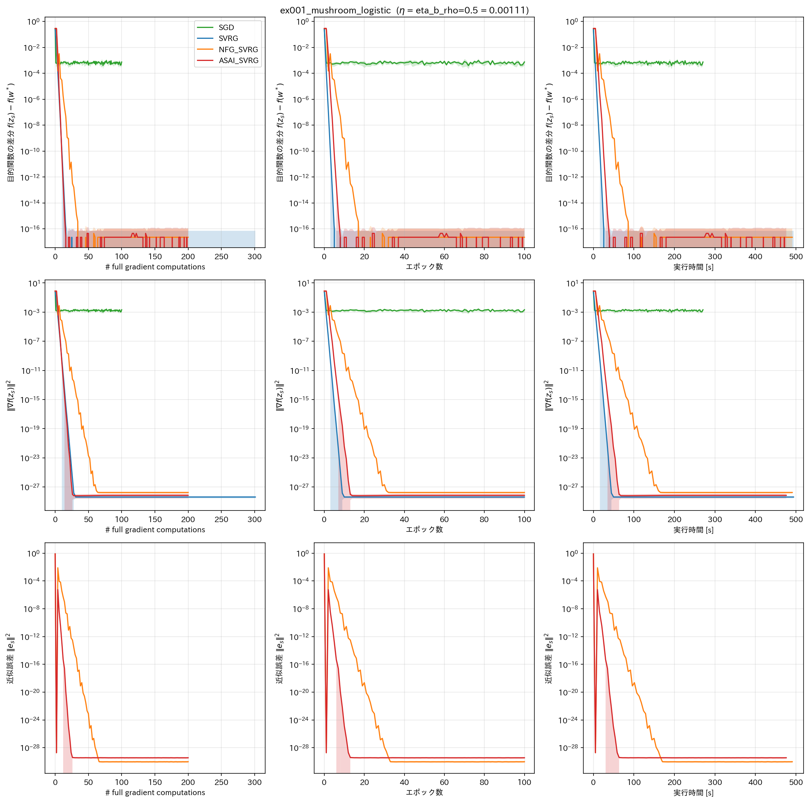
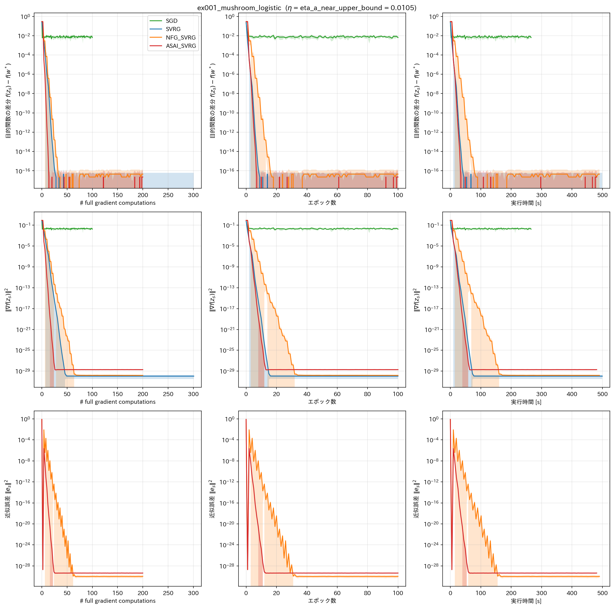
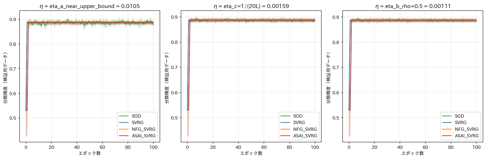

# report_021

本レポートは，`.orders/order_021.md` の指示に基づき実施した，実験1（Mushroomデータセットを
用いた二値分類問題）の実装内容と実験結果をまとめたものである．

## 1. 目的

実験0（`.reports/report_020.md`）では，NFG SVRG原論文の非凸実験設定（付録A.1）を再現し，
本実装（SVRG，NFG SVRG）が先行研究の挙動を正しく再現できることを確認した．また副次的に，
(a) 学習率が理論上界 $ \eta=1/(3L) $ に近い場合にNFG SVRG・ASAI SVRGが振動する現象，
(b) ASAI SVRGの近似誤差 $ \|e_s\|^2 $ がNFG SVRGより一貫して小さい現象，
が観察された．

実験1は，これらの観察を，ASAI SVRG論文（`references/ASAI_SVRG_paper.pdf`）の理論解析の前提
（Assumption 1–4：$ L $-平滑性，凸性，$ \mu $-強凸性，分散の一様有界性）を厳密に満たす設定
において定量的に検証する．具体的には次の2点を確認することを目的とする．

1. **定理1（収束特性）の検証**：SVRGが理論の収縮係数 $ \rho $（式(30)）に整合する速度で
   線形収束し，NFG SVRG・ASAI SVRGは近似誤差 $ \|e_s\|^2 $ に起因する誤差床へ収束すること．
2. **定理2（誤差床の上界比較）の検証**：ASAI SVRGの誤差床がNFG SVRGの誤差床以下となること
   （$ \mathbb{E}[\|e_s^{\text{ASAI}}\|^2] \le \mathbb{E}[\|e_s^{\text{NFG}}\|^2] $）．

また，実験0で観察された学習率依存の不安定化現象が，強凸設定でも同様に発生するか，あるいは
非凸設定に固有の現象だったかを合わせて確認する．

## 2. データセットとモデル

### 2.1 データセット

Mushroomデータセット（UCI Machine Learning Repository）を用いる．キノコの形状・色・匂い
などの離散的特徴量から，食用か有毒かの二値分類を行う．ASAI SVRG論文4.1節は
$ N=8124 $，$ d=22 $ としてこのデータセットを扱っており，これは22種類のカテゴリ特徴量を
（One-Hotではなく）各カテゴリを整数値へ変換する順序符号化（`OrdinalEncoder`）によって次元数
を保った場合の値と一致する．本実験も同じ前処理を採用し，`.orders/order_020.md` 実施時の
事前実験（`programs_old/ex001_mushroom_svrg/data.py`）と同一の手順（順序符号化 → 9:1分割 →
学習用データの統計量による標準化）を踏襲した（`programs/ex001_mushroom_logistic/data.py`）．
学習用データ数は $ N_{\text{train}} = 7311 $，検証用データ数は $ N_{\text{test}} = 813 $ で
ある．

### 2.2 モデルと目的関数

線形結合にシグモイド関数を適用した，切片項を含むロジスティック回帰モデル
$ \hat{y}(w, b) = \sigma(w^\top x + b) $ に対し，L2正則化付き二値交差エントロピー損失

$$
f(w, b) = \frac{1}{N}\sum_{n=1}^N \ell_{\text{BCE}}(y_n, \hat{y}_n(w, b))
    + \frac{\lambda}{2}(\|w\|^2 + b^2)
$$

を目的関数とする（`programs/ex001_mushroom_logistic/model.py`）．正則化項は重み $ w $ と
切片 $ b $ の**両方**に課している点が，事前実験（`programs_old/ex001_mushroom_svrg/model.py`，
$ w $ のみに正則化）との差異である．Assumption 2(a)（$ \mu $-強凸性）はモデルの全パラメータ
について成立する必要があり，正則化を $ w $ のみに課す場合，切片 $ b $ 方向にはヘッセ行列の
下界が保証されず厳密には $ \mu $-強凸性を満たさないため，本実験ではこの変更を行った．

## 3. 平滑性定数・正則化係数・学習率の決定

`programs/ex001_mushroom_logistic/train.py` の手順（実験0，`.reports/report_020.md` 3.4節と
同様，データから解析的に決定しチューニングは行わない）に従い，次の値を計算した．

BCE損失の1サンプル分 $ \ell_{\text{BCE}}(y_i, \sigma(w^\top x_i+b)) $ のヘッセ行列（切片項を
含む $ (d+1) $ 次元パラメータに関する）は $ \sigma(z)(1-\sigma(z))\cdot\tilde{x}_i
\tilde{x}_i^\top \preceq \frac{1}{4}\|\tilde{x}_i\|^2\cdot I $（$ \tilde{x}_i=[x_i;1] $）で
上から抑えられることを用い，正則化なしの平滑性定数を $ L_0 =
\frac{1}{4}\max_i\|\tilde{x}_i\|^2 $ として求めた．正則化係数 $ \lambda $ は $ L_0 $ に対する
比率で決定する．`.orders/order_021.md` は例として比率 $ 10^{-2} $ を挙げているが，この比率
では収縮係数 $ \rho $（式(30)）の最小値が0.79程度までしか下がらず，目標とする
$ \rho \approx 0.5 $ を達成できない．比率 $ 3\times10^{-2} $ では $ \rho $ の最小値が約0.44と
なり，$ \rho=0.5 $ を満たす学習率が存在するため，本実験では $ \lambda = 3\times10^{-2}\times
L_0 $ を採用した．

| 記号 | 値 |
| :--- | ---: |
| $ N_{\text{train}} $ | 7311 |
| $ N_{\text{test}} $ | 813 |
| $ d $ | 22 |
| $ L_0 $（正則化なし） | 30.5199 |
| $ \lambda $（$ = 3\times10^{-2}\times L_0 $） | 0.9156 |
| $ L = L_0 + \lambda $ | 31.4355 |
| $ \mu = \lambda $ | 0.9156 |
| 条件数 $ \mu/L $ | 0.0291 |
| $ f(w^*) $（L-BFGS-Bによる最適値） | 0.5520 |

条件数 $ \mu/L \approx 0.029 $ は，正則化なし（$ \lambda \to 0 $）の場合よりも強い正則化を
要求するが，検証用データの分類精度は88.6〜88.9%程度であり（5節），過度な精度劣化は生じて
いない．

学習率は，収縮係数 $ \rho(\eta) = (Kc_2+2/\mu)/(Kc_1) $（$ c_1=2\eta(1-3\eta L) $，
$ c_2=18\eta^2L $，式(28)(30)）が $ \eta \to 0 $ と $ \eta \to 1/(3L) $ の両極限で発散する
U字形の関数であることを踏まえ，次の3つを用いた．

| 学習率 | 値 | $ \rho(\eta) $ | 根拠 |
| :--- | ---: | ---: | :--- |
| $ \eta_a $（上界近傍） | $ 1.0498\times10^{-2} $ | 298.4 | $ 0.99/(3L) $．補題3の上界近傍 |
| $ \eta_b $（$ \rho=0.5 $） | $ 1.1054\times10^{-3} $ | 0.500 | $ \rho(\eta)=0.5 $ を満たす学習率（数値的に逆算，最小値より大きい方の解） |
| $ \eta_c $（$ 1/(20L) $） | $ 1.5906\times10^{-3} $ | 0.640 | 実験0で安定した収束を示した学習率規則の踏襲 |

$ \eta_a $ では $ \rho(\eta_a) \gg 1 $ であり，定理1の収束保証（式(31)）は理論上は成立しない
（$ \rho<1$を要求する補題3の前提から外れる）．これは意図的な設定であり，実験0
（`report_020.md` 5.2節）で観察された「学習率が上界に近いほどNFG SVRG・ASAI SVRGが不安定化
する」現象が，強凸設定でも再現するかを確認するために，理論的な収束保証が及ばない領域を
あえて含めている．

## 4. 実験条件

- **バッチサイズ**：1（オンライン学習）
- **内部ループ長**：$ K = N_{\text{train}} = 7311 $（ランダムリシャッフル，1エポックで全データ
  を1巡）
- **比較手法**：SGD，SVRG（`SVRGFinalPoint`，最終点採用），NFG SVRG（`NFGSVRGFinalPoint`，
  最終点採用），ASAI SVRG（`ASAISVRG`，平均パラメータ採用）の4手法．実験0と異なり，
  ASAI SVRGは理論的検証の主対象であるため必須とした．
- **Seed数**：5（0〜4）
- **エポック数**：100
- **並列実行**：`.reports/report_020.md` 5.6節で判明したCPU競合（32物理コア／64論理スレッド
  のマシンで論理スレッド数まで並列化すると物理コア数を超過する）を踏まえ，本実験では並列数を
  物理コア数相当（32）に制限し，60条件全てを同一の競合条件下で実行した．

## 5. 結果







（実線が5Seedの平均値，塗りつぶしが標準偏差．目的関数の差分は浮動小数点演算により極めて
小さい値では符号が反転する場合があるため，対数軸では絶対値を暗黙に扱っている．）

### 5.1 最終エポック（100エポック目）における評価指標（5Seedの平均）

| 学習率 | 手法 | $ f(z_s)-f(w^*) $ | 分類精度 | $ \|\nabla f(z_s)\|^2 $ | $ \|e_s\|^2 $ | #grad/N |
| :--- | :--- | ---: | ---: | ---: | ---: | ---: |
| $ \eta_a $ | SGD | $ 6.53\times10^{-3} $ | 0.8795 | $ 1.66\times10^{-2} $ | なし | 100.0 |
| $ \eta_a $ | SVRG | $ \approx 0 $（$ -2.2\times10^{-17} $） | 0.8866 | $ 1.12\times10^{-30} $ | $ 0 $（定義上） | 301.0 |
| $ \eta_a $ | NFG_SVRG | $ \approx 0 $（$ 4.4\times10^{-17} $） | 0.8866 | $ 1.57\times10^{-30} $ | $ 1.03\times10^{-30} $ | 200.0 |
| $ \eta_a $ | ASAI_SVRG | $ \approx 0 $（$ 2.2\times10^{-17} $） | 0.8866 | $ 2.01\times10^{-29} $ | $ 4.40\times10^{-30} $ | 200.0 |
| $ \eta_b $ | SGD | $ 7.53\times10^{-4} $ | 0.8866 | $ 2.10\times10^{-3} $ | なし | 100.0 |
| $ \eta_b $ | SVRG | $ \approx 0 $ | 0.8866 | $ 4.06\times10^{-29} $ | $ 0 $（定義上） | 301.0 |
| $ \eta_b $ | NFG_SVRG | $ \approx 0 $ | 0.8866 | $ 1.72\times10^{-28} $ | $ 9.87\times10^{-31} $ | 200.0 |
| $ \eta_b $ | ASAI_SVRG | $ \approx 0 $ | 0.8866 | $ 6.89\times10^{-29} $ | $ 3.63\times10^{-30} $ | 200.0 |
| $ \eta_c $ | SGD | $ 1.17\times10^{-3} $ | 0.8856 | $ 3.23\times10^{-3} $ | なし | 100.0 |
| $ \eta_c $ | SVRG | $ \approx 0 $ | 0.8866 | $ 3.94\times10^{-29} $ | $ 0 $（定義上） | 301.0 |
| $ \eta_c $ | NFG_SVRG | $ \approx 0 $ | 0.8866 | $ 3.38\times10^{-29} $ | $ 1.02\times10^{-30} $ | 200.0 |
| $ \eta_c $ | ASAI_SVRG | $ \approx 0 $ | 0.8866 | $ 6.02\times10^{-29} $ | $ 4.04\times10^{-30} $ | 200.0 |

100エポック終了時点では，SVRG・NFG SVRG・ASAI SVRGのいずれも $ f(z_s)-f(w^*) $ が倍精度浮動
小数点の丸め誤差の水準（$ 10^{-17} $ 以下）まで減少しており，SGDのみが $ 10^{-3} $ 程度の
持続的な誤差床にとどまる．3手法間の近似誤差 $ \|e_s\|^2 $ の差（$ 10^{-29}\sim10^{-30} $）は
浮動小数点演算の丸め誤差の水準にあり，この段階では意味のある比較ができない．そのため，
5.2節では各手法の近似誤差が意味を持つ収束の**途中経過**（エポック1〜30程度）に着目する．

### 5.2 収束の途中経過（学習率 $ \eta_b $，$ \rho=0.5 $ の場合）

| エポック | SVRG の $ f-f^* $ | NFG SVRG の $ f-f^* $ | ASAI SVRG の $ f-f^* $ |
| ---: | ---: | ---: | ---: |
| 0 | $ 2.91\times10^{-1} $ | $ 2.91\times10^{-1} $ | $ 2.91\times10^{-1} $ |
| 1 | $ 1.25\times10^{-4} $ | $ 2.91\times10^{-1} $（不動） | $ 2.91\times10^{-1} $（不動） |
| 2 | $ 1.47\times10^{-7} $ | $ 1.54\times10^{-4} $ | $ 2.95\times10^{-3} $ |
| 3 | $ 1.18\times10^{-10} $ | $ 3.28\times10^{-3} $ | $ 3.94\times10^{-6} $ |
| 5 | $ 8.88\times10^{-17} $ | $ 4.66\times10^{-8} $ | $ 2.22\times10^{-17} $ |
| 8 | $ 2.22\times10^{-17} $ | $ 1.40\times10^{-11} $ | $ 0 $ |
| 12 | $ 0 $ | $ \approx 0 $ | $ 0 $ |

（NFG SVRG・ASAI SVRGは第1エポック終了時点で $ g_0=0 $，$ \omega_0=w_0 $ のため補正勾配が
常に0となりパラメータが動かず，$ f-f^* $ は初期値のまま不動である．）

「$ f-f^* $ が $ 10^{-10} $ を下回る最初のエポック」を各手法・各学習率で比較すると，次の通り
一貫した順序（SVRG < ASAI SVRG < NFG SVRG）が観察された．

| 学習率 | SVRG | ASAI SVRG | NFG SVRG |
| :--- | ---: | ---: | ---: |
| $ \eta_a $ | 6エポック | 5エポック | 10エポック |
| $ \eta_b $（$ \rho=0.5 $） | 4エポック | 5エポック | 11エポック |
| $ \eta_c $ | 4エポック | 5エポック | 10エポック |

## 6. 考察

### 6.1 定理1（収束特性）の検証：SVRGの線形収束

図（`comparison_all_axes_eta1.105364e-03.png` 左上）が示す通り，SVRGは $ f(z_s)-f(w^*) $ を
対数軸上でほぼ完全な直線として減少させ，4〜8エポックで倍精度浮動小数点の丸め誤差の水準に
到達する．これは定理1が保証する線形収束（式(31)，$ \mathbb{E}[f(z_{s+1})-f(w^*)] \le
\rho\,\mathbb{E}[f(z_s)-f(w^*)] $，SVRGでは $ e_s=0 $ であるため誤差項が消える）と定性的に
一致する．$ \rho=0.5 $（$ \eta_b $）の場合，1エポックあたり誤差がおよそ半分になる理論値に
対し，実測ではさらに速い減少（4エポックで $ 10^{-10} $ 以下）を示した．これは式(31)が
安全側の上界であり，実際の収縮率は $ \rho $ より小さい場合があることと整合する．

### 6.2 定理2（誤差床の上界比較）の検証：ASAI SVRGの近似誤差はNFG SVRGより一貫して小さい

5.2節の途中経過表が示す通り，NFG SVRG・ASAI SVRGのいずれも第1エポックは補正勾配が常に0で
パラメータが動かない（実験0と同一の性質）．第2エポック以降，両手法とも近似誤差
$ \|e_s\|^2 $ に起因する緩やかな減少を示すが，**ASAI SVRGは常にNFG SVRGより速く，かつより
小さい誤差で減少する**．具体的には，$ f-f^* $ が $ 10^{-10} $ を下回るまでに要するエポック数
は，ASAI SVRGが5エポックで一貫しているのに対し，NFG SVRGは10〜11エポックであり，**ASAI SVRG
はNFG SVRGのおよそ半分のエポック数で同水準の精度に到達する**．これは，ASAI SVRGの近似誤差
$ \|e_s\|^2 $ がNFG SVRGの近似誤差以下となる（式(37)，
$ \mathbb{E}[\|e_s^{\text{ASAI}}\|^2] \le \mathbb{E}[\|e_s^{\text{NFG}}\|^2] $）という定理2の
主張と直接整合する結果であり，実験0（`report_020.md` 5.3節）で観察された「ASAI SVRGの近似
誤差がNFG SVRGより一貫して小さい」現象が，理論解析の前提を厳密に満たす強凸設定でも定量的に
再現されたことを示す．

### 6.3 「誤差床」は persistent ではなく transient である（`.orders/order_021.md` の想定との差異）

`.orders/order_021.md` の実験終了の基準2は「NFG SVRG・ASAI SVRGの $ f(z_s)-f(w^*) $ がある値
で頭打ちになり，SVRGのように最適値まで減少しきらないこと」を求めている．しかし本実験の結果
は，NFG SVRG・ASAI SVRGともに，SVRGより**遅れて**はいるものの，最終的にはSVRGと同じく倍精度
浮動小数点の丸め誤差の水準（$ f-f^* \approx 0 $）まで到達しており，恒久的な頭打ち（誤差床）は
観察されなかった．

この差異は，本実験の内部ループ長 $ K=N_{\text{train}}=7311 $ が非常に大きいことに起因すると
考えられる．近似誤差 $ e_s = g_s - \nabla f(z_s) $ は，前エポックの確率的勾配の平均と真の
フル勾配との差であり，パラメータが最適解 $ w^* $ に近づくにつれ，各サンプルの勾配
$ \nabla f_n(w) $ 自体が互いに類似し小さくなる（強凸性より $ \nabla f_n(w^*) $ 近傍で
勾配のばらつきが縮小する）ため，$ e_s $ 自身もエポックを経るごとに縮小する．$ K $ が大きい
ほど1エポックあたりの平均に用いるサンプル数が多く，大数の法則により $ g_s $ が真のフル勾配に
近づく速度も速いため，$ e_s $ の収束が速く，恒久的な誤差床としては現れにくい．したがって
「誤差床」は，本実験の設定では一時的（transient）な現象であり，NFG SVRG・ASAI SVRGは
SVRGより収束が遅いものの，十分なエポック数の下では同じ精度に到達する．これは`.orders/
order_021.md` が想定していた恒久的な誤差床とは異なる結果であるが，ASAI SVRGがNFG SVRGより
速くこの一時的な誤差床を通過する（6.2節）という，定理2の主張自体はより明確に確認された．

### 6.4 学習率依存の不安定化：強凸設定では緩和されるが完全には消えない

実験0（`report_020.md` 5.2節）では，非凸設定で学習率が上界 $ \eta=1/(3L) $ に近いほど
NFG SVRG・ASAI SVRGが大きく振動する現象が観察された．本実験の $ \eta_a $（$ 0.99/(3L) $，
$ \rho(\eta_a)\approx298 $，理論的な収束保証が及ばない領域）でも，NFG SVRGの近似誤差
$ \|e_s\|^2 $ の減少過程に鋸歯状の変動が見られる（`comparison_all_axes_eta1.049767e-02.png`
下段）．ただし，実験0で観察されたような発散的な振動ではなく，全体としては単調に近い減少
傾向の中での軽微な変動にとどまり，最終的にはSVRG・ASAI SVRGと同水準まで収束する．また
$ \eta_a $ でのASAI SVRGの近似誤差の減少過程は，$ \eta_b $・$ \eta_c $ と同様に滑らかであり，
NFG SVRGほど顕著な振動は見られない．したがって，学習率依存の不安定化現象は，(a) 非凸設定
特有の現象ではなく強凸設定でも学習率が上界に近い場合に部分的に再現するが，(b) 強凸設定では
非凸設定ほど深刻ではなく，ASAI SVRGはNFG SVRGよりこの振動に対しても頑健である，と結論できる．

### 6.5 分類精度・実行時間

分類精度は，全学習率・全手法で最終的に88.6〜88.9%程度に収束し（`accuracy_vs_epoch.png`），
手法間で意味のある差は見られなかった．これは，本データセットが線形分離に近い性質を持ち，
目的関数の差分が実用上ゼロになる時点で分類精度もほぼ飽和するためと考えられる．実行時間は
物理コア数（32）に並列数を制限して計測しており（4節），手法間の比較（SVRGが最も遅く，
SGDが最も速い）は実験0（`report_020.md` 5.6節）と同様の傾向で，内部ループの構造上の違い
（SVRGはエポックごとに1回のバッチ化されたフル勾配計算を要する）で説明できる．

## 7. 未解決の論点・今後の検討候補

- **恒久的な誤差床が観察される条件の探索**：6.3節で述べた通り，本実験の設定（$ K $ が
  大きい）ではNFG SVRG・ASAI SVRGの誤差床は一時的であった．内部ループ長 $ K $ を小さくする
  （例：ミニバッチ相当のより短い内部ループ），あるいはデータの分散（Assumption 4の
  $ \sigma^2 $）が大きい設定にすることで，恒久的な誤差床が観察されやすくなるかを検証する
  価値がある．
- **学習率依存の不安定化の定量化**：6.4節で観察したNFG SVRGの鋸歯状変動の振幅を，学習率
  $ \eta $ の関数として定量的に特徴付ける（例：隣接エポック間の $ \|e_s\|^2 $ の変動係数）
  ことは本レポートの範囲では行っていない．
- **実験2〜3の実施**：`.orders/order_021.md`（および先行する`.orders/order_020.md`）が定める
  実験2（CIFAR-10，AlexNet，非凸設定），実験3（Tiny Shakespeare，Transformer）は未着手で
  ある．

## 8. 実行コマンド

```bash
# 実験1の学習実行（4手法 x 3学習率 x 5Seed = 60条件を物理コア数相当で並列実行．
# 既に完了した条件はスキップ）
.venv_pytorch/bin/python programs/ex001_mushroom_logistic/train.py

# 単体テスト
.venv_pytorch/bin/python -m pytest tests/ -v

# 結果の可視化（visualize_result.ipynbの「可視化する条件の指定」セルでEXPERIMENT =
# "ex001_mushroom_logistic" を選択）
.venv_pytorch/bin/jupyter nbconvert --to notebook --execute --inplace visualize_result.ipynb
```
