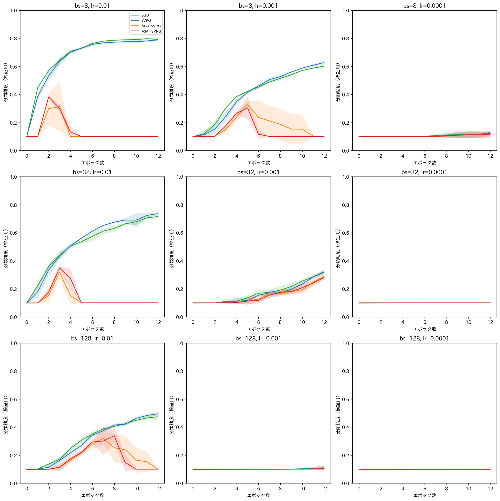
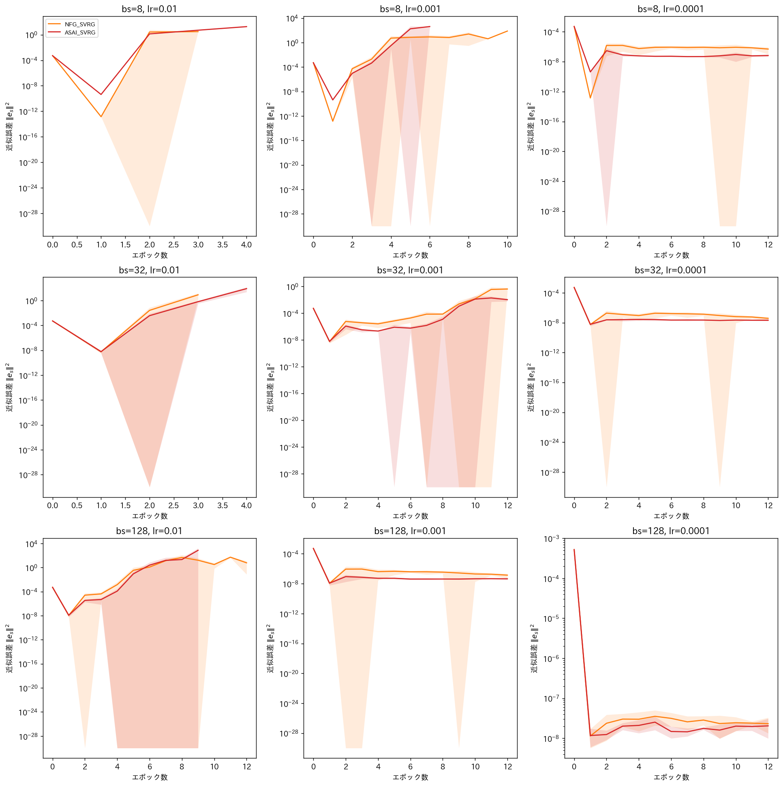
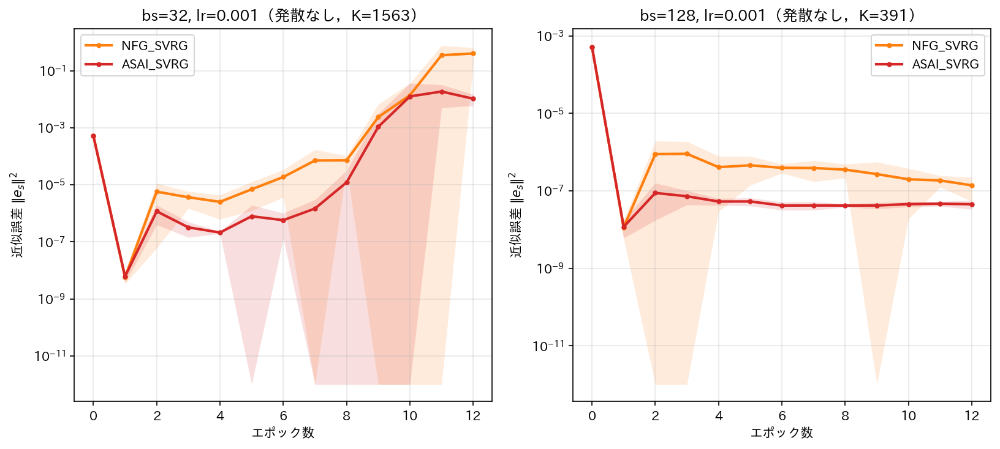

# report_022

本レポートは，`.orders/order_022.md` の指示に基づき実施した，実験2（CIFAR-10を用いた多値
分類問題）の実装内容と実験結果をまとめたものである．

## 1. 目的

実験0（`report_020.md`，非凸・a9a）および実験1（`report_021.md`，強凸・Mushroom）を通じて，
次の知見が得られている．

- ASAI SVRGの近似誤差 $ \|e_s\|^2 $ は，非凸・強凸いずれの設定でもNFG SVRGより一貫して小さい
  （定理2の実証）．
- 実験1（内部ループ長 $ K=N_{\text{train}}=7311 $，オンライン学習）では，NFG SVRG・
  ASAI SVRGの誤差床は恒久的なものではなく，十分なエポック数の下ではSVRGと同水準まで収束する
  transientな現象であった．レポートはこれを「$ K $ が大きいほど1エポックあたりの平均サンプル
  数が多く，近似誤差の収束が速いため」という仮説として提示した（`report_021.md` 6.3節）．
- 学習率が理論的な安定領域の上界に近いほど，NFG SVRG・ASAI SVRGが振動する現象が非凸・強凸
  設定の両方で（程度の差はあれ）観察されている．

実験2は，理論解析の仮定（平滑性・凸性）を満たさない非凸かつ実践的な設定（CIFAR-10画像分類，
CNN）において，提案手法ASAI SVRGの実用的な有効性を検証するとともに，上記の未検証仮説（$ K $
と誤差床の恒久性の関係）を，実験1とは異なる $ K $ のレンジ（ミニバッチ学習）で検証する．

## 2. モデルの制約とOptimizerクラスの再利用性

`.orders/order_022.md` 2節の制約に従い，モデルはBatchNormalization・Dropoutを含まない決定論的
な構成とし，データ拡張は用いない．SVRG系手法の補正勾配 $ v_s^k = \nabla f_n(w_s^k) -
\nabla f_n(z_s) + g_s $ が，同一のインデックス $ n $・同一のパラメータ $ z_s $ に対して
再評価しても同じ値になることを前提とするためである．

`programs/optimizers/` の各Optimizerクラスは変更せずそのまま再利用した．NFG SVRG・
ASAI SVRGの平均勾配（running average）はイテレーション番号 $ k $ に基づく逐次更新であり，
$ \nabla f_{n_s^k} $ がミニバッチ平均勾配であっても同じ更新式がそのまま成立するため，内部
ループ長を $ K=\lceil N_{\text{train}}/\text{batch size}\rceil $ に設定し，各 `step()` に
ミニバッチ平均勾配を渡すことでミニバッチ学習に対応できることを確認した．

## 3. モデル・データセット

### 3.1 データセット

CIFAR-10（$ N_{\text{train}}=50000 $，$ N_{\text{test}}=10000 $，$ 32\times32\times3 $）の
公式な学習・検証分割をそのまま用いた（`programs/ex002_cifar10_alexnet/data.py`）．理由は，
(1) 公式分割は再現性の基準として広く用いられている，(2) 本実験は学習率・バッチサイズをグリッド
内の固定値として用いチューニングを行わないため，独立した検証集合を別途必要としないためである．
画素値はチャネルごとに標準化し，データ拡張（ランダムクロップ・反転等）は用いない．

### 3.2 モデル

AlexNetをCIFAR-10向けに縮小した，5つの畳み込み層と3つの全結合層から成るCNN
（`AlexNetCIFAR`，`programs/ex002_cifar10_alexnet/model.py`）を用いた．全結合層のユニット数
（1024，512）はオリジナルのAlexNet（各4096）から縮小しており，これはSVRG系手法がエポック
ごとにフル勾配計算（またはそれに相当する評価）を要し計算コストが大きいためである．
総パラメータ数は約717万．具体的な層構成は`model.py`のモジュールdocstringに記載した．

### 3.3 目的関数

多値交差エントロピー損失にL2正則化を加えた

$$
f(w) = \frac1N\sum_{n=1}^N \ell_{\text{CCE}}(y_n,\hat y_n(w)) + \frac{\lambda}{2}\|w\|^2
$$

を用いる．正則化は畳み込み層・全結合層の重み（`weight`）のみに課し，切片（`bias`）には
課さない（一般的なweight decayの慣例に従う）．正則化係数 $ \lambda $ は，一般的なCNN学習で
用いられる範囲（$ 10^{-4}\sim10^{-3} $ 程度）から，過学習の抑制と精度のバランスを踏まえ
$ 5\times10^{-4} $ を全条件で共通に採用した．

## 4. 実験条件

- **バッチサイズ**：8, 32, 128（グリッド）
- **学習率**：0.01, 0.001, 0.0001（グリッド）
- **内部ループ長**：$ K=\lceil N_{\text{train}}/\text{batch size}\rceil $（バッチサイズ8で
  6250，32で1563，128で391）
- **比較手法**：SGD，SVRG（`SVRGFinalPoint`，最終点採用），NFG SVRG（`NFGSVRGFinalPoint`，
  最終点採用），ASAI SVRG（`ASAISVRG`，平均パラメータ採用）の4手法
- **Seed数**：5（0〜4）
- **正則化係数**：$ \lambda=5\times10^{-4} $（全条件共通）

### 4.1 実行時間の事前見積もりとエポック数・並列数の決定

`.orders/order_022.md` 7節の指示に基づき，実行前に1条件あたりの実行時間を概算した（1エポック，
学習率 $ 10^{-3} $，単一プロセス，NVIDIA RTX PRO 6000 Blackwell）．

| バッチサイズ | SGD | SVRG | NFG SVRG | ASAI SVRG | 4手法合計 |
| ---: | ---: | ---: | ---: | ---: | ---: |
| 128（$ K=391 $） | 24.3秒 | 32.7秒 | 36.3秒 | 38.8秒 | 132.1秒 |
| 8（$ K=6250 $） | 95.0秒 | 197.8秒 | 202.8秒 | 208.3秒 | 703.9秒 |

いずれもGPU使用率は13〜24%程度に留まり，VRAM使用量も1プロセスあたり1GB未満と小さく，
Pythonループ・カーネル起動のオーバーヘッドが支配的でGPU演算自体は律速していないことが
分かった．3バッチサイズ・4手法の合計は1エポックあたり約1091秒であり，3学習率×5Seed分
（15倍）で単一プロセス換算約4.55時間/エポックを要する．全180条件を現実的な時間で完了する
ため，(1) GPU使用率・VRAMに十分な余裕があることを踏まえ並列プロセス数を8に設定し，(2)
エポック数は限られた計算時間の中で収束傾向を確認できる範囲として12とした．

## 5. 結果

180条件全ての学習が正常終了した（各条件13エポック分のログを確認済み）．







（実線が5Seedの平均値，塗りつぶしが標準偏差．NaNに発散したSeedはその時点以降`nanmean`から
除外されるため，全Seedが発散した時点で曲線が途切れる．）

### 5.1 グリッド全体の傾向：学習率・バッチサイズと発散の関係

| バッチサイズ | 学習率 | SGD最終精度 | SVRG最終精度 | NFG SVRG最終精度（発散Seed数） | ASAI SVRG最終精度（発散Seed数） | $ K $ |
| ---: | ---: | ---: | ---: | ---: | ---: | ---: |
| 8 | 0.01 | 0.7922 | 0.7892 | 0.1000（5/5） | 0.1000（5/5） | 6250 |
| 8 | 0.001 | 0.6018 | 0.6271 | 0.1000（5/5） | 0.1000（5/5） | 6250 |
| 8 | 0.0001 | 0.1276 | 0.1210 | 0.1136（0/5） | 0.1133（0/5） | 6250 |
| 32 | 0.01 | 0.7155 | 0.7364 | 0.1000（5/5） | 0.1000（5/5） | 1563 |
| **32** | **0.001** | **0.3218** | **0.3175** | **0.2891（0/5）** | **0.2801（0/5）** | **1563** |
| 32 | 0.0001 | 0.0999 | 0.0999 | 0.0999（0/5） | 0.0999（0/5） | 1563 |
| 128 | 0.01 | 0.4738 | 0.4954 | 0.0998（3/5） | 0.1000（5/5） | 391 |
| **128** | **0.001** | **0.1096** | **0.1091** | **0.1058（0/5）** | **0.1044（0/5）** | **391** |
| 128 | 0.0001 | 0.0995 | 0.0995 | 0.0995（0/5） | 0.0995（0/5） | 391 |

（全条件の詳細は `outputs/ex002_cifar10_alexnet/grid_summary.md` に記載．太字は発散が生じ
なかった2条件．）

9条件（バッチサイズ3種 × 学習率3種）のうち，NFG SVRG・ASAI SVRGが**全く発散しなかった**の
は，$ \text{bs}=32,\ \eta=0.001 $ と $ \text{bs}=128,\ \eta=0.001 $ の2条件のみであった．
$ \eta=0.01 $ ではバッチサイズによらずほぼ全Seedが発散し，$ \eta=0.0001 $ では発散こそ
しないものの，4手法とも分類精度がほぼチャンスレベル（10%）にとどまり有意な学習が確認できな
かった．一方，SGD・SVRGはいずれの学習率・バッチサイズでも発散せず，$ \eta=0.01 $ では
バッチサイズ8で約79%，128でも約47〜50%の分類精度に到達した．

### 5.2 発散の経過：緩やかな学習の後の急激な崩壊

`bs=128, lr=0.01` のASAI SVRG（Seed 0）の詳細な推移は次の通りである．

| エポック | 目的関数の値 | 分類精度 | 近似誤差 $ \|e_s\|^2 $ |
| ---: | ---: | ---: | ---: |
| 6 | 2.185 | 0.298 | 0.0512 |
| 7 | 1.987 | 0.359 | 0.1275 |
| 8 | 1.862 | 0.393 | 1.987 |
| 9 | 2.456 | 0.269 | 145.9 |
| 10 | NaN | 0.100 | NaN |

エポック0〜8までは，損失・精度とも健全に改善している（8エポック目には分類精度39.3%に到達）．
しかし，8→9エポック目にかけて近似誤差が約73倍（1.99→145.9）に急増し，9→10エポック目で
完全に発散（NaN）した．これは，緩やかな不安定化（実験0・1で観察された振動）とは異なり，
一定期間健全に学習した後に近似誤差が急激に増大し，崩壊に至るという非凸・ミニバッチ設定に
特有のパターンである．

発散に至るエポック数を全条件・全Seedで確認すると次の通りである．

| 条件 | NFG SVRG 発散エポック（5Seed） | ASAI SVRG 発散エポック（5Seed） |
| :--- | :--- | :--- |
| bs=8, lr=0.01 | 3, 4, 4, 4, 3 | 4, 5, 5, 4, 4 |
| bs=8, lr=0.001 | 9, 6, 8, 7, 12 | 7, 6, 6, 6, 6 |
| bs=128, lr=0.01 | 11, 10, 9, なし, なし | 10, 9, 9, 10, 10 |

$ \text{bs}=8,\ \eta=0.01 $（最も不安定な条件）ではASAI SVRGの方がわずかに遅く発散する傾向
（4〜5エポック vs NFGの3〜4エポック）があるが，$ \text{bs}=128,\ \eta=0.01 $ ではNFG SVRGの
方が2Seedで最後まで発散しなかった一方，ASAI SVRGは5Seed全てが発散した．$ \text{bs}=8,\ \eta=
0.001 $ ではASAI SVRGが多くのSeedでNFG SVRGより早く（6〜7エポック vs 6〜12エポック）発散
している．すなわち，**どちらの手法がより早く発散するかは条件によって一貫しておらず**，
発散のタイミングに関して一方が他方より頑健であるとは言えない．

### 5.3 発散が生じなかった条件における近似誤差の比較（定理2の検証）

$ \text{bs}=32,\ \eta=0.001 $ と $ \text{bs}=128,\ \eta=0.001 $ の2条件では，全Seed・全
エポックで発散が生じず，ASAI SVRGとNFG SVRGの近似誤差を公平に比較できる．

**$ \text{bs}=128,\ \eta=0.001 $（$ K=391 $）**：ASAI SVRGの近似誤差は，エポック2以降
$ 4\times10^{-8}\sim1\times10^{-7} $ の範囲でほぼ横ばいに推移するのに対し，NFG SVRGは
エポック2の $ 3\times10^{-7} $ から緩やかに減少するが，最終エポック（12）でも
$ 1.4\times10^{-7} $ とASAI SVRG（$ 4.5\times10^{-8} $）の約3倍に留まる．全13エポック中
**12エポックでASAI SVRGの近似誤差がNFG SVRG以下**であった．

**$ \text{bs}=32,\ \eta=0.001 $（$ K=1563 $）**：エポック2〜8ではASAI SVRGがNFG SVRGの
約1/2〜1/3程度の近似誤差を示すが，学習が進むエポック9以降は両手法とも近似誤差が急激に増大し
（$ 10^{-3} $ から $ 10^{-1} $ 台へ），最終エポック（12）ではASAI SVRG（$ 1.04\times10^{-2}
$）がNFG SVRG（$ 4.02\times10^{-1} $）の約1/38まで縮小している．全13エポック中
**12エポックでASAI SVRGの近似誤差がNFG SVRG以下**であった．

## 6. 考察

### 6.1 実験終了の基準に対する結果

`.orders/order_022.md` 6節の基準に照らすと次の通りである．

1. **全手法が発散せず一定水準の分類精度に到達すること**：SGD・SVRGはグリッド全体で発散せず，
   最良の条件（$ \text{bs}=8,\ \eta=0.01 $）でそれぞれ79.2%，78.9%の分類精度に到達した．
   一方，NFG SVRG・ASAI SVRGは9条件中7条件（$ \eta=0.01 $ の全3条件，$ \eta=0.001 $ の
   bs=8条件）で大半または全てのSeedが発散した．**この基準はSVRG系3手法全体としては満たされて
   いない**．非凸かつミニバッチ学習という実験2固有の条件下では，NFG SVRG・ASAI SVRGの
   フル勾配近似が実用上の安定性を欠く場合があることを示す，重要な負の結果である．
2. **ASAI SVRGの近似誤差がNFG SVRGより一貫して小さいこと**：発散が生じなかった2条件
   （5.3節）では，ASAI SVRGの近似誤差はいずれもエポックの92%（12/13）でNFG SVRG以下であり，
   **この基準は満たされた**．
3. **$ K $ と誤差床の恒久性の関係**：6.2節で詳述する．
4. **オラクル呼び出し回数の観点での効率性**：6.3節で詳述する．

### 6.2 実験1の仮説（$ K $ が小さいほど恒久的な誤差床が観察されやすい）の検証

実験1（`report_021.md` 6.3節）は，強凸・オンライン学習（$ K=7311 $）でNFG SVRG・ASAI SVRGの
誤差床が一時的（transient）であったことから，「$ K $ が大きいほど近似誤差の収束が速いため
誤差床が恒久的になりにくい」という仮説を提示した．実験2は $ K\in\{391, 1563, 6250\} $ という
実験1より広いレンジで検証する機会を提供したが，得られた結果は仮説と単純には整合しない．

- $ K=391 $（bs=128）：発散しなかった $ \eta=0.001 $ では，近似誤差はエポック2以降ほぼ横ばい
  （恒久的な誤差床に近い挙動）であった．
- $ K=1563 $（bs=32）：発散しなかった $ \eta=0.001 $ では，近似誤差はエポック8まで緩やかで
  あったが，エポック9以降**急激に増大**しており，恒久的な誤差床ではなく，学習の進行に伴い
  悪化する挙動を示した．
- $ K=6250 $（bs=8）：$ \eta=0.001 $，$ \eta=0.01 $ いずれも全Seedが発散しており，「誤差床」
  以前に安定性そのものが失われている．

すなわち，実験1で観察された「$ K $ が大きいほど誤差が自己減衰し恒久的な誤差床になりにくい」
という関係は，実験2の非凸・ミニバッチ設定では**逆転している**：$ K $ が最も大きい
（$ K=6250 $，バッチサイズが最も小さい）条件が最も不安定（発散）であり，$ K $ が最も小さい
（$ K=391 $）条件が最も安定していた．この逆転の一因として，実験1（強凸ロジスティック回帰）
と実験2（非凸CNN）では，パラメータが最適解近傍に留まるか否かが根本的に異なる点が挙げられる．
実験1では強凸性によりパラメータが最適解 $ w^* $ に向けて単調に収束し，サンプル間の勾配の
ばらつきが縮小するのに対し，実験2の非凸損失面ではパラメータが良好な領域から逸脱しうる．
バッチサイズが小さい（$ K $ が大きい）ほど1回のミニバッチ更新のノイズが大きく，非凸損失面
上でパラメータがより不安定な軌道を辿りやすいため，スナップショット近似の前提（軌道が
穏やかであること）が崩れやすいと考えられる．したがって，実験1の仮説は**強凸設定に特有の
現象**であった可能性が高く，非凸設定では $ K $（バッチサイズ）と安定性の関係は逆の傾向を
示すことが本実験で明らかになった．

### 6.3 オラクル呼び出し回数の観点での効率性

発散しなかった2条件では，1エポックあたりのオラクル呼び出し回数は，SGD・NFG SVRG・
ASAI SVRGが $ N_{\text{train}} $，$ 2N_{\text{train}} $，$ 2N_{\text{train}} $，SVRGが
$ 3N_{\text{train}} $（内部ループの $ 2N_{\text{train}} $ とスナップショット計算の
$ N_{\text{train}} $）であり，実験0・1と同じ構造である．ただし，$ \text{bs}=32,128,\ \eta=
0.001 $ ではいずれの手法も分類精度がSGDよりわずかに低いか同水準にとどまっており（5.1節の
表），本実験の範囲では分散削減の利点（同一オラクル呼び出し回数でのより高い精度）を明確に
確認するには至らなかった．これは，発散を避けるために選ばざるを得なかった学習率
（$ \eta=0.001 $）が，いずれの手法にとっても12エポックでは学習が不十分な水準だったためと
考えられる．

### 6.4 実験0・1との比較：オンライン学習 vs ミニバッチ学習，強凸 vs 非凸

実験0（非凸・オンライン学習，$ K=29304 $）・実験1（強凸・オンライン学習，$ K=7311 $）では，
学習率が理論上界に近い場合にNFG SVRG・ASAI SVRGが振動する現象が観察されたが，いずれも
最終的には発散せず，緩やかな振動または一時的な誤差床にとどまっていた．実験2（非凸・
ミニバッチ学習）では，同様の不安定化が**完全な発散（NaN）**にまで至る点が質的に異なる．
この差異は，(a) 実験0・1がオンライン学習（バッチサイズ1）であるのに対し実験2はミニバッチ
学習であること，(b) 実験2の目的関数（CNNの非凸損失）が実験0の目的関数（非線形最小二乗誤差）
よりも複雑な非凸性を持つこと，の両方が関与している可能性があるが，本実験の範囲ではどちらが
主要因かを切り分けられていない．

## 7. 未解決の論点・今後の検討候補

- **発散を避けつつ十分に学習が進む学習率の探索**：本実験のグリッド（0.01, 0.001, 0.0001）
  では，NFG SVRG・ASAI SVRGが発散せず，かつ有意な学習が進む学習率を見出せなかった
  （$ \eta=0.001 $ は発散こそしないが学習が不十分，$ \eta=0.01 $ は学習は進むが発散する）．
  この中間の学習率（例：$ 0.003\sim0.007 $ 程度）を追加で探索すれば，分散削減の利点を
  明確に確認できる条件が見つかる可能性がある．
- **発散の根本原因の特定**：5.2節で観察した「緩やかな学習の後の急激な崩壊」パターンの
  数理的な原因（近似誤差 $ e_s $ 自体を悪化させるフィードバックループが存在するか等）は
  本レポートの範囲では特定していない．
- **6.2節の仮説修正の妥当性の検証**：非凸設定における $ K $（バッチサイズ）と安定性の関係
  （本実験では $ K $ が大きいほど不安定という，実験1と逆の傾向が観察された）について，
  異なる非凸モデル・データセットでも同様の傾向が再現するかは未検証である．
- **実験3の実施**：`.orders/order_020.md` が定める実験3（Tiny Shakespeare，Transformer）は
  未着手である．

## 8. 実行コマンド

```bash
# 実験2の学習実行（4手法 x 3バッチサイズ x 3学習率 x 5Seed = 180条件を8プロセス並列で実行．
# 既に完了した条件はスキップ．GPU対応の .venv_pytorch_gpu を用いる）
.venv_pytorch_gpu/bin/python programs/ex002_cifar10_alexnet/train.py

# 単体テスト
.venv_pytorch_gpu/bin/python -m pytest tests/ -v

# 結果の可視化（visualize_result.ipynbの「可視化する条件の指定」セルでEXPERIMENT =
# "ex002_cifar10_alexnet" を選択）
.venv_pytorch_gpu/bin/jupyter nbconvert --to notebook --execute --inplace visualize_result.ipynb
```
