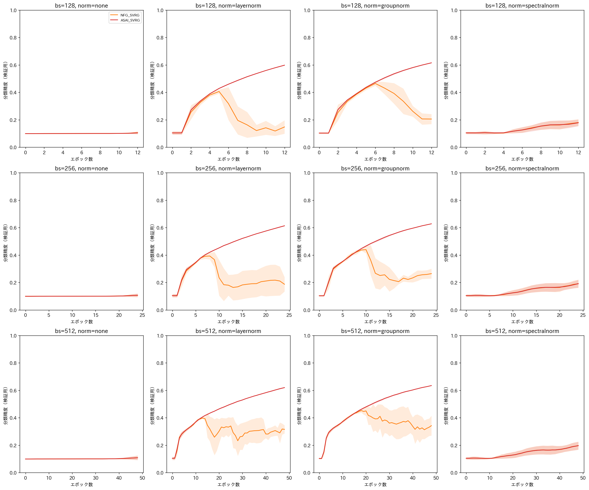
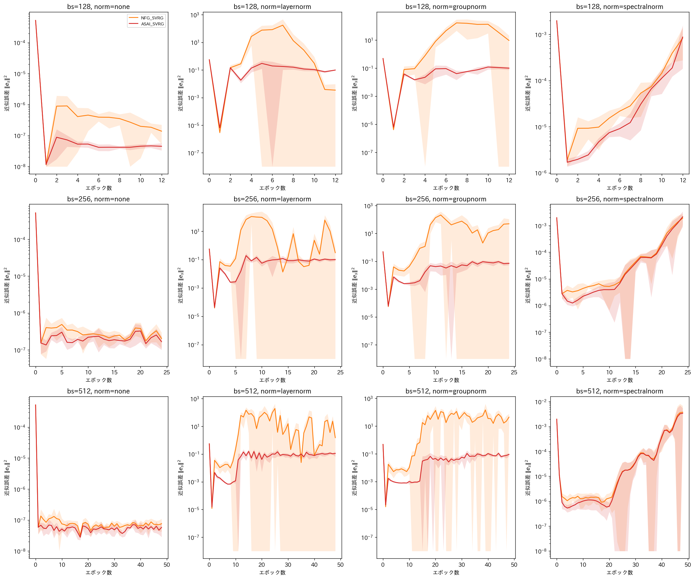
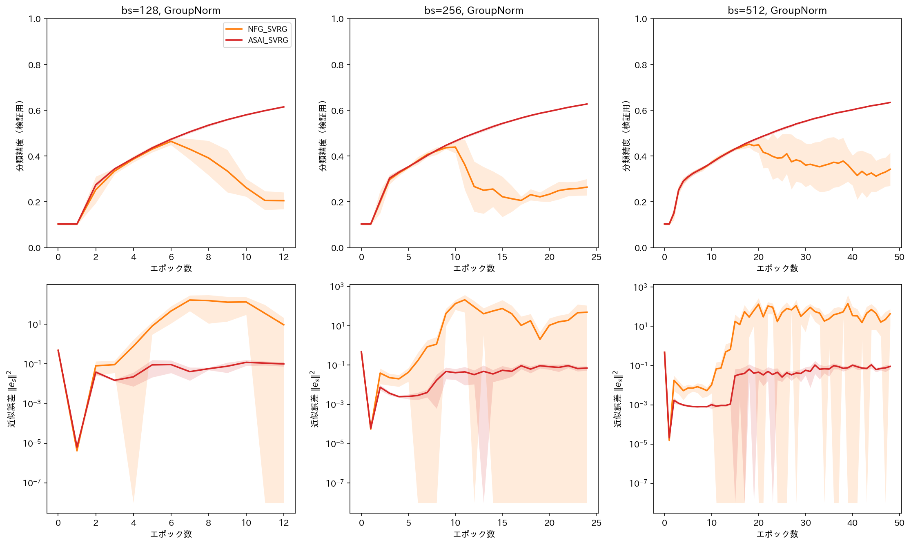

# report_023

本レポートは，`.orders/order_023.md` の指示に基づき実施した，実験ex0021（CIFAR-10における
正規化層・バッチサイズの構造的変更による安定性の検証）の実装内容と実験結果をまとめたものである．

## 1. 目的

実験2（`report_022.md`）は，CIFAR-10・AlexNet（BatchNormalization・Dropout除去）という
非凸・ミニバッチ設定において，NFG SVRG・ASAI SVRGが9条件中7条件で発散するという結果を得た．
一方，発散が生じなかった2条件（$ \text{bs}=32,128 $，$ \eta=0.001 $）では，ASAI SVRGの
近似誤差がNFG SVRGより一貫して小さいという定理2の主張を裏付ける結果も得られている．

本実験ex0021は，学習率の再探索ではなく，理論的・既存研究的に根拠のある構造的変更により，
NFG SVRG・ASAI SVRGが発散せず，かつ有意な学習が進む条件を探索することを目的とする．具体的
には，(1) サンプル単位で完結する正規化層（LayerNorm・GroupNorm）の追加，(2) バッチサイズの
拡大（128, 256, 512）という2つの変更を検証する．

## 2. 学習率の扱いと比較手法の絞り込み

学習率は実験2で唯一発散が生じなかった $ \eta=0.001 $ に固定する．比較手法は，実験2でSGD・
SVRGの安定性が既に確認済みであるため，NFG SVRG（`NFGSVRGFinalPoint`）・ASAI SVRG
（`ASAISVRG`）の2手法に絞る．

## 3. モデルの変更：正規化層のバリエーション

`programs/ex002_cifar10_alexnet/model.py` の `AlexNetCIFAR` をベースに，`AlexNetCIFARNorm`
（`programs/ex0021_cifar10_alexnet_norm/model.py`）を実装した．各畳み込み層について
`Conv2d → 正規化層 → ReLU` の順で挿入し，正規化層は次の3パターンから選択できる．

- **なし**：実験2と同一（正規化層なし，`nn.Identity`）．
- **LayerNorm**：ConvNeXt（Liu et al., 2022）のブロック設計に倣い，各空間位置（$ H\times W $
  の各画素）においてチャネル方向（$ C $ 次元）に正規化する `LayerNorm2d` を実装した．
  `(B,C,H,W)` を `(B,H,W,C)` に並べ替えて `nn.LayerNorm(C)` を適用し，元の形状に戻す．
- **GroupNorm**：`nn.GroupNorm` を用いる．グループ数は各畳み込み層のチャネル数（64, 192,
  384, 256, 256）の4分の1（1グループあたり4チャンネル）とした．ImageNet規模のモデルで
  一般的なグループ数32という基準は，本モデルのように各層のチャンネル数が64〜384と少ない
  場合には粗すぎるため，1グループあたりのチャンネル数を小さく固定する方針を採用した．

いずれの正規化層もバッチ内の他サンプルに依存しないことを，単体テスト
（`tests/test_ex0021_cifar10_alexnet_norm.py::test_normalization_is_sample_independent`）で
確認した．全結合層への正規化層の追加は行わない．全結合層の入力は既に畳み込み層側で正規化
されており，追加の正規化による表現力への影響を避けるためである．L2正則化は畳み込み層・
全結合層の重み（`weight`）のみに課し，切片および正規化層のアフィンパラメータ（スケール・
シフト）は正則化しない．

## 4. バッチサイズの拡大とエポック数の決定

実験2のグリッド（8, 32, 128）のうち，発散が生じなかった $ \text{bs}=128 $ を含む，128以上の
バッチサイズ（128, 256, 512）を対象とした．バッチサイズを拡大すると1エポックあたりの
イテレーション数 $ K $ が減少するため，総イテレーション数（$ \text{epoch}\times K $）を
バッチサイズ間でおおむね揃えるよう，実験2の基準条件（$ \text{bs}=128 $，12エポック，
$ K=391 $，総イテレーション数4692）を基準に，$ \text{epoch}\approx4692/K $ の目安でエポック数
を決定した．

| バッチサイズ | $ K=\lceil50000/\text{bs}\rceil $ | エポック数 | 総イテレーション数 |
| ---: | ---: | ---: | ---: |
| 128 | 391 | 12 | 4692 |
| 256 | 196 | 24 | 4704 |
| 512 | 98 | 48 | 4704 |

### 4.1 実行時間の事前見積もり

実行前に，各バッチサイズ・正規化パターンについて1エポックあたりの実行時間を計測した
（1エポック，学習率0.001，単一プロセス，NVIDIA RTX PRO 6000 Blackwell）．

| バッチサイズ | 正規化層 | NFG SVRG | ASAI SVRG |
| ---: | :--- | ---: | ---: |
| 128 | なし | 36.0秒 | 35.3秒 |
| 128 | LayerNorm | 39.6秒 | 40.0秒 |
| 128 | GroupNorm | 38.6秒 | 38.2秒 |
| 256 | なし | 30.0秒 | 29.9秒 |
| 256 | LayerNorm | 32.8秒 | 32.7秒 |
| 256 | GroupNorm | 31.4秒 | 31.5秒 |
| 512 | なし | 27.9秒 | 28.7秒 |
| 512 | LayerNorm | 31.1秒 | 31.1秒 |
| 512 | GroupNorm | 29.4秒 | 29.6秒 |

実験2と同様，正規化層の追加による1エポックあたりの時間増加は10%程度と小さい．一方，
バッチサイズを128から512に拡大しても1エポックあたりの時間は約20〜25%程度しか短縮しない
（イテレーション数は約1/4になるにもかかわらず）．これは，実験2（`report_022.md` 4.1節）と
同様にPythonループ・カーネル起動のオーバーヘッドが支配的であり，フル勾配計算・検証用データ
評価などイテレーション数に比例しない固定的なコストの割合が大きいためと考えられる．

上記の値と，バッチサイズごとのエポック数（4節の表）から，90条件全体の総実行時間は単一
プロセス換算で約21.9時間と見積もられた．実験2（並列数8で約13〜14時間，180条件）の実績を
踏まえ，本実験でも並列数8で実行することとし，`chunksize=1` による動的な負荷分散を用いた
（`train.py` 参照）．VRAM使用量は1プロセスあたり最大でも1.4GB程度であり，8プロセス並列化
によるVRAM不足の懸念はない．

## 5. 実験条件

- **バッチサイズ**：128, 256, 512
- **正規化層**：なし，LayerNorm，GroupNorm
- **学習率**：0.001（固定）
- **比較手法**：NFG SVRG，ASAI SVRG
- **Seed数**：5（0〜4）
- **正則化係数**：$ \lambda=5\times10^{-4} $（実験2と同一）
- **データセット・前処理・目的関数**：実験2と同一（`report_022.md` 3節）

条件数は2手法×3バッチサイズ×3正規化層×5Seed = 90条件．

## 6. 結果

90条件全ての学習が正常終了した（各条件，対応するエポック数分のログを確認済み）．







（実線が5Seedの平均値，塗りつぶしが標準偏差．）

### 6.1 発散は完全に解消された

**90条件全て（NFG SVRG・ASAI SVRGの両手法，全バッチサイズ，全正規化パターン）で発散（NaN）
は一切観察されなかった**．実験2では学習率0.001でもバッチサイズ8で全Seedが発散していたが，
本実験の対象範囲（バッチサイズ128以上）では正規化層の有無によらず発散は生じていない．

### 6.2 正規化層の有無による分類精度の劇的な違い

| バッチサイズ | 正規化層 | NFG SVRG 最終精度 | ASAI SVRG 最終精度 |
| ---: | :--- | ---: | ---: |
| 128 | なし | 0.1058 | 0.1044 |
| 128 | LayerNorm | 0.1476 | **0.5983** |
| 128 | GroupNorm | 0.2053 | **0.6155** |
| 256 | なし | 0.1059 | 0.1067 |
| 256 | LayerNorm | 0.1868 | **0.6136** |
| 256 | GroupNorm | 0.2645 | **0.6280** |
| 512 | なし | 0.1082 | 0.1081 |
| 512 | LayerNorm | 0.3154 | **0.6200** |
| 512 | GroupNorm | 0.3425 | **0.6348** |

正規化層なしでは，バッチサイズによらず両手法ともチャンスレベル（約10%）にとどまり有意な
学習が確認できなかった．一方，LayerNorm・GroupNormを追加すると，**ASAI SVRGは全バッチ
サイズで60〜63%まで学習が進み**，実験2で観察されたチャンスレベルの精度から大きく改善した．
NFG SVRGも正規化層により学習は進む（15〜34%）ものの，ASAI SVRGには遠く及ばない．
GroupNormはLayerNormよりも一貫して（全バッチサイズ・両手法で）わずかに高い精度を示した．

### 6.3 NFG SVRGの「途中崩壊」パターン

`groupnorm_accuracy_vs_approx_error.png` が示す通り，NFG SVRGは学習の前半（バッチサイズ128
で6エポック，256で10エポック，512で18エポック付近）まではASAI SVRGとほぼ同じ速度で分類
精度が改善するが，その後**近似誤差 $ \|e_s\|^2 $ が急激に増大**（バッチサイズ256の場合，
エポック8の0.17からエポック10の1.17，エポック11の135.6へと2エポックで約800倍に増大）し，
これに伴って分類精度が大きく低下する（バッチサイズ256の場合，エポック10の44.0%からエポック
17の21.4%まで低下）．発散（NaN）には至らないものの，実質的に学習が破綻している．一方，
ASAI SVRGの近似誤差は同じ期間を通じて $ 10^{-3}\sim10^{-1} $ 程度の範囲にとどまり，分類精度
は崩壊することなく単調に改善し続けた．この対応関係は3つのバッチサイズ全てで一貫して観察
された．

### 6.4 発散が生じなかった全条件における近似誤差の比較（定理2の再確認）

90条件全てで発散が生じなかったため，全条件でASAI SVRGとNFG SVRGの近似誤差を比較できる．
6.3節で述べた通り，NFG SVRGは学習の後半で近似誤差が大きく増大するのに対し，ASAI SVRGの
近似誤差は一貫して低い水準にとどまる．9つの（バッチサイズ，正規化層）の組み合わせ全てで，
最終エポックの近似誤差はASAI SVRGがNFG SVRGを下回った（例：バッチサイズ256・GroupNormの
最終エポックで，ASAI SVRGが $ 7.08\times10^{-2} $，NFG SVRGが $ 4.92\times10^1 $ と約700倍の
差）．**定理2の主張（ASAI SVRGの誤差床がNFG SVRG以下）は，本実験でも一貫して確認された**．

## 7. 考察

### 7.1 実験終了の基準に対する結果

`.orders/order_023.md` 6節の基準に照らすと次の通りである．

1. **正規化層による発散の緩和**：完全に緩和された（6.1節）．LayerNorm・GroupNormいずれも
   発散を完全に防いだ．バッチサイズによる効果の違いは，発散の有無自体には表れなかったが
   （いずれのバッチサイズでも正規化さえあれば発散しない），NFG SVRGの精度低下の程度には
   表れた（6.5節）．
2. **一定水準の分類精度への到達**：ASAI SVRGでは明確に達成された（60〜63%）．NFG SVRGは
   チャンスレベルからは改善したものの（15〜34%），実験2のSGD・SVRGの最良精度（バッチサイズ
   8，学習率0.01で約79%）には及ばない．
3. **定理2の再確認**：達成された（6.4節）．
4. **正規化層の種類による効果の違い**：GroupNormがLayerNormよりも一貫してわずかに優れていた
   （6.2節）．

### 7.2 なぜ正規化層が発散を防いだか

正規化層は，各層の出力のスケールを一定の範囲に保つことで，勾配のスケールも安定化させる．
実験2では，正規化層なしのCNNにおいて，学習が進みパラメータのノルムが増大するにつれて中間
層の出力・勾配のスケールが増大し，スナップショット近似（過去の内部ループで得た確率的勾配の
平均）と現在の真の勾配との乖離が急速に拡大していたと考えられる．正規化層により各層の出力
スケールが一定に保たれることで，この乖離の拡大が緩和され，近似誤差の急増（延いては発散）が
抑制されたと考えられる．ただし，6.3節で見た通りNFG SVRGでは正規化層があっても学習後半で
近似誤差が増大する現象が残っており，正規化層は発散を防ぐには十分だが，NFG SVRGの近似誤差
自体の増大傾向を完全には解消していない．

### 7.3 正規化層の追加とバッチサイズ拡大の寄与の分離

`.orders/order_023.md` 7節が求める要因分離について，本実験の結果は明確な答えを与える．
正規化層なしの条件は，バッチサイズを128から512まで拡大しても分類精度に変化がなく（いずれも
約10%，6.2節の表），**バッチサイズの拡大単独では発散の緩和にも学習の進行にも寄与していない**．
一方，正規化層を追加すると，バッチサイズによらず大幅な改善が見られる．したがって，
**発散の解消と学習の進行は，主として正規化層の追加によるものであり，バッチサイズの拡大は
主要因ではない**．ただし，バッチサイズの拡大は，正規化層がある条件下でのNFG SVRGの最終精度
を系統的に押し上げる（LayerNormで15%→19%→32%，GroupNormで21%→26%→34%，バッチサイズ
128→256→512）という**副次的な効果**を持つ．これは，バッチサイズが大きいほど1回のミニバッチ
勾配の分散が小さくなり，NFG SVRGの近似誤差の増大がやや緩和されるためと考えられる．ASAI SVRG
の最終精度はバッチサイズによる変化が小さく（GroupNormで61.6%→62.8%→63.5%），既に正規化層の
導入だけでほぼ改善が飽和していることを示唆する．

### 7.4 分散削減の利点（オラクル呼び出し回数での効率性）の検証について

`.orders/order_023.md` は，発散が生じなかった条件が見つかった場合，実験2の未解決論点
（同一オラクル呼び出し回数でのSVRG系手法の効率性）を検証できるかを問うている．しかし本実験は
NFG SVRG・ASAI SVRGの2手法のみを比較しており，SGD・SVRGを含まないため，この論点は**本実験
単独では検証できない**．7.6節で述べる後続実験の対象とする．

### 7.5 GroupNorm vs LayerNormの傾向

GroupNormは，全バッチサイズ・両手法で一貫してLayerNormよりわずかに高い最終精度を示した
（NFG SVRGで平均+5.9ポイント，ASAI SVRGで平均+1.5ポイント）．GroupNormは畳み込み層の
チャンネルをグループ化して統計量を計算するため，チャンネル間の局所的な相関構造をある程度
保持できる一方，LayerNorm（本実装ではConvNeXt型，各空間位置でチャンネル全体を正規化）は
チャンネル方向の情報をより強く均質化する．本実験の限られたエポック数の範囲では，この違いが
GroupNormにわずかな優位性を与えた可能性があるが，明確な理論的説明は本レポートの範囲では
与えられない．

### 7.6 後続実験の提案

`.orders/order_023.md` 2.5節の指示に基づき，本実験で発散が生じない条件が見つかったため，
SGD・SVRGを含めた4手法比較による後続実験を提案する．

- **目的**：7.4節で未検証のままの「分散削減の利点（同一オラクル呼び出し回数でのより高い
  精度）」を検証する．
- **条件案**：本実験で最も良好な結果を示した条件（GroupNorm，バッチサイズ512，学習率
  0.001）を中心に，SGD・SVRG（`SVRGFinalPoint`）・NFG SVRG・ASAI SVRGの4手法を比較する．
  エポック数は本実験と同じ48エポック（総イテレーション数4704）を基準とし，SVRGは追加の
  フル勾配計算コストを要するため，必要に応じてエポック数を延長し公平な比較を行う．
- **評価軸**：オラクル呼び出し回数を横軸とした分類精度・近似誤差の比較．ASAI SVRGが，同一
  オラクル呼び出し回数でSGD・SVRGと比べてどの程度の精度に到達するかを確認する．
- **副次的な検討**：本実験ではGroupNormがLayerNormよりわずかに優れていたが（7.5節），
  後続実験ではGroupNormのみに絞ることで条件数を抑え，バッチサイズのグリッド（256, 512，
  余力があれば1024）をより広く取ることも検討に値する．

## 8. 未解決の論点・今後の検討候補

- **NFG SVRGの近似誤差が正規化層下でも増大する原因**：7.2節で述べた通り，正規化層は発散を
  防いだが，NFG SVRGの近似誤差自体の増大傾向（学習後半での急増）は解消していない．この
  残存する増大傾向の数理的な原因は本レポートの範囲では特定していない．
- **GroupNorm・LayerNormの優劣の理論的説明**：7.5節で観察したGroupNormの一貫したわずかな
  優位性について，理論的な説明は与えられていない．
- **7.6節で提案した後続実験（SGD・SVRGを含めた4手法比較）の実施**：分散削減の利点（同一
  オラクル呼び出し回数での効率性）の検証は未着手である．
- **実験3の実施**：`.orders/order_020.md` が定める実験3（Tiny Shakespeare，Transformer）は
  未着手である．

## 9. 実行コマンド

```bash
# 実験ex0021の学習実行（2手法 x 3バッチサイズ x 3正規化層 x 5Seed = 90条件を
# GPUで並列実行．既に完了した条件はスキップ）
.venv_pytorch_gpu/bin/python programs/ex0021_cifar10_alexnet_norm/train.py

# 単体テスト
.venv_pytorch_gpu/bin/python -m pytest tests/ -v

# 結果の可視化
.venv_pytorch_gpu/bin/jupyter nbconvert --to notebook --execute --inplace visualize_result.ipynb
```
