# summary

本ファイルは，論文に掲載する実験（実験0，実験1，ex0023，ex003）の結果を横断的に一覧するために機械的に生成したものであり，考察文書ではない．論文へ掲載する条件・図の選定は行っておらず，実行時点で完了している条件をすべて掲載している．

比較対象はSGD，SVRG，NFG SVRG（NFG_SVRG），ASAI SVRG（ASAI_SVRG）の4手法である．ある条件で一部の手法しか完了していない場合は，完了した手法のみを描画し，条件の仕様に未実施の手法を明記する．

フル勾配の近似誤差 $\|e_s\|^2$ のグラフは，SGD（近似誤差の概念がない）・SVRG（定義上常に0）を除き，NFG SVRG・ASAI SVRGの2手法のみを描画する．

# 実験0：a9aデータセットを用いた非線形最小二乗回帰

参照レポート：`.reports/report_020.md`

NFG SVRG原論文（Medyakov et al., 2025）付録A.1の非凸実験設定を再現し，本実装（SVRG，NFG SVRG）が先行研究の挙動を正しく再現できることを確認する検証実験である．

目的関数：

$$ f(x) = \frac{1}{n}\sum_{i=1}^n (y_i - h_i)^2,\quad h_i = \sigma(A_i x) $$

シグモイド出力に対する二乗和誤差（非線形最小二乗誤差，非凸）．正則化項は付加しない．

## 実験0 / $\eta$ = 1/(3L) = 0.155

条件ディレクトリ：`outputs/ex000_a9a_least_squares/{手法}/eta1.545485e-01_K29304_epochs100/`

### 条件の仕様

- モデル：線形結合にシグモイド関数を適用したモデル（ロジスティック関数出力の非線形最小二乗回帰）．
- データセット：a9a（LIBSVM Data，UCI Adult所得予測データセットの二値分類向け前処理版）．特徴量の前処理は原データセットのLIBSVM形式をそのまま使用．（$ N_{\text{train}}=29304 $, $ N_{\text{test}}=3257 $）
- バッチサイズ：1
- 学習率：0.15454851922541735
- 正則化係数 $ \lambda $：0
- 内部ループ長 $ K $：29304
- エポック数：100
- Seed数：SGD: 5，SVRG: 5，NFG_SVRG: 5，ASAI_SVRG: 5

学習誤差の指標：目的関数の値 $f(z_s)$／検証指標：分類精度（検証用データ）

### グラフ

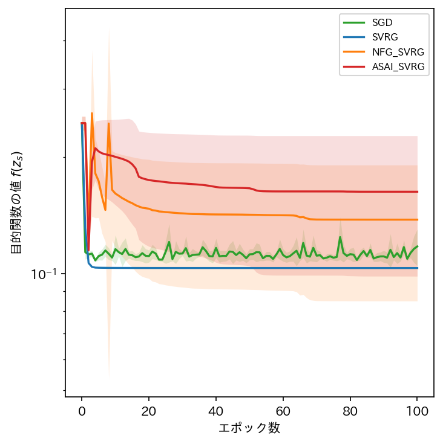

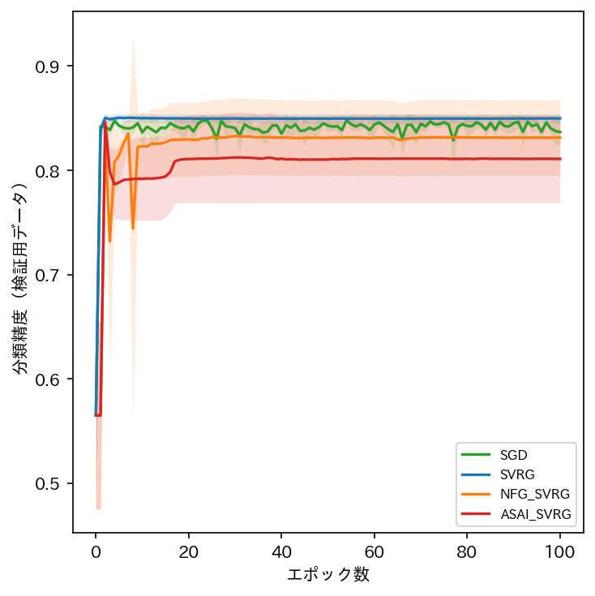

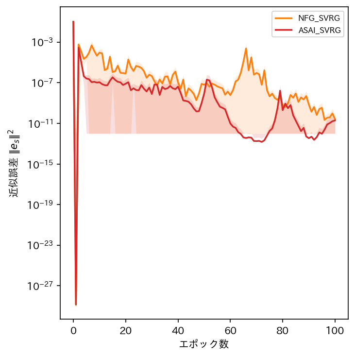

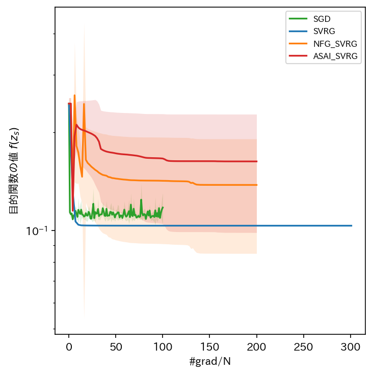

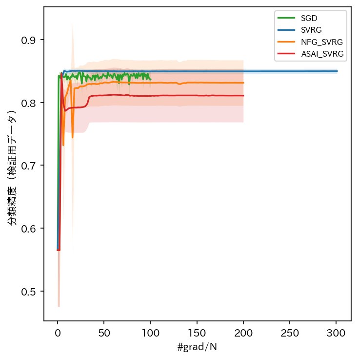

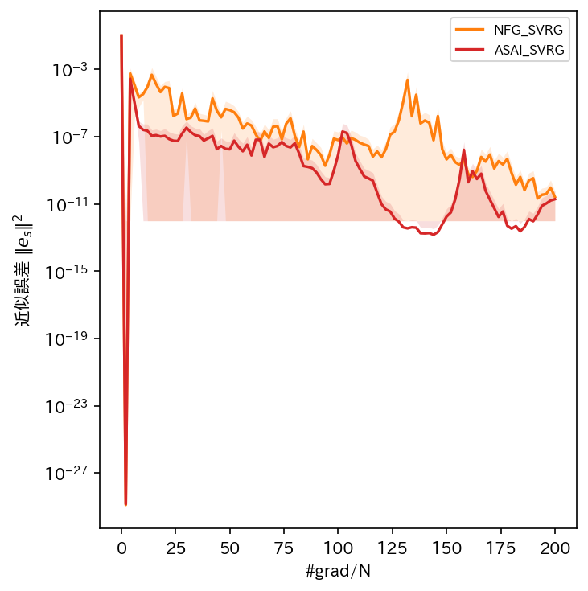

### 数値サマリー

| 手法 | 最終学習誤差(平均±std) | 最良学習誤差 | 最終検証精度(平均±std) | 最良検証精度 | 最終近似誤差(平均±std) | 最良近似誤差 | 発散Seed数 |
| :--- | ---: | ---: | ---: | ---: | ---: | ---: | ---: |
| SGD | 1.1756e-01 ± 1.27e-02 | 1.0819e-01 | 0.8367 ± 0.0113 | 0.8480 | 対象外 | 対象外 | 0/5 |
| SVRG | 1.0344e-01 ± 1.94e-04 | 1.0344e-01 | 0.8497 ± 0.0042 | 0.8504 | 0（定義上） | 0（定義上） | 0/5 |
| NFG_SVRG | 1.3785e-01 ± 5.28e-02 | 1.3254e-01 | 0.8313 ± 0.0363 | 0.8354 | 2.6620e-11 ± 3.25e-11 | 1.3007e-29 | 0/5 |
| ASAI_SVRG | 1.6270e-01 ± 6.42e-02 | 1.1493e-01 | 0.8109 ± 0.0422 | 0.8462 | 1.9390e-11 ± 3.88e-11 | 1.4842e-29 | 0/5 |

## 実験0 / $\eta$ = 1/(20L) = 0.0232

条件ディレクトリ：`outputs/ex000_a9a_least_squares/{手法}/eta2.318228e-02_K29304_epochs100/`

### 条件の仕様

- モデル：線形結合にシグモイド関数を適用したモデル（ロジスティック関数出力の非線形最小二乗回帰）．
- データセット：a9a（LIBSVM Data，UCI Adult所得予測データセットの二値分類向け前処理版）．特徴量の前処理は原データセットのLIBSVM形式をそのまま使用．（$ N_{\text{train}}=29304 $, $ N_{\text{test}}=3257 $）
- バッチサイズ：1
- 学習率：0.023182277883812604
- 正則化係数 $ \lambda $：0
- 内部ループ長 $ K $：29304
- エポック数：100
- Seed数：SGD: 5，SVRG: 5，NFG_SVRG: 5，ASAI_SVRG: 5

学習誤差の指標：目的関数の値 $f(z_s)$／検証指標：分類精度（検証用データ）

### グラフ

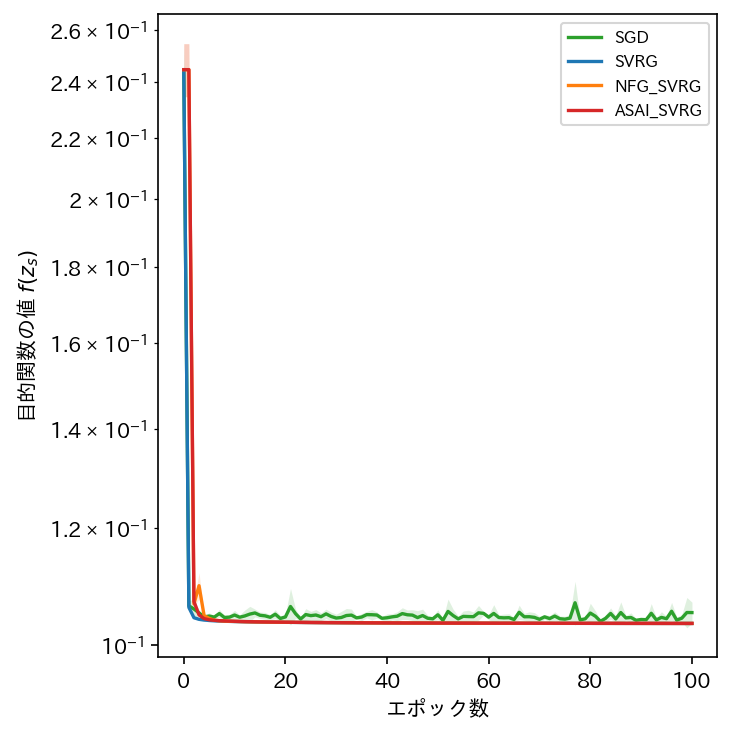

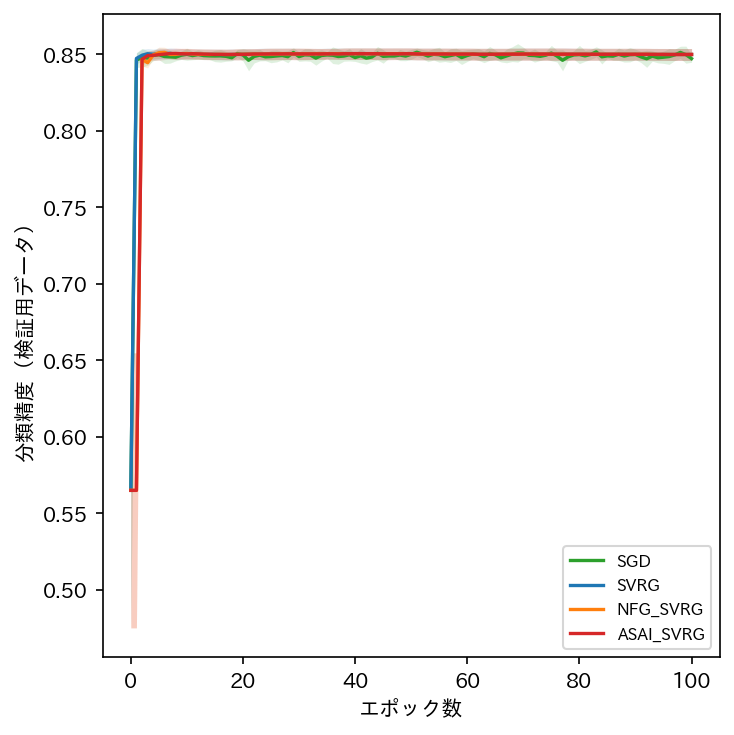

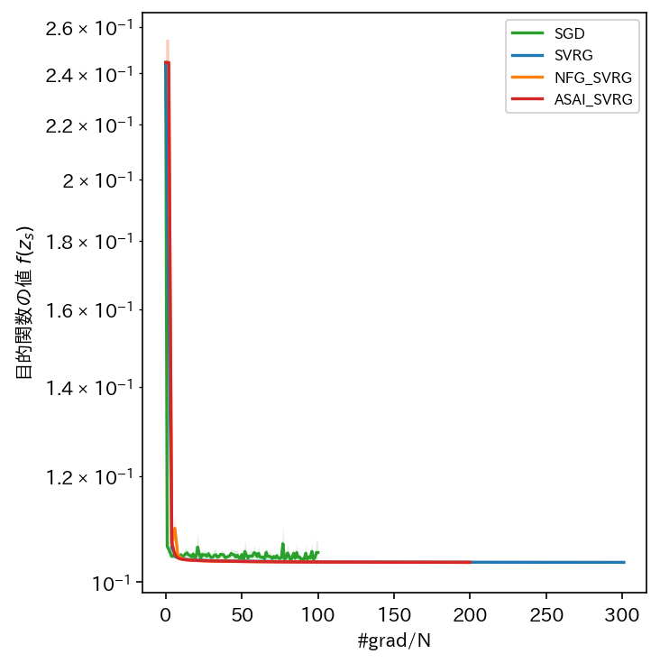

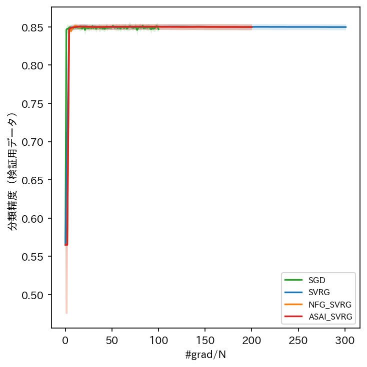

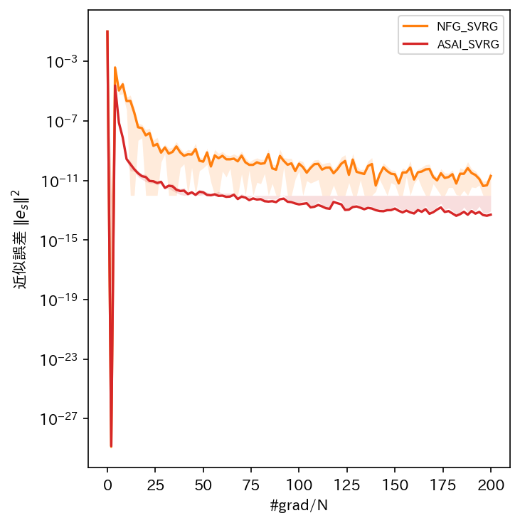

### 数値サマリー

| 手法 | 最終学習誤差(平均±std) | 最良学習誤差 | 最終検証精度(平均±std) | 最良検証精度 | 最終近似誤差(平均±std) | 最良近似誤差 | 発散Seed数 |
| :--- | ---: | ---: | ---: | ---: | ---: | ---: | ---: |
| SGD | 1.0522e-01 ± 1.72e-03 | 1.0381e-01 | 0.8471 ± 0.0024 | 0.8515 | 対象外 | 対象外 | 0/5 |
| SVRG | 1.0346e-01 ± 1.96e-04 | 1.0346e-01 | 0.8498 ± 0.0039 | 0.8505 | 0（定義上） | 0（定義上） | 0/5 |
| NFG_SVRG | 1.0346e-01 ± 1.96e-04 | 1.0346e-01 | 0.8498 ± 0.0039 | 0.8512 | 2.0418e-11 ± 2.50e-11 | 1.3007e-29 | 0/5 |
| ASAI_SVRG | 1.0346e-01 ± 1.96e-04 | 1.0346e-01 | 0.8498 ± 0.0039 | 0.8505 | 5.1107e-14 ± 3.81e-14 | 1.4842e-29 | 0/5 |

## 実験0 / $\eta$ = 1/(20Ln) = 7.91e-07

条件ディレクトリ：`outputs/ex000_a9a_least_squares/{手法}/eta7.910960e-07_K29304_epochs100/`

### 条件の仕様

- モデル：線形結合にシグモイド関数を適用したモデル（ロジスティック関数出力の非線形最小二乗回帰）．
- データセット：a9a（LIBSVM Data，UCI Adult所得予測データセットの二値分類向け前処理版）．特徴量の前処理は原データセットのLIBSVM形式をそのまま使用．（$ N_{\text{train}}=29304 $, $ N_{\text{test}}=3257 $）
- バッチサイズ：1
- 学習率：7.91096023881129e-07
- 正則化係数 $ \lambda $：0
- 内部ループ長 $ K $：29304
- エポック数：100
- Seed数：SGD: 5，SVRG: 5，NFG_SVRG: 5，ASAI_SVRG: 5

学習誤差の指標：目的関数の値 $f(z_s)$／検証指標：分類精度（検証用データ）

### グラフ

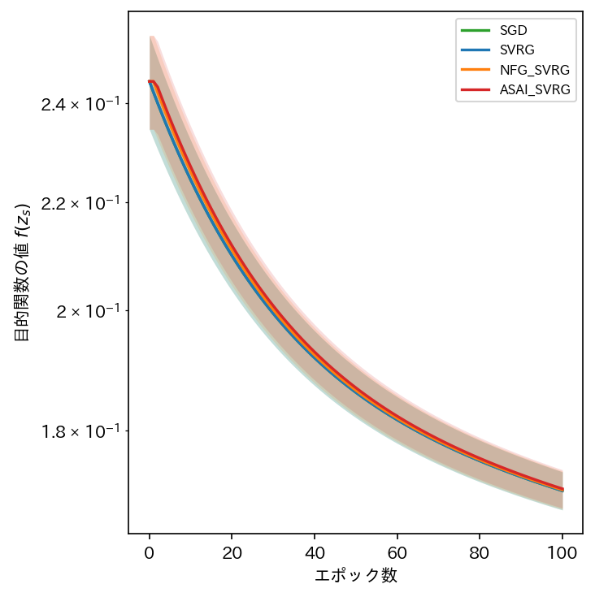

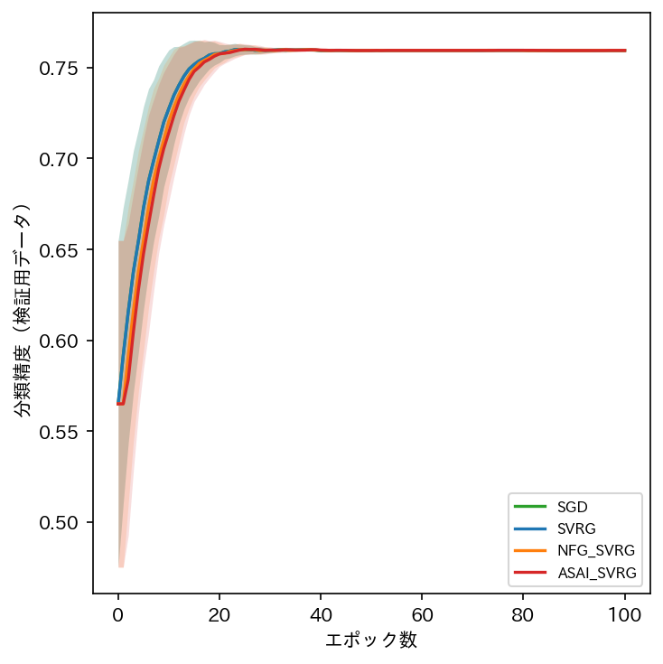

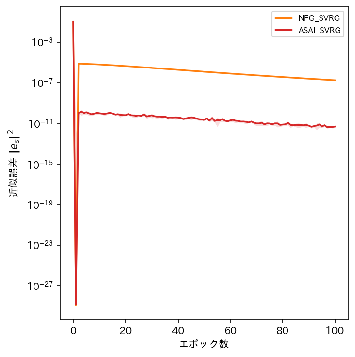

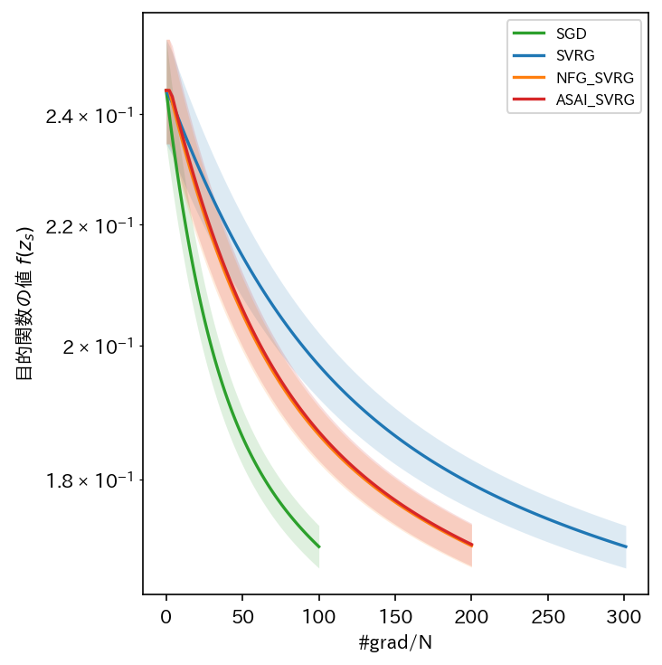

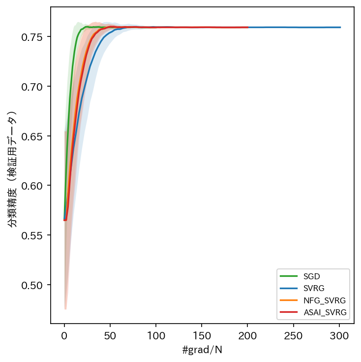

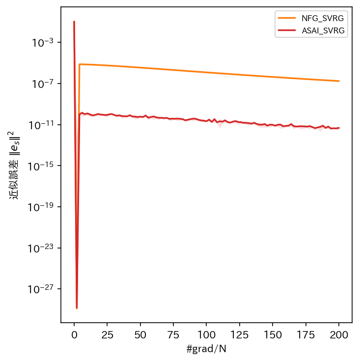

### 数値サマリー

| 手法 | 最終学習誤差(平均±std) | 最良学習誤差 | 最終検証精度(平均±std) | 最良検証精度 | 最終近似誤差(平均±std) | 最良近似誤差 | 発散Seed数 |
| :--- | ---: | ---: | ---: | ---: | ---: | ---: | ---: |
| SGD | 1.7072e-01 ± 2.86e-03 | 1.7072e-01 | 0.7594 ± 0.0008 | 0.7599 | 対象外 | 対象外 | 0/5 |
| SVRG | 1.7072e-01 ± 2.86e-03 | 1.7072e-01 | 0.7594 ± 0.0008 | 0.7599 | 0（定義上） | 0（定義上） | 0/5 |
| NFG_SVRG | 1.7084e-01 ± 2.87e-03 | 1.7084e-01 | 0.7594 ± 0.0008 | 0.7600 | 1.7434e-07 ± 2.25e-08 | 1.3007e-29 | 0/5 |
| ASAI_SVRG | 1.7101e-01 ± 2.88e-03 | 1.7101e-01 | 0.7594 ± 0.0008 | 0.7601 | 4.7713e-12 ± 1.19e-12 | 1.4842e-29 | 0/5 |

# 実験1：Mushroomデータセットを用いたL2正則化ロジスティック回帰

参照レポート：`.reports/report_021.md`

ASAI SVRG論文の理論解析の前提（L-平滑性，凸性，μ-強凸性，分散の一様有界性）を厳密に満たす設定において，定理1（収束特性）・定理2（誤差床の上界比較）を定量的に検証する．

目的関数：

$$ f(w, b) = \frac{1}{N}\sum_{n=1}^N \ell_{\mathrm{BCE}}(y_n, \hat{y}_n(w, b)) + \frac{\lambda}{2}(\|w\|^2 + b^2),\quad \hat{y}(w, b) = \sigma(w^\top x + b) $$

L2正則化付き二値交差エントロピー損失．正則化は重み $ w $ と切片 $ b $ の両方に課す．

## 実験1 / $\eta$ = eta_a_near_upper_bound = 0.0105

条件ディレクトリ：`outputs/ex001_mushroom_logistic/{手法}/eta1.049767e-02_lambda9.155984e-01_K7311_epochs100/`

### 条件の仕様

- モデル：切片項を含むロジスティック回帰モデル．
- データセット：Mushroomデータセット（UCI Machine Learning Repository）．22種類のカテゴリ特徴量を順序符号化（OrdinalEncoder）し，9:1に分割後，学習用データの統計量で標準化．（$ N_{\text{train}}=7311 $, $ N_{\text{test}}=813 $）
- バッチサイズ：1
- 学習率：0.010497670251258317
- 正則化係数 $ \lambda $：0.9155984380710358
- 内部ループ長 $ K $：7311
- エポック数：100
- Seed数：SGD: 5，SVRG: 5，NFG_SVRG: 5，ASAI_SVRG: 5

学習誤差の指標：目的関数の差分 $f(z_s)-f(w^*)$（L-BFGS-Bによる最適値との差分）／検証指標：分類精度（検証用データ）

### グラフ

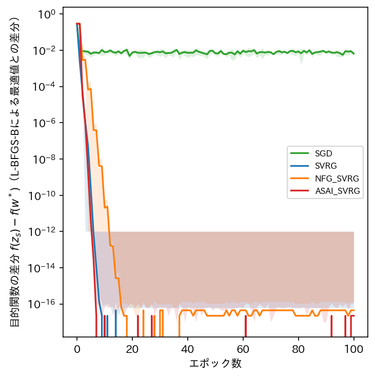

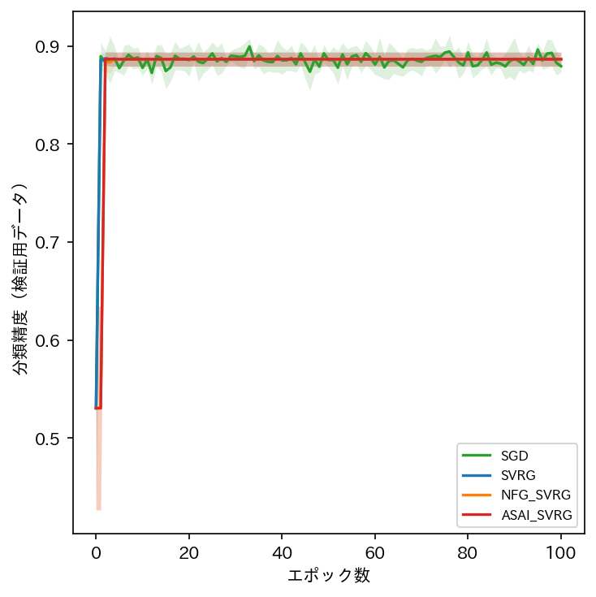

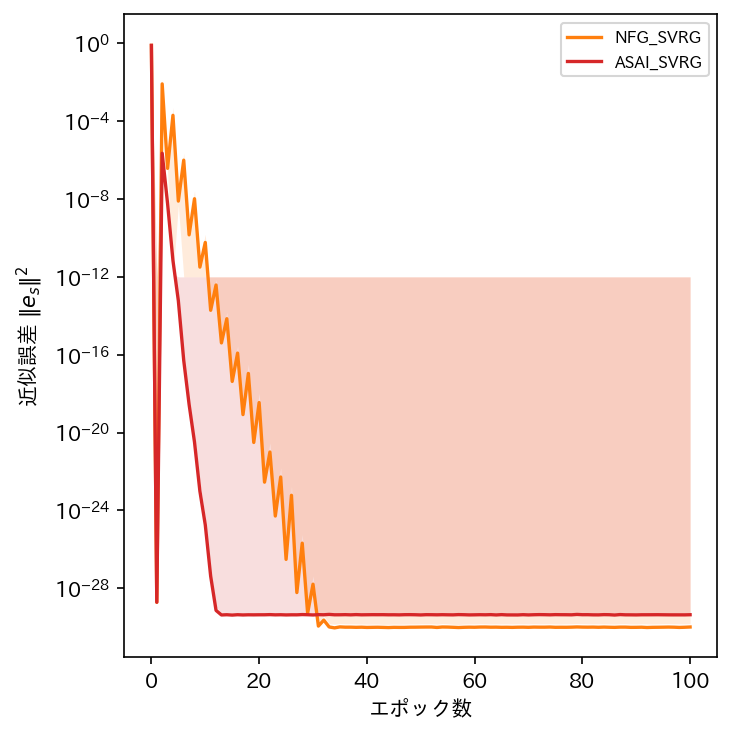

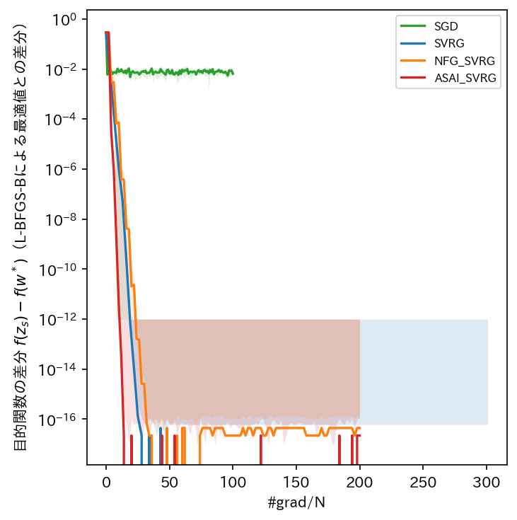

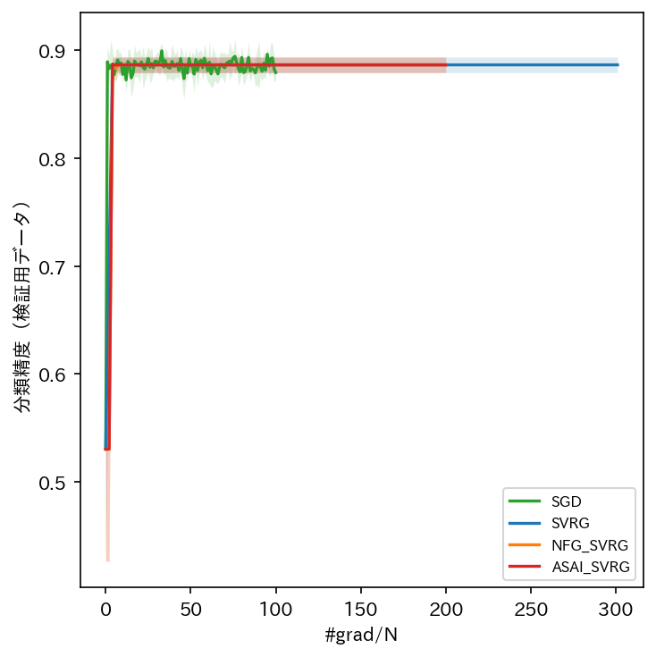

### 数値サマリー

| 手法 | 最終学習誤差(平均±std) | 最良学習誤差 | 最終検証精度(平均±std) | 最良検証精度 | 最終近似誤差(平均±std) | 最良近似誤差 | 発散Seed数 |
| :--- | ---: | ---: | ---: | ---: | ---: | ---: | ---: |
| SGD | 6.5333e-03 ± 1.14e-03 | 4.8184e-03 | 0.8795 ± 0.0060 | 0.8996 | 対象外 | 対象外 | 0/5 |
| SVRG | -2.2204e-17 ± 8.31e-17 | -2.2204e-17 | 0.8866 ± 0.0072 | 0.8873 | 0（定義上） | 0（定義上） | 0/5 |
| NFG_SVRG | 4.4409e-17 ± 8.88e-17 | -6.6613e-17 | 0.8866 ± 0.0072 | 0.8866 | 1.0286e-30 ± 5.11e-31 | 9.2824e-31 | 0/5 |
| ASAI_SVRG | 2.2204e-17 ± 8.31e-17 | -4.4409e-17 | 0.8866 ± 0.0072 | 0.8871 | 4.3951e-30 ± 9.49e-31 | 4.2198e-30 | 0/5 |

## 実験1 / $\eta$ = eta_c=1/(20L) = 0.00159

条件ディレクトリ：`outputs/ex001_mushroom_logistic/{手法}/eta1.590556e-03_lambda9.155984e-01_K7311_epochs100/`

### 条件の仕様

- モデル：切片項を含むロジスティック回帰モデル．
- データセット：Mushroomデータセット（UCI Machine Learning Repository）．22種類のカテゴリ特徴量を順序符号化（OrdinalEncoder）し，9:1に分割後，学習用データの統計量で標準化．（$ N_{\text{train}}=7311 $, $ N_{\text{test}}=813 $）
- バッチサイズ：1
- 学習率：0.0015905560986755026
- 正則化係数 $ \lambda $：0.9155984380710358
- 内部ループ長 $ K $：7311
- エポック数：100
- Seed数：SGD: 5，SVRG: 5，NFG_SVRG: 5，ASAI_SVRG: 5

学習誤差の指標：目的関数の差分 $f(z_s)-f(w^*)$（L-BFGS-Bによる最適値との差分）／検証指標：分類精度（検証用データ）

### グラフ

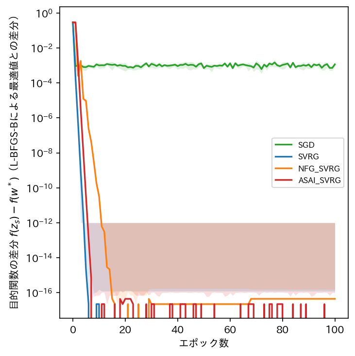

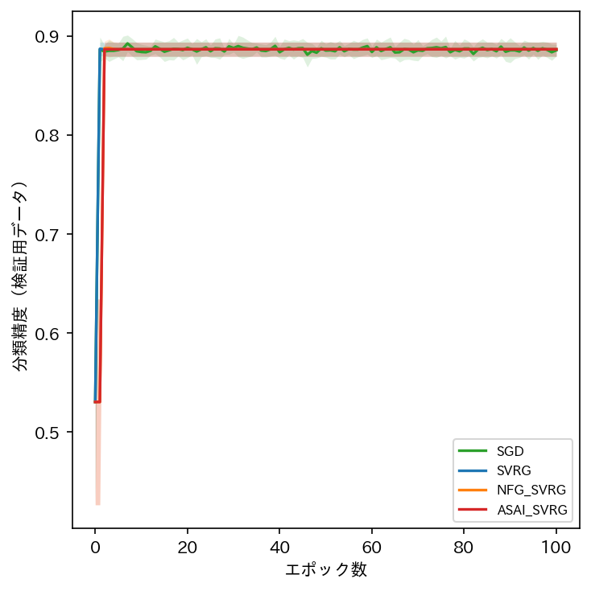

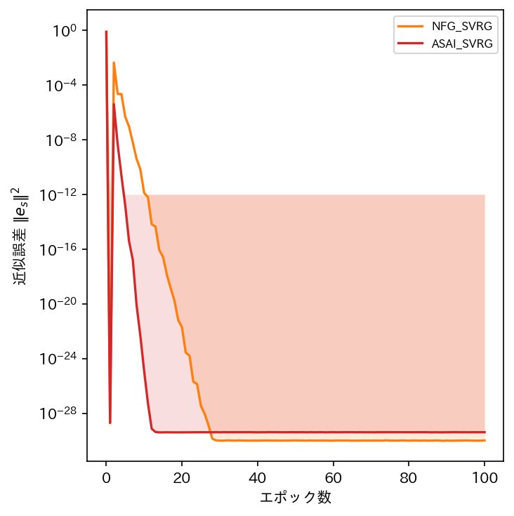

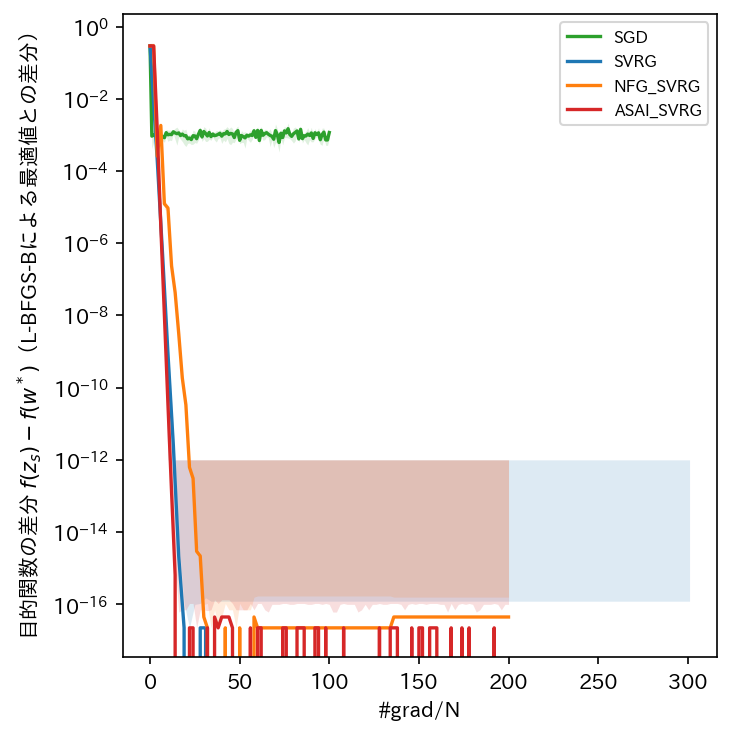

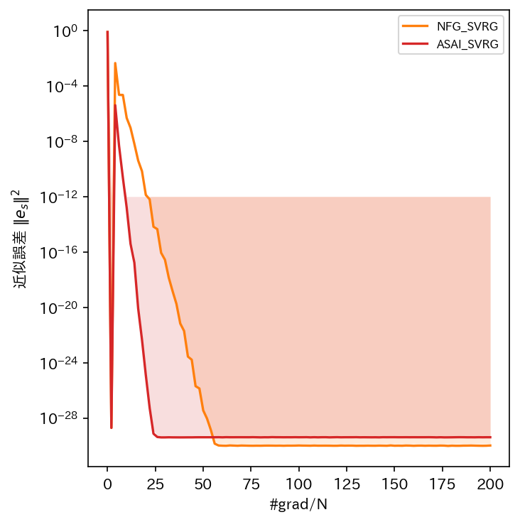

### 数値サマリー

| 手法 | 最終学習誤差(平均±std) | 最良学習誤差 | 最終検証精度(平均±std) | 最良検証精度 | 最終近似誤差(平均±std) | 最良近似誤差 | 発散Seed数 |
| :--- | ---: | ---: | ---: | ---: | ---: | ---: | ---: |
| SGD | 1.1664e-03 ± 3.61e-04 | 6.1780e-04 | 0.8856 ± 0.0059 | 0.8925 | 対象外 | 対象外 | 0/5 |
| SVRG | 0.0000e+00 ± 1.22e-16 | -2.2204e-17 | 0.8866 ± 0.0072 | 0.8871 | 0（定義上） | 0（定義上） | 0/5 |
| NFG_SVRG | 4.4409e-17 ± 1.13e-16 | -4.4409e-17 | 0.8866 ± 0.0072 | 0.8878 | 1.0234e-30 ± 3.88e-31 | 9.5487e-31 | 0/5 |
| ASAI_SVRG | 0.0000e+00 ± 9.93e-17 | -2.2204e-17 | 0.8866 ± 0.0072 | 0.8866 | 4.0381e-30 ± 1.17e-30 | 3.9395e-30 | 0/5 |

## 実験1 / $\eta$ = eta_b_rho=0.5 = 0.00111

条件ディレクトリ：`outputs/ex001_mushroom_logistic/{手法}/eta1.105364e-03_lambda9.155984e-01_K7311_epochs100/`

### 条件の仕様

- モデル：切片項を含むロジスティック回帰モデル．
- データセット：Mushroomデータセット（UCI Machine Learning Repository）．22種類のカテゴリ特徴量を順序符号化（OrdinalEncoder）し，9:1に分割後，学習用データの統計量で標準化．（$ N_{\text{train}}=7311 $, $ N_{\text{test}}=813 $）
- バッチサイズ：1
- 学習率：0.001105363616263384
- 正則化係数 $ \lambda $：0.9155984380710358
- 内部ループ長 $ K $：7311
- エポック数：100
- Seed数：SGD: 5，SVRG: 5，NFG_SVRG: 5，ASAI_SVRG: 5

学習誤差の指標：目的関数の差分 $f(z_s)-f(w^*)$（L-BFGS-Bによる最適値との差分）／検証指標：分類精度（検証用データ）

### グラフ

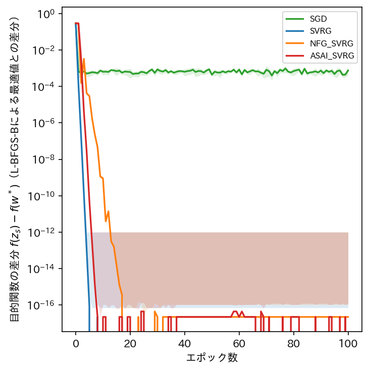

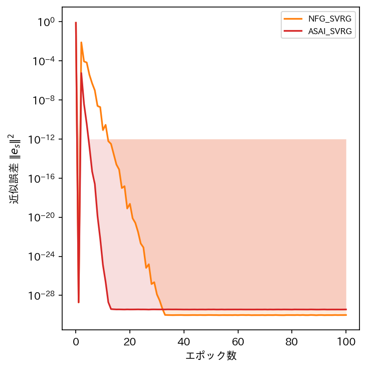

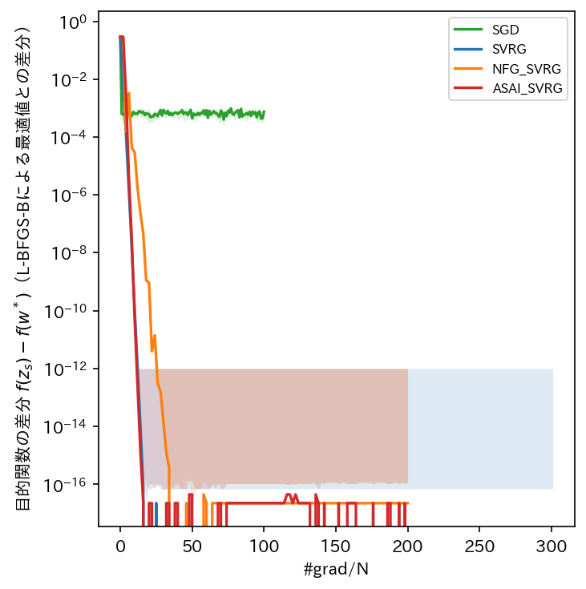

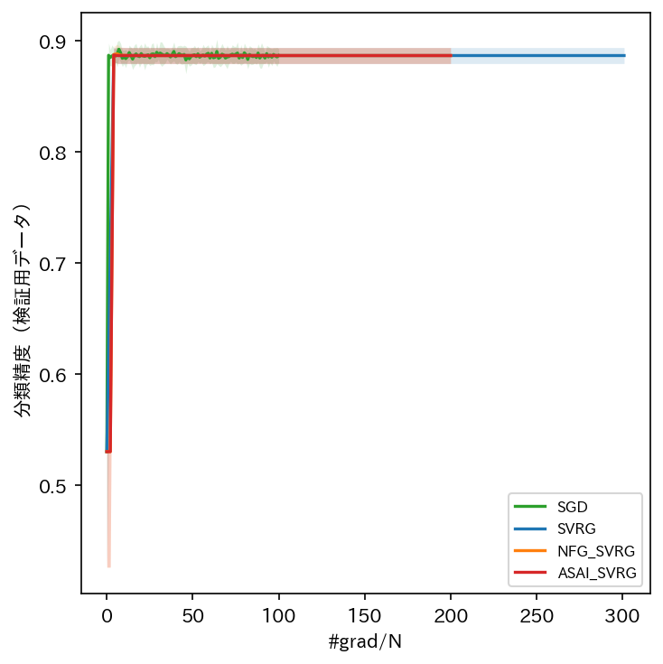

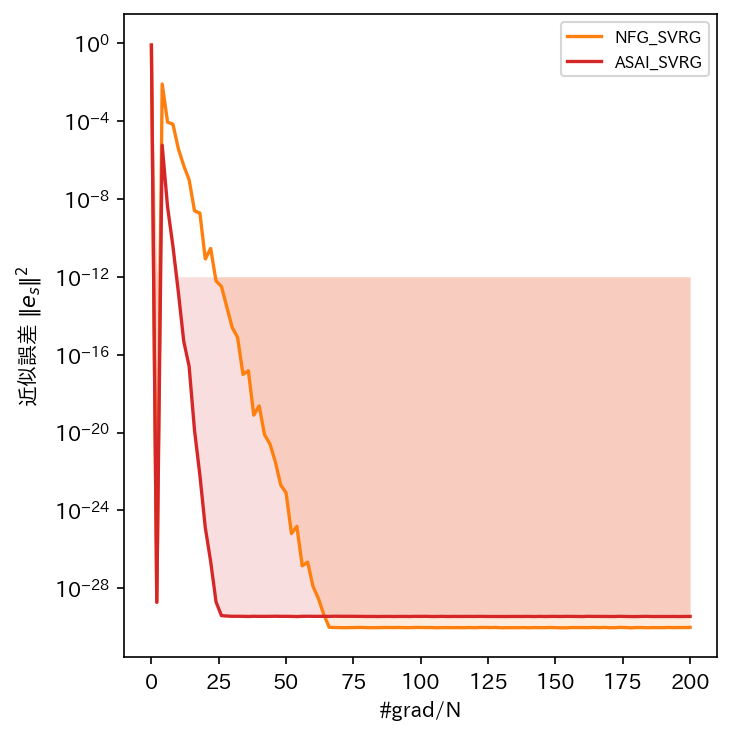

### 数値サマリー

| 手法 | 最終学習誤差(平均±std) | 最良学習誤差 | 最終検証精度(平均±std) | 最良検証精度 | 最終近似誤差(平均±std) | 最良近似誤差 | 発散Seed数 |
| :--- | ---: | ---: | ---: | ---: | ---: | ---: | ---: |
| SGD | 7.5298e-04 ± 3.34e-04 | 4.0088e-04 | 0.8866 ± 0.0061 | 0.8923 | 対象外 | 対象外 | 0/5 |
| SVRG | 0.0000e+00 ± 7.02e-17 | 0.0000e+00 | 0.8866 ± 0.0072 | 0.8873 | 0（定義上） | 0（定義上） | 0/5 |
| NFG_SVRG | 2.2204e-17 ± 8.31e-17 | -2.2204e-17 | 0.8866 ± 0.0072 | 0.8881 | 9.8651e-31 ± 2.94e-31 | 9.3642e-31 | 0/5 |
| ASAI_SVRG | 0.0000e+00 ± 1.22e-16 | -2.2204e-17 | 0.8866 ± 0.0072 | 0.8871 | 3.6291e-30 ± 9.55e-31 | 3.5561e-30 | 0/5 |

# ex0023：CIFAR-10・AlexNet（GroupNorm）長期学習による誤差床の収束観察

参照レポート：`.reports/report_026.md`

GroupNorm下・学習率0.001固定でエポック数を大幅に延長し，近似誤差 $\|e_s\|^2$ および分類精度がプラトーに達するまで観察することで，誤差床がtransientか恒久的かをバッチサイズごとに判定する．

目的関数：

$$ f(w) = \frac{1}{N}\sum_{n=1}^N \ell_{\mathrm{CCE}}(y_n, \hat{y}_n(w)) + \frac{\lambda}{2}\|w\|^2 $$

カテゴリカルクロスエントロピー損失にL2正則化を加えた目的関数．

## ex0023 / バッチサイズ = 512（学習率0.001固定）

条件ディレクトリ：`outputs/ex0023_cifar10_alexnet_groupnorm_longrun/{手法}/lr0.001_bs512_normgroupnorm_lambda0.0005_epochs192/`

### 条件の仕様

- モデル：AlexNetをCIFAR-10向けに縮小した，5つの畳み込み層と3つの全結合層から成るCNN（`AlexNetCIFAR`，総パラメータ数約717万）．正規化層はGroupNorm固定．
- データセット：CIFAR-10．画素値はチャネルごとに標準化，データ拡張なし．（$ N_{\text{train}}=50000 $, $ N_{\text{test}}=10000 $）
- バッチサイズ：512
- 学習率：0.001
- 正則化係数 $ \lambda $：0.0005
- 内部ループ長 $ K $：98
- エポック数：192
- Seed数：SGD: 5，SVRG: 5，NFG_SVRG: 5，ASAI_SVRG: 5

学習誤差の指標：目的関数の値（訓練誤差，train_loss）／検証指標：分類精度（検証用データ，CIFAR-10）

### グラフ

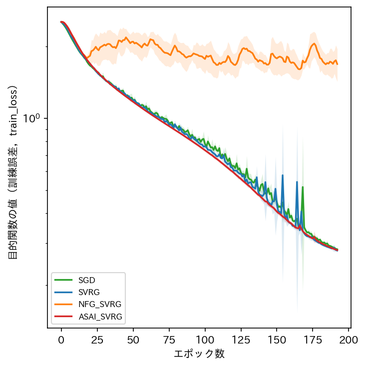

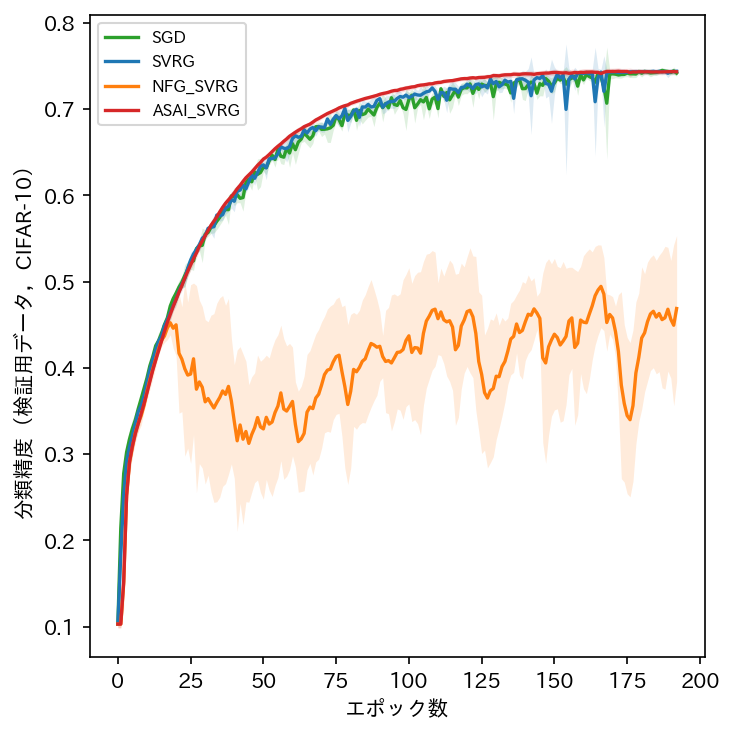

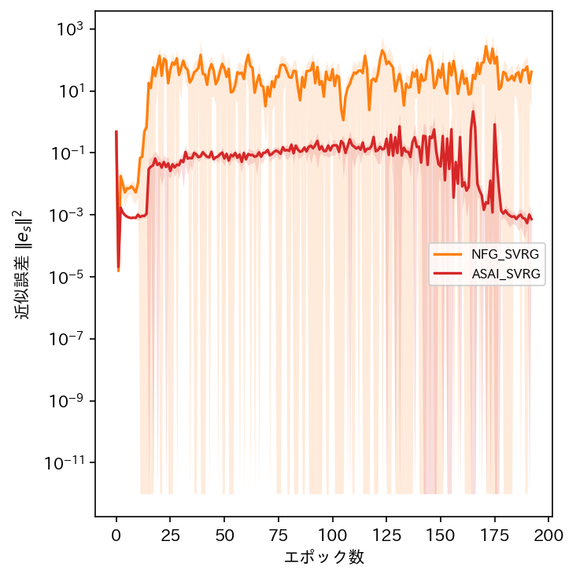

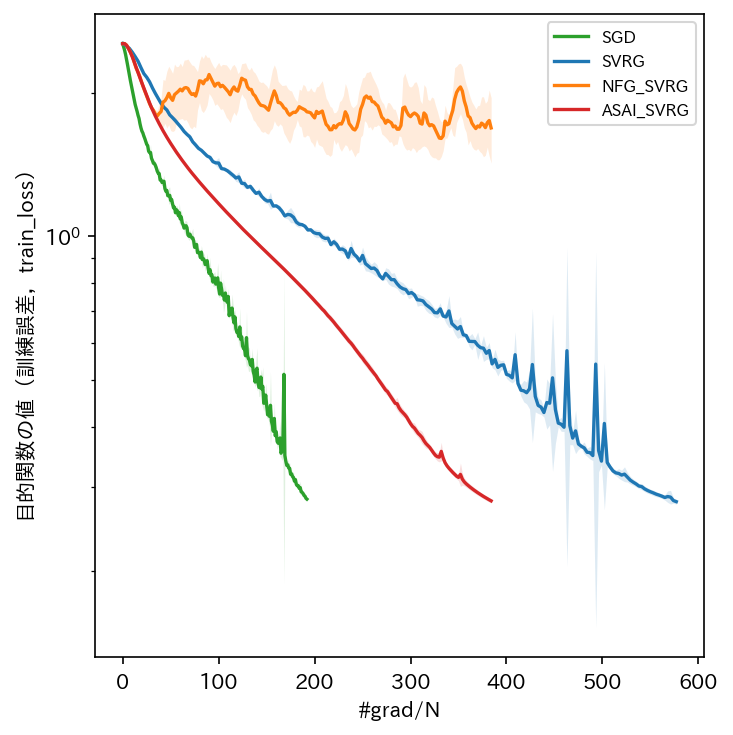

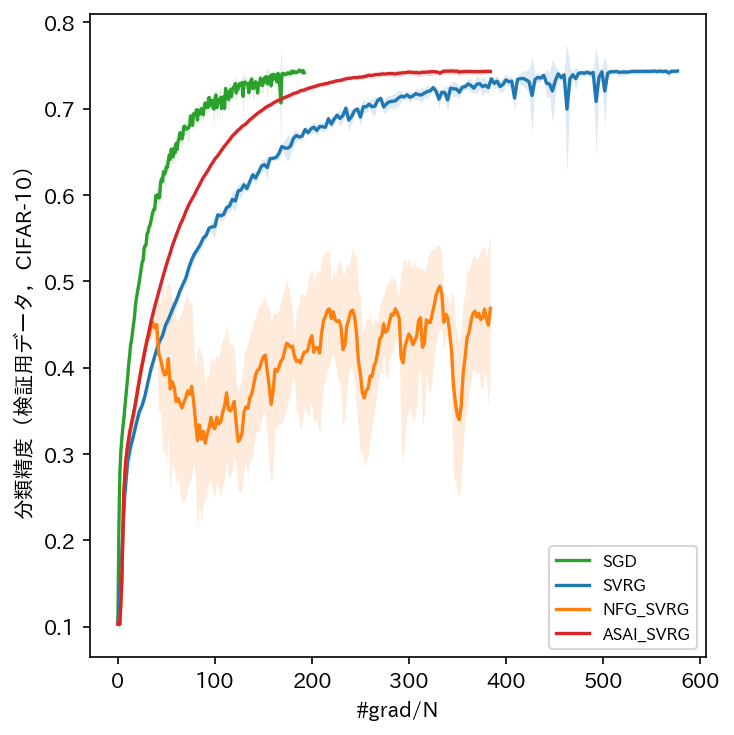

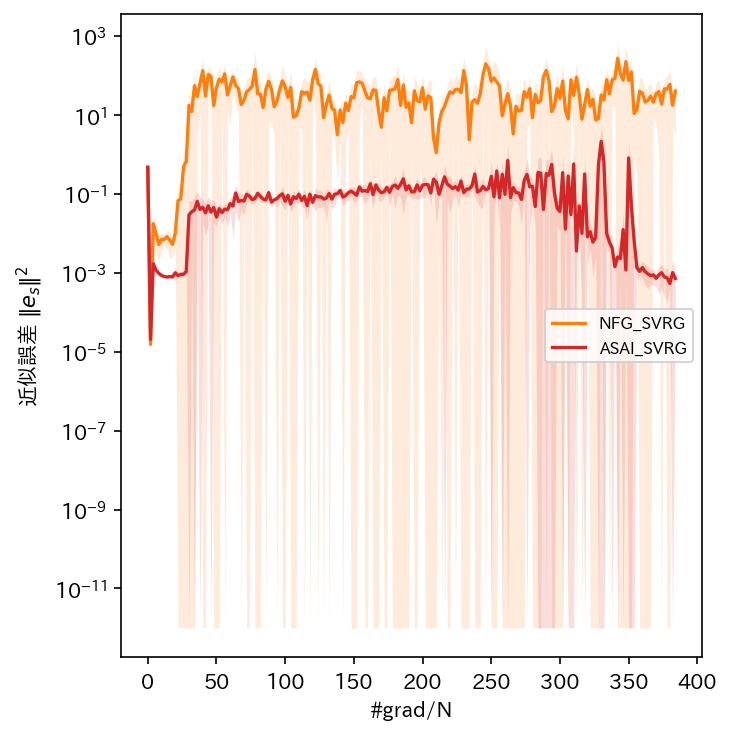

### 数値サマリー

| 手法 | 最終学習誤差(平均±std) | 最良学習誤差 | 最終検証精度(平均±std) | 最良検証精度 | 最終近似誤差(平均±std) | 最良近似誤差 | 発散Seed数 |
| :--- | ---: | ---: | ---: | ---: | ---: | ---: | ---: |
| SGD | 2.8230e-01 ± 1.40e-03 | 2.8230e-01 | 0.7417 ± 0.0034 | 0.7448 | 対象外 | 対象外 | 0/5 |
| SVRG | 2.7888e-01 ± 3.42e-03 | 2.7888e-01 | 0.7437 ± 0.0027 | 0.7438 | 0（定義上） | 0（定義上） | 0/5 |
| NFG_SVRG | 1.6865e+00 ± 2.63e-01 | 1.6033e+00 | 0.4688 ± 0.0845 | 0.4945 | 4.1010e+01 ± 3.81e+01 | 1.5459e-05 | 0/5 |
| ASAI_SVRG | 2.7997e-01 ± 2.88e-03 | 2.7997e-01 | 0.7432 ± 0.0032 | 0.7438 | 7.2360e-04 ± 3.72e-04 | 2.0875e-05 | 0/5 |

## ex0023 / バッチサイズ = 128（学習率0.001固定）

条件ディレクトリ：`outputs/ex0023_cifar10_alexnet_groupnorm_longrun/{手法}/lr0.001_bs128_normgroupnorm_lambda0.0005_epochs48/`

### 条件の仕様

- モデル：AlexNetをCIFAR-10向けに縮小した，5つの畳み込み層と3つの全結合層から成るCNN（`AlexNetCIFAR`，総パラメータ数約717万）．正規化層はGroupNorm固定．
- データセット：CIFAR-10．画素値はチャネルごとに標準化，データ拡張なし．（$ N_{\text{train}}=50000 $, $ N_{\text{test}}=10000 $）
- バッチサイズ：128
- 学習率：0.001
- 正則化係数 $ \lambda $：0.0005
- 内部ループ長 $ K $：391
- エポック数：48
- Seed数：SGD: 5，SVRG: 5，NFG_SVRG: 5，ASAI_SVRG: 5

学習誤差の指標：目的関数の値（訓練誤差，train_loss）／検証指標：分類精度（検証用データ，CIFAR-10）

### グラフ

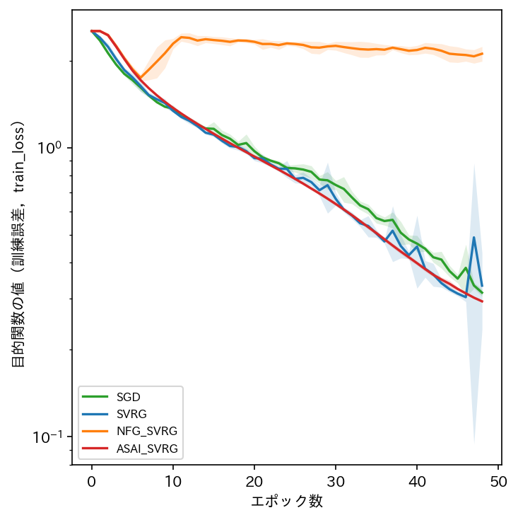

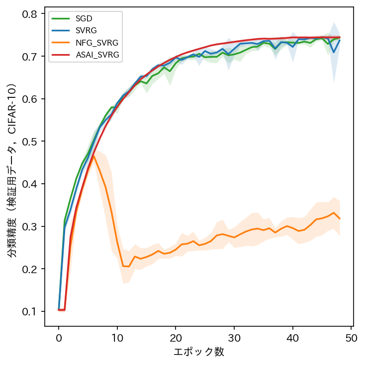

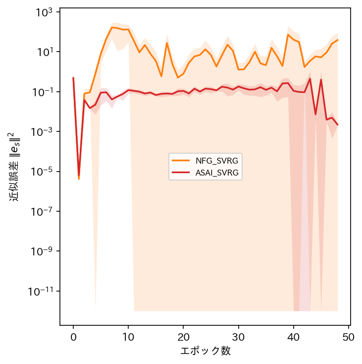

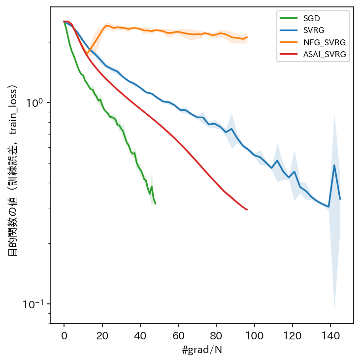

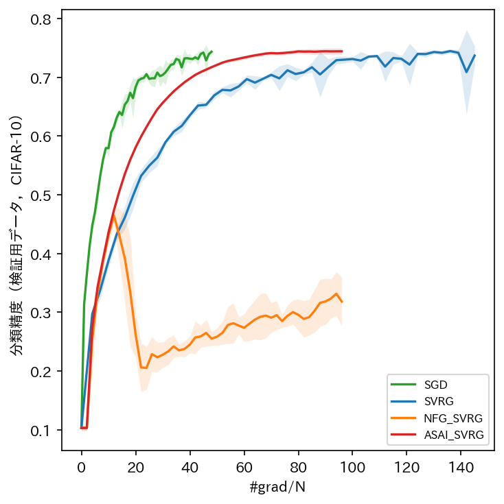

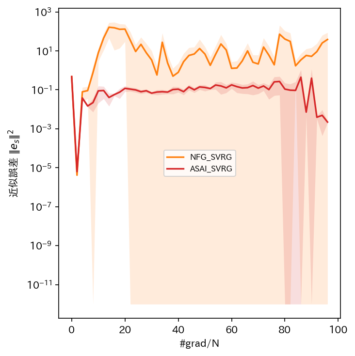

### 数値サマリー

| 手法 | 最終学習誤差(平均±std) | 最良学習誤差 | 最終検証精度(平均±std) | 最良検証精度 | 最終近似誤差(平均±std) | 最良近似誤差 | 発散Seed数 |
| :--- | ---: | ---: | ---: | ---: | ---: | ---: | ---: |
| SGD | 3.1483e-01 ± 9.43e-03 | 3.1483e-01 | 0.7436 ± 0.0052 | 0.7436 | 対象外 | 対象外 | 0/5 |
| SVRG | 3.3283e-01 ± 9.77e-02 | 3.0369e-01 | 0.7370 ± 0.0164 | 0.7446 | 0（定義上） | 0（定義上） | 0/5 |
| NFG_SVRG | 2.1129e+00 ± 1.24e-01 | 1.7454e+00 | 0.3182 ± 0.0413 | 0.4648 | 3.8451e+01 ± 4.84e+01 | 4.1734e-06 | 0/5 |
| ASAI_SVRG | 2.9378e-01 ± 2.82e-03 | 2.9378e-01 | 0.7443 ± 0.0053 | 0.7443 | 2.2221e-03 ± 2.26e-04 | 6.3891e-06 | 0/5 |

## ex0023 / バッチサイズ = 32（学習率0.001固定）

条件ディレクトリ：`outputs/ex0023_cifar10_alexnet_groupnorm_longrun/{手法}/lr0.001_bs32_normgroupnorm_lambda0.0005_epochs12/`

### 条件の仕様

- モデル：AlexNetをCIFAR-10向けに縮小した，5つの畳み込み層と3つの全結合層から成るCNN（`AlexNetCIFAR`，総パラメータ数約717万）．正規化層はGroupNorm固定．
- データセット：CIFAR-10．画素値はチャネルごとに標準化，データ拡張なし．（$ N_{\text{train}}=50000 $, $ N_{\text{test}}=10000 $）
- バッチサイズ：32
- 学習率：0.001
- 正則化係数 $ \lambda $：0.0005
- 内部ループ長 $ K $：1563
- エポック数：12
- Seed数：SGD: 5，SVRG: 5，NFG_SVRG: 5，ASAI_SVRG: 5

学習誤差の指標：目的関数の値（訓練誤差，train_loss）／検証指標：分類精度（検証用データ，CIFAR-10）

### グラフ

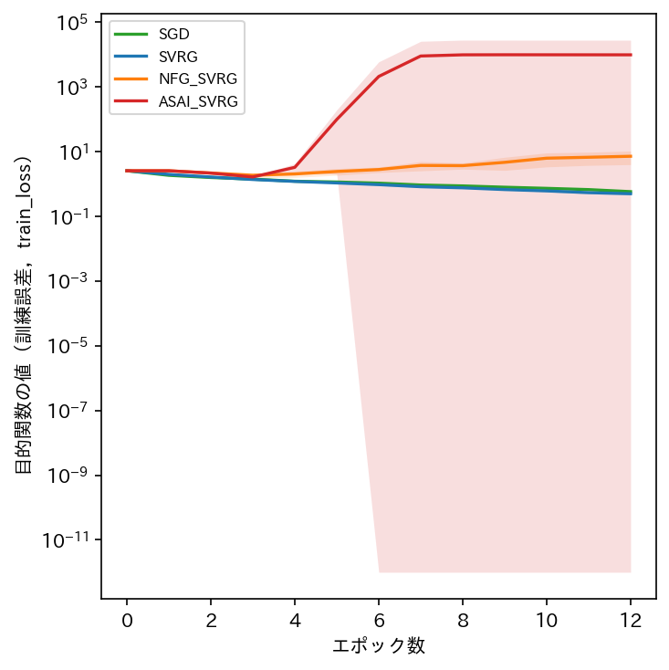

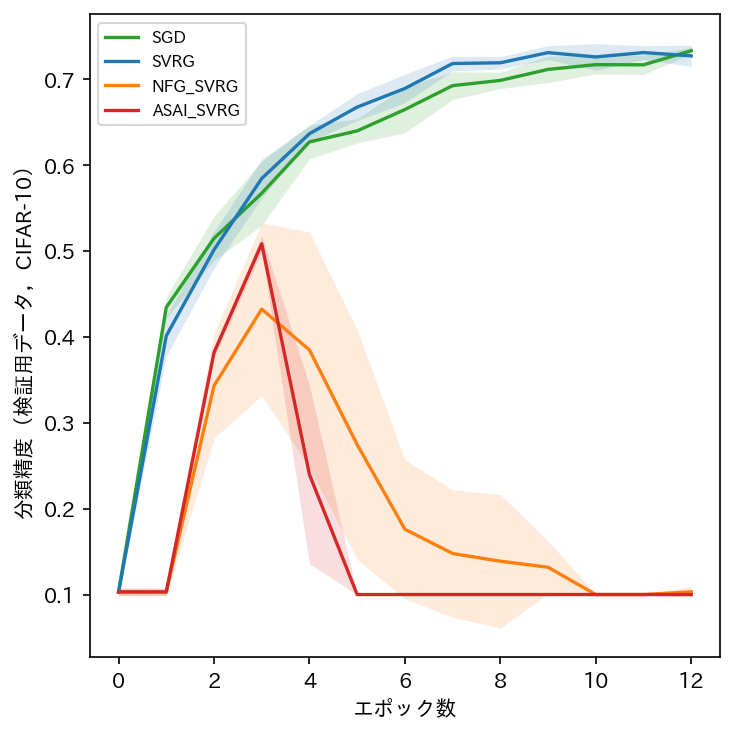

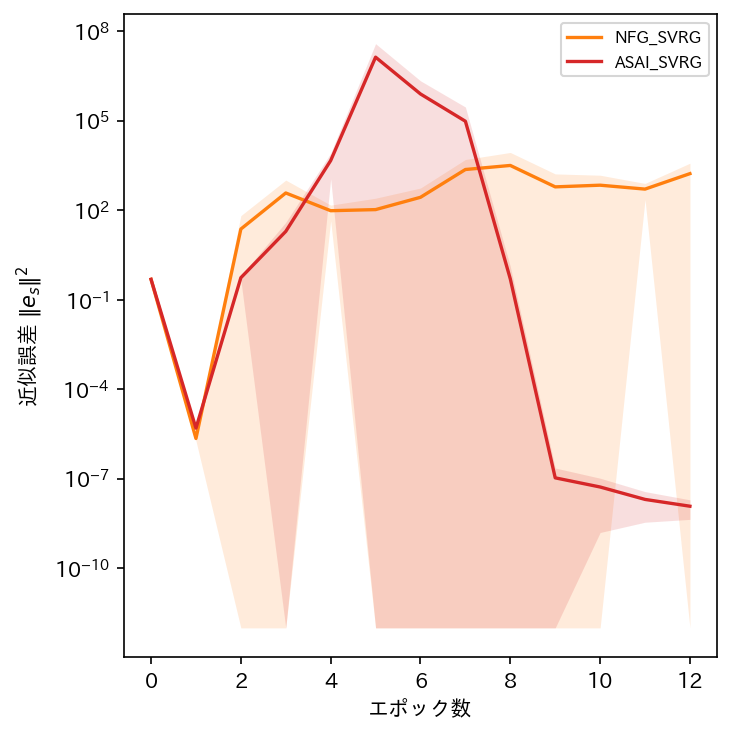

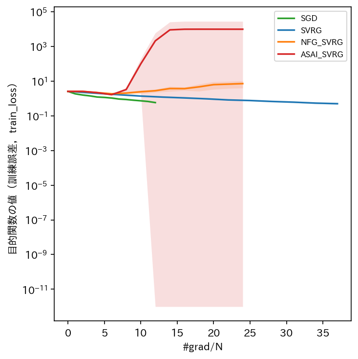

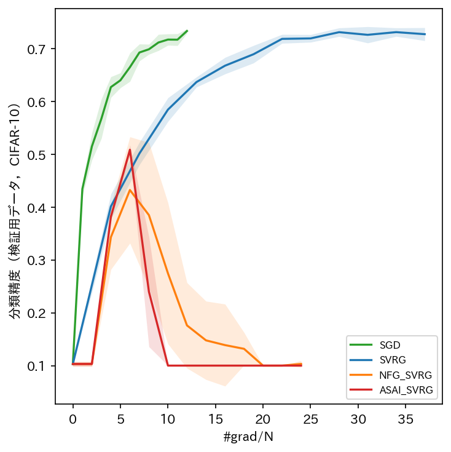

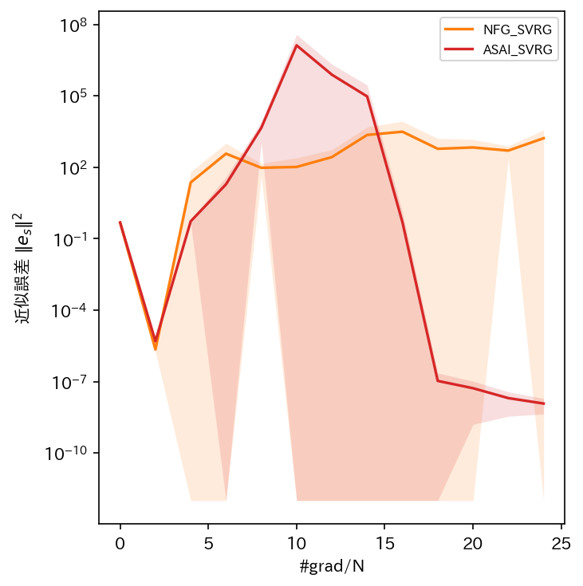

### 数値サマリー

| 手法 | 最終学習誤差(平均±std) | 最良学習誤差 | 最終検証精度(平均±std) | 最良検証精度 | 最終近似誤差(平均±std) | 最良近似誤差 | 発散Seed数 |
| :--- | ---: | ---: | ---: | ---: | ---: | ---: | ---: |
| SGD | 5.7347e-01 ± 1.95e-02 | 5.7347e-01 | 0.7330 ± 0.0039 | 0.7330 | 対象外 | 対象外 | 0/5 |
| SVRG | 4.9449e-01 ± 4.70e-02 | 4.9449e-01 | 0.7270 ± 0.0123 | 0.7309 | 0（定義上） | 0（定義上） | 0/5 |
| NFG_SVRG | 7.1017e+00 ± 3.18e+00 | 1.8405e+00 | 0.1032 ± 0.0064 | 0.4322 | 1.6677e+03 ± 2.06e+03 | 2.2210e-06 | 0/5 |
| ASAI_SVRG | 9.6603e+03 ± 1.77e+04 | 1.6286e+00 | 0.1000 ± 0.0000 | 0.5084 | 1.1934e-08 ± 7.61e-09 | 1.1934e-08 | 0/5 |

# ex003：Tiny Shakespeareを用いた文字レベル次文字予測（Decoder-only Transformer，Stage A）

参照レポート：`.orders/order_027.md`（Stage Aはレポート未作成，実施中のため指示書へのリンクを示す）

Transformer・系列データという新しい設定で，NFG SVRG・ASAI SVRGが発散・崩壊せずに学習が進む（バッチサイズ，学習率の）条件を特定するStage A（安定性探索）．この段階ではSGD・SVRGは対象に含めない．

目的関数：

$$ f(w) = \frac{1}{N}\sum_{n=1}^N \ell_{\mathrm{CCE}}(y_n, \hat{y}_n(w)) + \frac{\lambda}{2}\|w\|^2 $$

次文字予測のカテゴリカルクロスエントロピー損失にL2正則化を加えた目的関数．

## ex003 / バッチサイズ = 512, 学習率 = 0.01

条件ディレクトリ：`outputs/ex003_tinyshakespeare_transformer/{手法}/lr0.01_bs512_lambda0.0005_epochs12/`

### 条件の仕様

- モデル：4層Decoder-only Transformer（`DecoderOnlyTransformer`，$ d_{\text{model}}=128 $，Attention head数4，Feed Forward中間次元512）．Pre-LN構成のLayerNormを使用し，Dropout・BatchNormalizationは一切使用しない．位置エンコーディングは学習可能な埋め込み．
- データセット：Tiny Shakespeare（文字レベル言語モデリング）．コーパスを系列長 $ T=128 $ の非重複チャンクに分割し，前方90%を学習用，後方10%を検証用とする．（$ N_{\text{train}}=7781 $, $ N_{\text{test}}=864 $）
- バッチサイズ：512
- 学習率：0.01
- 正則化係数 $ \lambda $：0.0005
- 内部ループ長 $ K $：16
- エポック数：12
- Seed数：SGD: 3，SVRG: 3，NFG_SVRG: 3，ASAI_SVRG: 3

学習誤差の指標：目的関数の値（訓練誤差，train_loss）／検証指標：次文字予測精度（検証用データ）

### グラフ

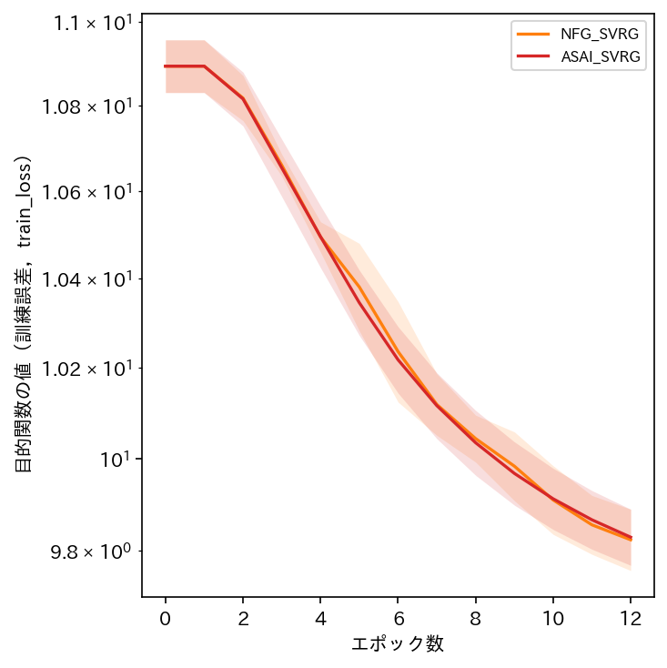

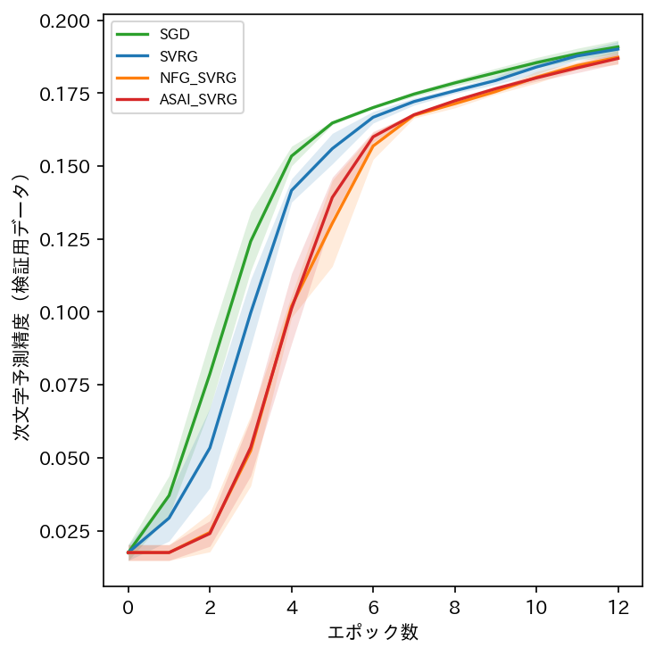

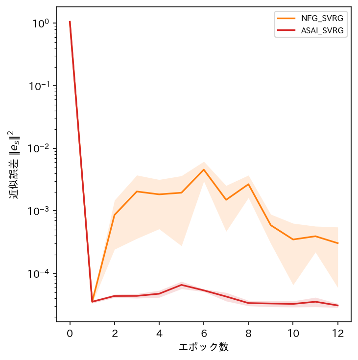

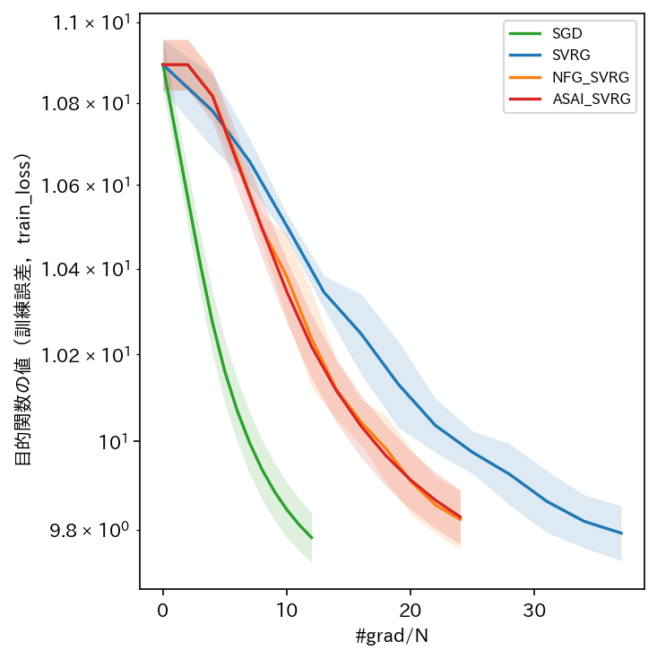

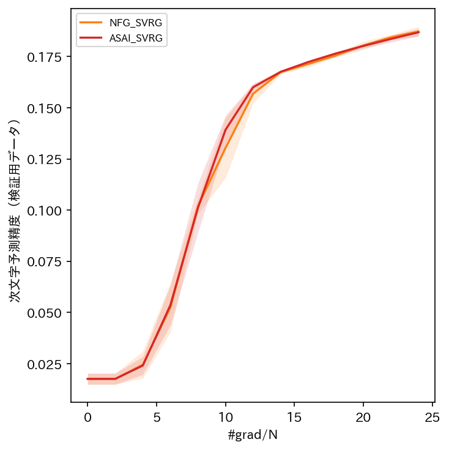

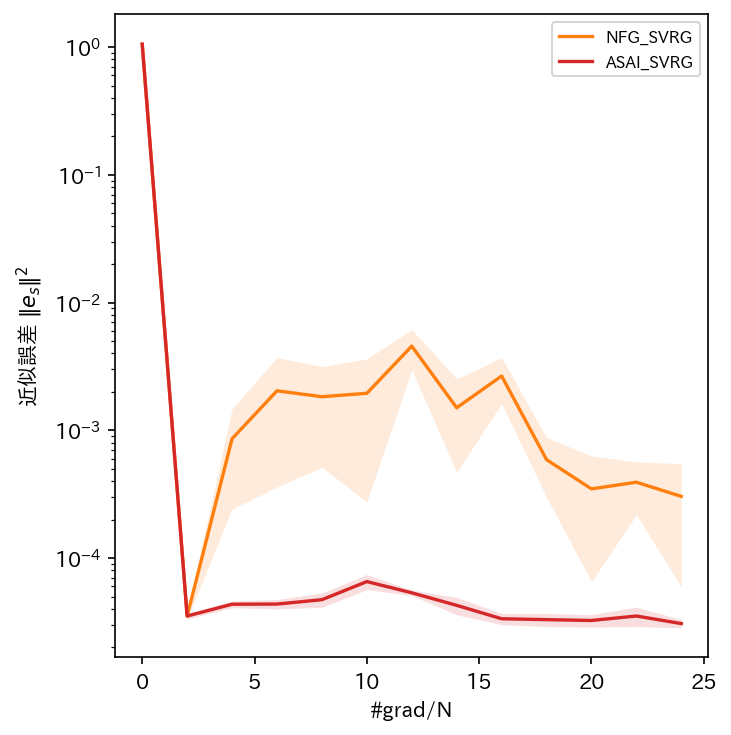

### 数値サマリー

| 手法 | 最終学習誤差(平均±std) | 最良学習誤差 | 最終検証精度(平均±std) | 最良検証精度 | 最終近似誤差(平均±std) | 最良近似誤差 | 発散Seed数 |
| :--- | ---: | ---: | ---: | ---: | ---: | ---: | ---: |
| SGD | 9.7832e+00 ± 5.62e-02 | 9.7832e+00 | 0.1909 ± 0.0023 | 0.1909 | 対象外 | 対象外 | 0/3 |
| SVRG | 9.7933e+00 ± 6.12e-02 | 9.7933e+00 | 0.1901 ± 0.0026 | 0.1901 | 0（定義上） | 0（定義上） | 0/3 |
| NFG_SVRG | 9.8239e+00 ± 6.57e-02 | 9.8239e+00 | 0.1873 ± 0.0024 | 0.1873 | 3.0419e-04 ± 2.45e-04 | 3.5195e-05 | 0/3 |
| ASAI_SVRG | 9.8294e+00 ± 6.02e-02 | 9.8294e+00 | 0.1869 ± 0.0018 | 0.1869 | 3.0717e-05 ± 2.28e-06 | 3.0717e-05 | 0/3 |

## ex003 / バッチサイズ = 128, 学習率 = 0.01

条件ディレクトリ：`outputs/ex003_tinyshakespeare_transformer/{手法}/lr0.01_bs128_lambda0.0005_epochs12/`

### 条件の仕様

- モデル：4層Decoder-only Transformer（`DecoderOnlyTransformer`，$ d_{\text{model}}=128 $，Attention head数4，Feed Forward中間次元512）．Pre-LN構成のLayerNormを使用し，Dropout・BatchNormalizationは一切使用しない．位置エンコーディングは学習可能な埋め込み．
- データセット：Tiny Shakespeare（文字レベル言語モデリング）．コーパスを系列長 $ T=128 $ の非重複チャンクに分割し，前方90%を学習用，後方10%を検証用とする．（$ N_{\text{train}}=7781 $, $ N_{\text{test}}=864 $）
- バッチサイズ：128
- 学習率：0.01
- 正則化係数 $ \lambda $：0.0005
- 内部ループ長 $ K $：61
- エポック数：12
- Seed数：SGD: 3，SVRG: 3，NFG_SVRG: 3，ASAI_SVRG: 3

学習誤差の指標：目的関数の値（訓練誤差，train_loss）／検証指標：次文字予測精度（検証用データ）

### グラフ

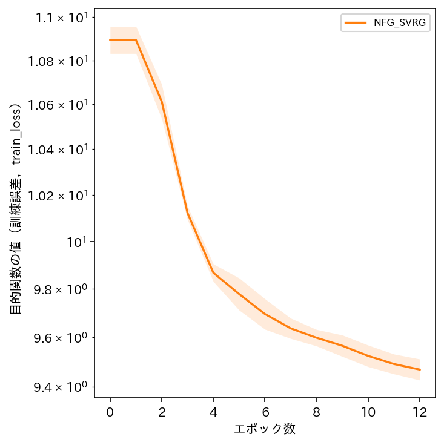

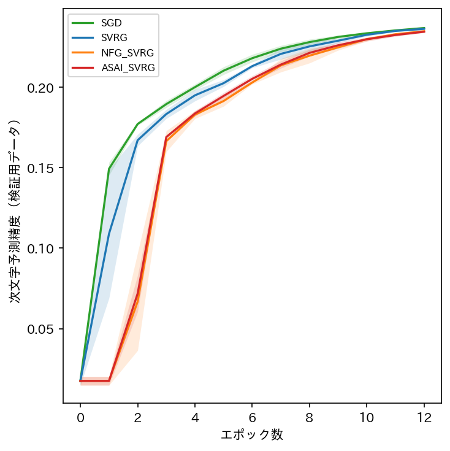

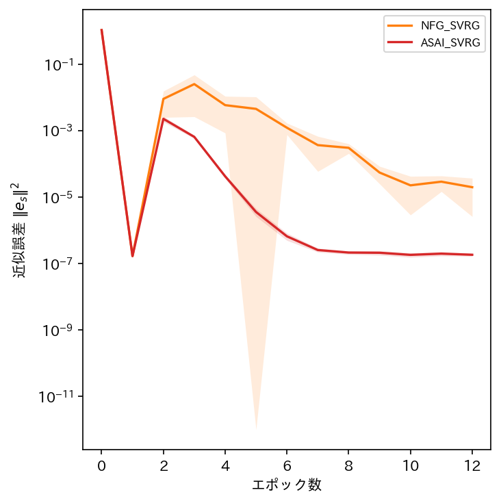

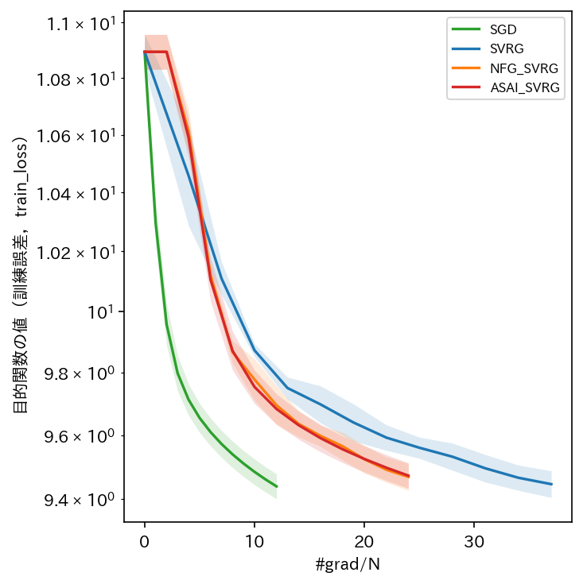

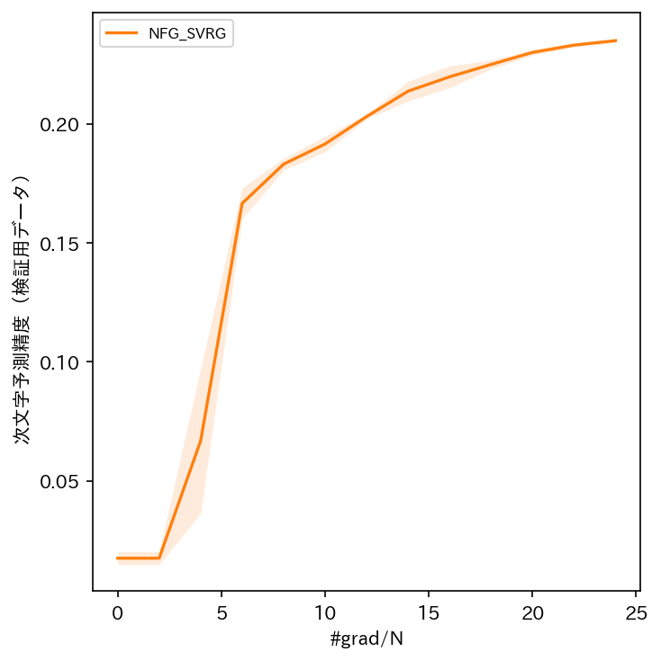

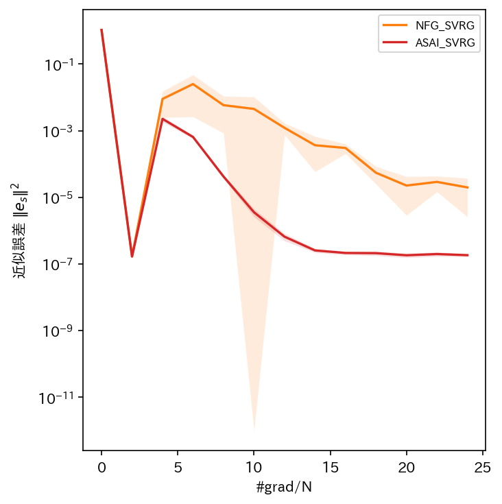

### 数値サマリー

| 手法 | 最終学習誤差(平均±std) | 最良学習誤差 | 最終検証精度(平均±std) | 最良検証精度 | 最終近似誤差(平均±std) | 最良近似誤差 | 発散Seed数 |
| :--- | ---: | ---: | ---: | ---: | ---: | ---: | ---: |
| SGD | 9.4394e+00 ± 3.89e-02 | 9.4394e+00 | 0.2369 ± 0.0008 | 0.2369 | 対象外 | 対象外 | 0/3 |
| SVRG | 9.4462e+00 ± 4.15e-02 | 9.4462e+00 | 0.2364 ± 0.0008 | 0.2364 | 0（定義上） | 0（定義上） | 0/3 |
| NFG_SVRG | 9.4689e+00 ± 4.24e-02 | 9.4689e+00 | 0.2349 ± 0.0007 | 0.2349 | 1.9777e-05 ± 1.72e-05 | 1.6720e-07 | 0/3 |
| ASAI_SVRG | 9.4728e+00 ± 3.99e-02 | 9.4728e+00 | 0.2346 ± 0.0006 | 0.2346 | 1.8337e-07 ± 1.79e-08 | 1.6720e-07 | 0/3 |

## ex003 / バッチサイズ = 32, 学習率 = 0.01

条件ディレクトリ：`outputs/ex003_tinyshakespeare_transformer/{手法}/lr0.01_bs32_lambda0.0005_epochs12/`

### 条件の仕様

- モデル：4層Decoder-only Transformer（`DecoderOnlyTransformer`，$ d_{\text{model}}=128 $，Attention head数4，Feed Forward中間次元512）．Pre-LN構成のLayerNormを使用し，Dropout・BatchNormalizationは一切使用しない．位置エンコーディングは学習可能な埋め込み．
- データセット：Tiny Shakespeare（文字レベル言語モデリング）．コーパスを系列長 $ T=128 $ の非重複チャンクに分割し，前方90%を学習用，後方10%を検証用とする．（$ N_{\text{train}}=7781 $, $ N_{\text{test}}=864 $）
- バッチサイズ：32
- 学習率：0.01
- 正則化係数 $ \lambda $：0.0005
- 内部ループ長 $ K $：244
- エポック数：12
- Seed数：SGD: 3，SVRG: 3，NFG_SVRG: 3，ASAI_SVRG: 3

学習誤差の指標：目的関数の値（訓練誤差，train_loss）／検証指標：次文字予測精度（検証用データ）

### グラフ

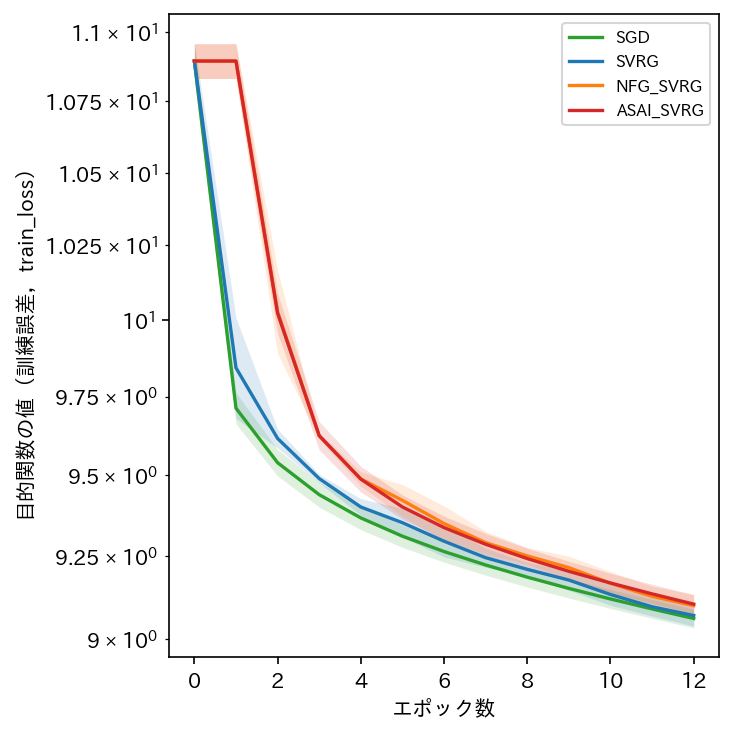

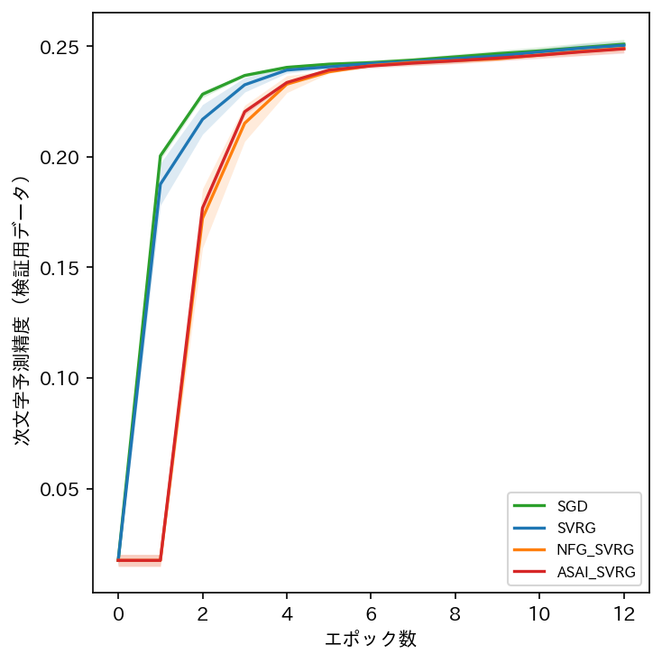

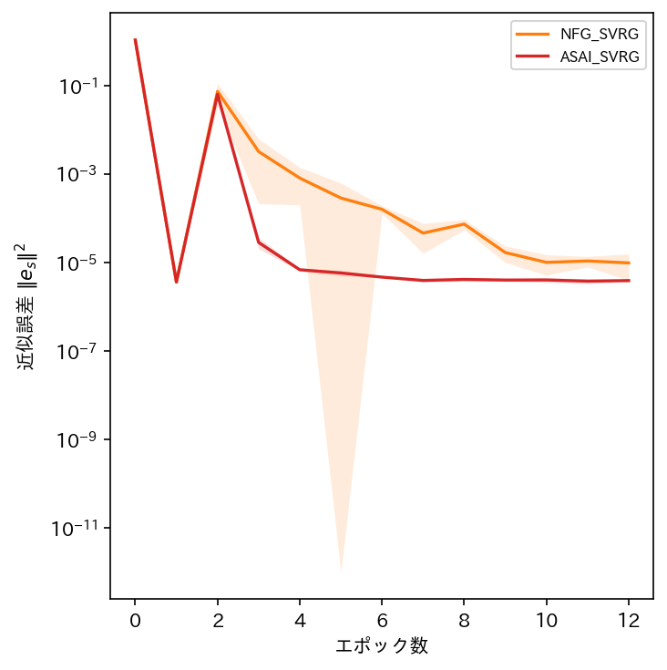

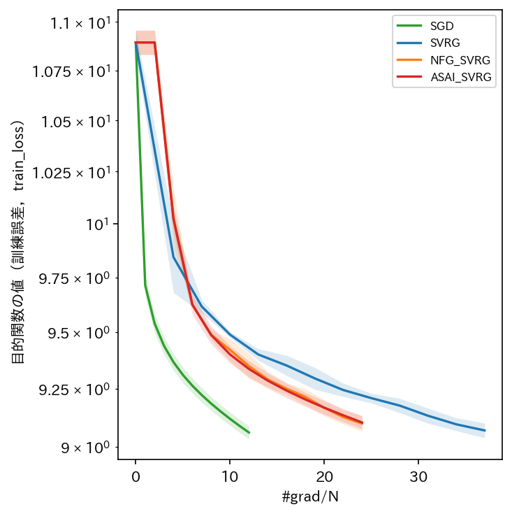

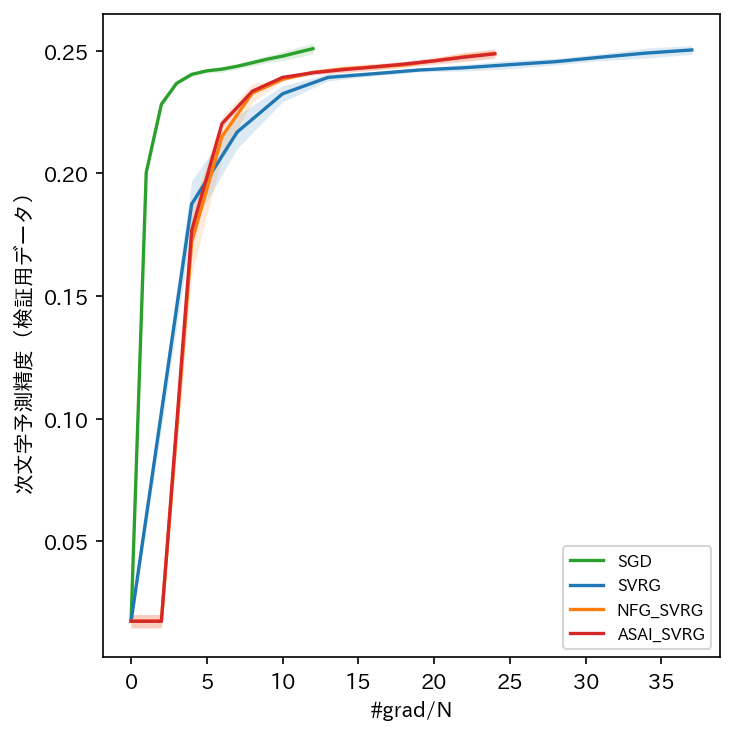

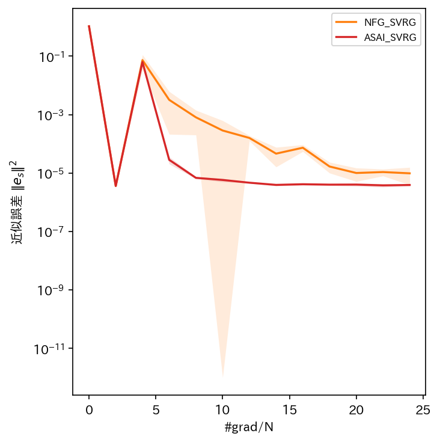

### 数値サマリー

| 手法 | 最終学習誤差(平均±std) | 最良学習誤差 | 最終検証精度(平均±std) | 最良検証精度 | 最終近似誤差(平均±std) | 最良近似誤差 | 発散Seed数 |
| :--- | ---: | ---: | ---: | ---: | ---: | ---: | ---: |
| SGD | 9.0609e+00 ± 2.81e-02 | 9.0609e+00 | 0.2508 ± 0.0022 | 0.2508 | 対象外 | 対象外 | 0/3 |
| SVRG | 9.0698e+00 ± 3.16e-02 | 9.0698e+00 | 0.2503 ± 0.0018 | 0.2503 | 0（定義上） | 0（定義上） | 0/3 |
| NFG_SVRG | 9.0994e+00 ± 3.42e-02 | 9.0994e+00 | 0.2489 ± 0.0016 | 0.2489 | 9.7758e-06 ± 5.84e-06 | 3.6064e-06 | 0/3 |
| ASAI_SVRG | 9.1040e+00 ± 2.84e-02 | 9.1040e+00 | 0.2488 ± 0.0020 | 0.2488 | 3.8970e-06 ± 2.25e-07 | 3.6064e-06 | 0/3 |

## ex003 / バッチサイズ = 512, 学習率 = 0.001

条件ディレクトリ：`outputs/ex003_tinyshakespeare_transformer/{手法}/lr0.001_bs512_lambda0.0005_epochs12/`

### 条件の仕様

- モデル：4層Decoder-only Transformer（`DecoderOnlyTransformer`，$ d_{\text{model}}=128 $，Attention head数4，Feed Forward中間次元512）．Pre-LN構成のLayerNormを使用し，Dropout・BatchNormalizationは一切使用しない．位置エンコーディングは学習可能な埋め込み．
- データセット：Tiny Shakespeare（文字レベル言語モデリング）．コーパスを系列長 $ T=128 $ の非重複チャンクに分割し，前方90%を学習用，後方10%を検証用とする．（$ N_{\text{train}}=7781 $, $ N_{\text{test}}=864 $）
- バッチサイズ：512
- 学習率：0.001
- 正則化係数 $ \lambda $：0.0005
- 内部ループ長 $ K $：16
- エポック数：12
- Seed数：SGD: 3，SVRG: 3，NFG_SVRG: 3，ASAI_SVRG: 3

学習誤差の指標：目的関数の値（訓練誤差，train_loss）／検証指標：次文字予測精度（検証用データ）

### グラフ

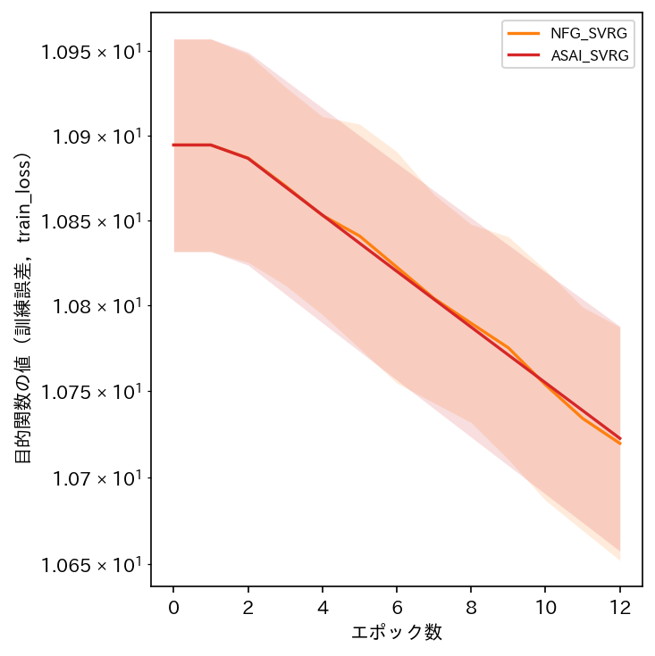

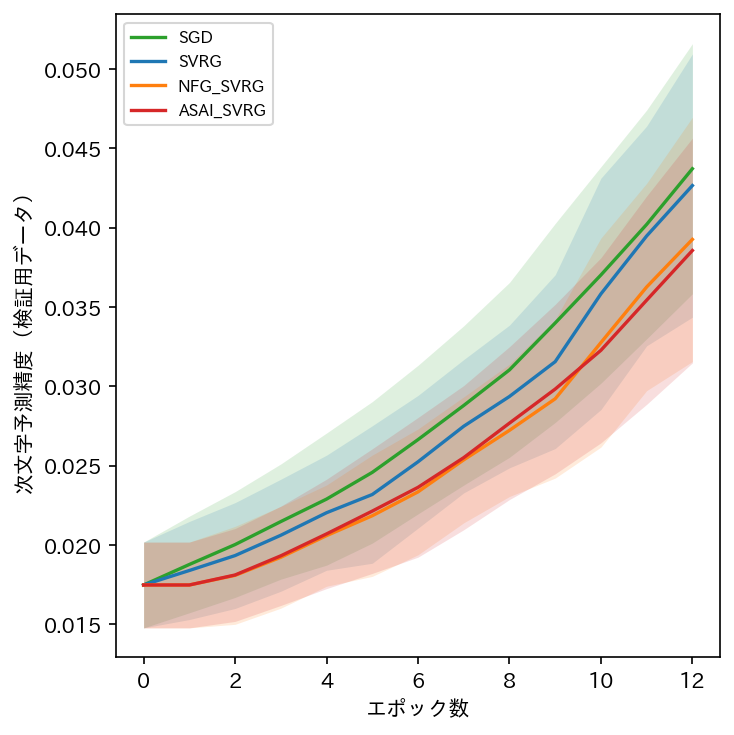

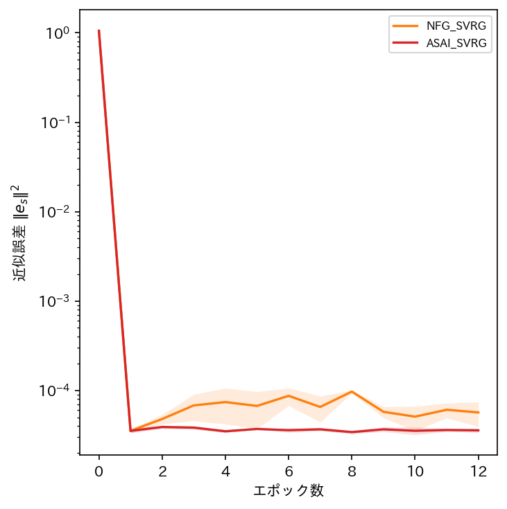

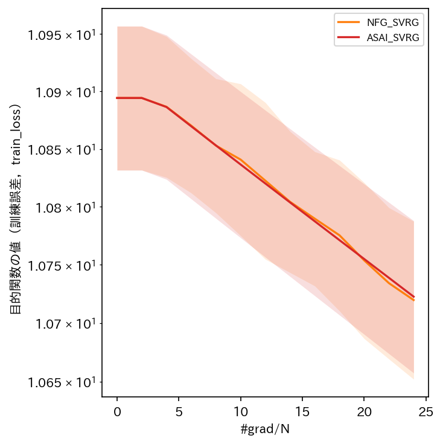

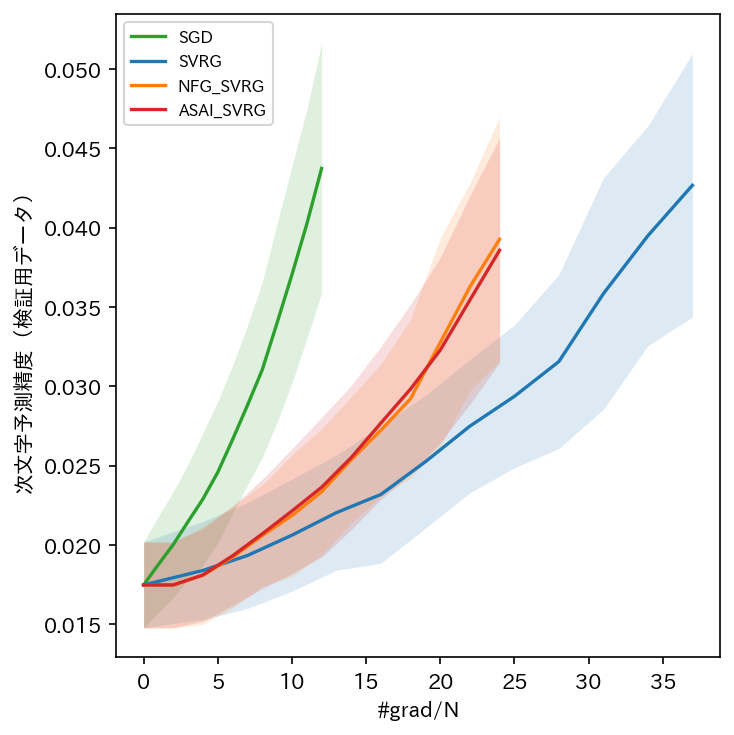

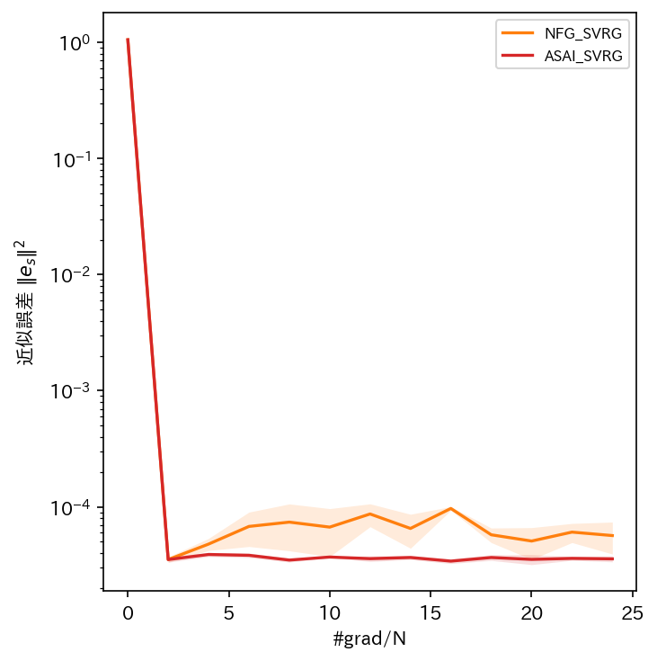

### 数値サマリー

| 手法 | 最終学習誤差(平均±std) | 最良学習誤差 | 最終検証精度(平均±std) | 最良検証精度 | 最終近似誤差(平均±std) | 最良近似誤差 | 発散Seed数 |
| :--- | ---: | ---: | ---: | ---: | ---: | ---: | ---: |
| SGD | 1.0698e+01 ± 6.58e-02 | 1.0698e+01 | 0.0437 ± 0.0079 | 0.0437 | 対象外 | 対象外 | 0/3 |
| SVRG | 1.0704e+01 ± 6.80e-02 | 1.0704e+01 | 0.0427 ± 0.0083 | 0.0427 | 0（定義上） | 0（定義上） | 0/3 |
| NFG_SVRG | 1.0720e+01 ± 6.76e-02 | 1.0720e+01 | 0.0393 ± 0.0077 | 0.0393 | 5.6620e-05 ± 1.74e-05 | 3.5195e-05 | 0/3 |
| ASAI_SVRG | 1.0723e+01 ± 6.52e-02 | 1.0723e+01 | 0.0386 ± 0.0071 | 0.0386 | 3.5680e-05 ± 2.07e-06 | 3.4099e-05 | 0/3 |

## ex003 / バッチサイズ = 128, 学習率 = 0.001

条件ディレクトリ：`outputs/ex003_tinyshakespeare_transformer/{手法}/lr0.001_bs128_lambda0.0005_epochs12/`

### 条件の仕様

- モデル：4層Decoder-only Transformer（`DecoderOnlyTransformer`，$ d_{\text{model}}=128 $，Attention head数4，Feed Forward中間次元512）．Pre-LN構成のLayerNormを使用し，Dropout・BatchNormalizationは一切使用しない．位置エンコーディングは学習可能な埋め込み．
- データセット：Tiny Shakespeare（文字レベル言語モデリング）．コーパスを系列長 $ T=128 $ の非重複チャンクに分割し，前方90%を学習用，後方10%を検証用とする．（$ N_{\text{train}}=7781 $, $ N_{\text{test}}=864 $）
- バッチサイズ：128
- 学習率：0.001
- 正則化係数 $ \lambda $：0.0005
- 内部ループ長 $ K $：61
- エポック数：12
- Seed数：SGD: 3，SVRG: 3，NFG_SVRG: 3，ASAI_SVRG: 3

学習誤差の指標：目的関数の値（訓練誤差，train_loss）／検証指標：次文字予測精度（検証用データ）

### グラフ

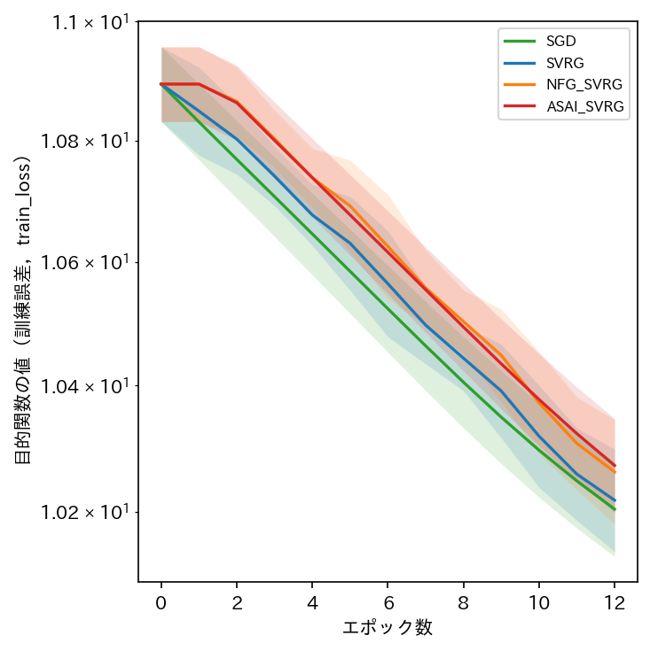

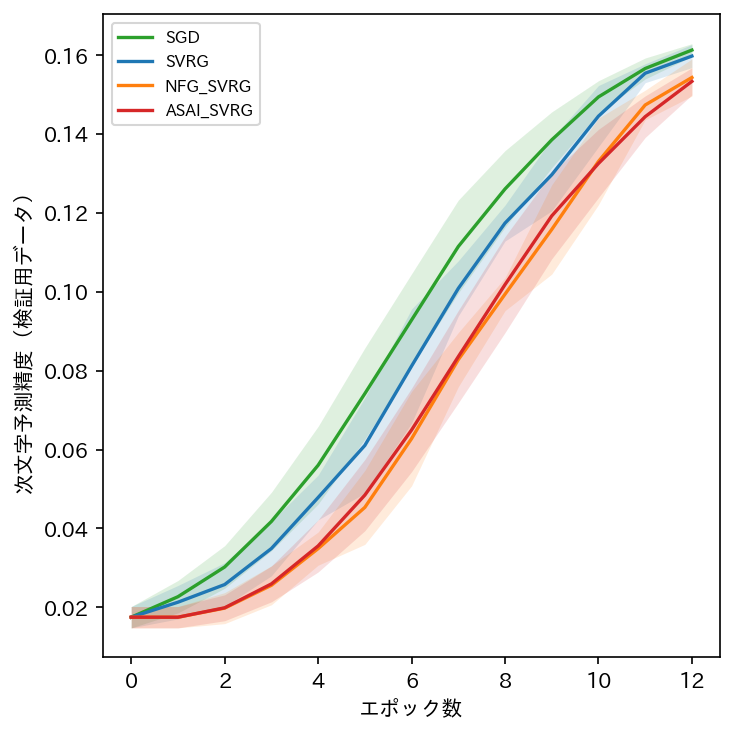

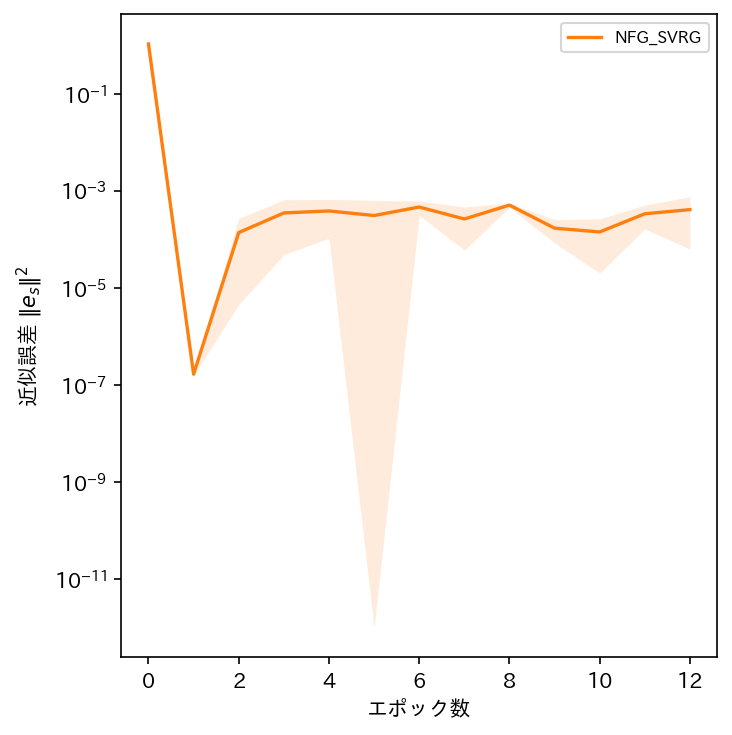

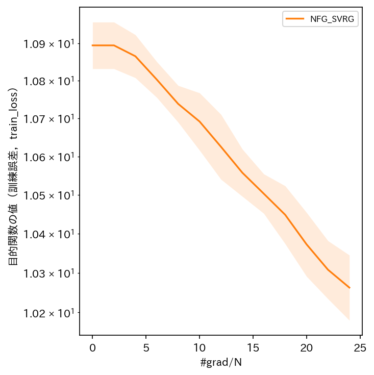

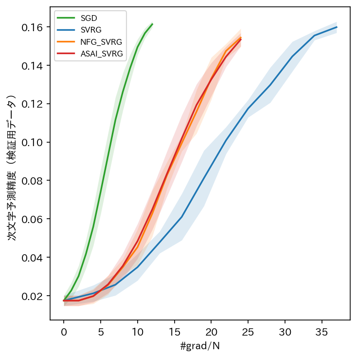

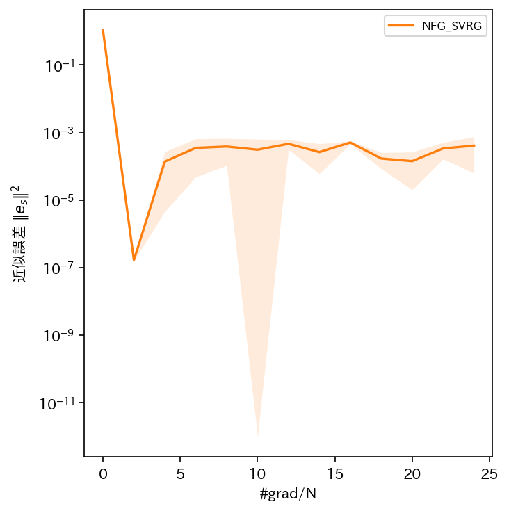

### 数値サマリー

| 手法 | 最終学習誤差(平均±std) | 最良学習誤差 | 最終検証精度(平均±std) | 最良検証精度 | 最終近似誤差(平均±std) | 最良近似誤差 | 発散Seed数 |
| :--- | ---: | ---: | ---: | ---: | ---: | ---: | ---: |
| SGD | 1.0204e+01 ± 7.41e-02 | 1.0204e+01 | 0.1613 ± 0.0016 | 0.1613 | 対象外 | 対象外 | 0/3 |
| SVRG | 1.0218e+01 ± 8.06e-02 | 1.0218e+01 | 0.1597 ± 0.0029 | 0.1597 | 0（定義上） | 0（定義上） | 0/3 |
| NFG_SVRG | 1.0263e+01 ± 8.25e-02 | 1.0263e+01 | 0.1543 ± 0.0047 | 0.1543 | 4.0923e-04 ± 3.47e-04 | 1.6720e-07 | 0/3 |
| ASAI_SVRG | 1.0273e+01 ± 7.44e-02 | 1.0273e+01 | 0.1533 ± 0.0034 | 0.1533 | 8.1281e-07 ± 9.57e-08 | 1.6720e-07 | 0/3 |

## ex003 / バッチサイズ = 32, 学習率 = 0.001

条件ディレクトリ：`outputs/ex003_tinyshakespeare_transformer/{手法}/lr0.001_bs32_lambda0.0005_epochs12/`

### 条件の仕様

- モデル：4層Decoder-only Transformer（`DecoderOnlyTransformer`，$ d_{\text{model}}=128 $，Attention head数4，Feed Forward中間次元512）．Pre-LN構成のLayerNormを使用し，Dropout・BatchNormalizationは一切使用しない．位置エンコーディングは学習可能な埋め込み．
- データセット：Tiny Shakespeare（文字レベル言語モデリング）．コーパスを系列長 $ T=128 $ の非重複チャンクに分割し，前方90%を学習用，後方10%を検証用とする．（$ N_{\text{train}}=7781 $, $ N_{\text{test}}=864 $）
- バッチサイズ：32
- 学習率：0.001
- 正則化係数 $ \lambda $：0.0005
- 内部ループ長 $ K $：244
- エポック数：12
- Seed数：SGD: 3，SVRG: 3，NFG_SVRG: 3，ASAI_SVRG: 3

学習誤差の指標：目的関数の値（訓練誤差，train_loss）／検証指標：次文字予測精度（検証用データ）

### グラフ

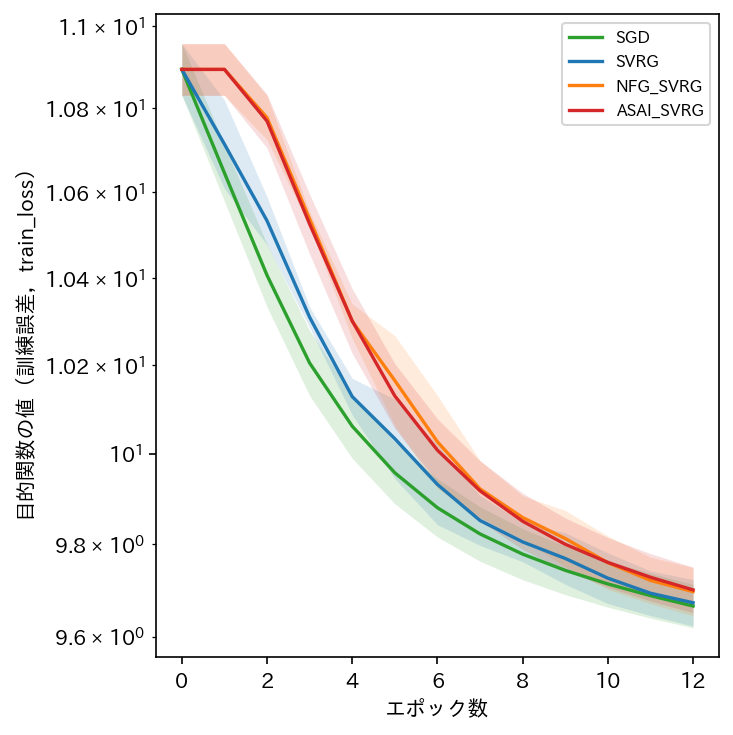

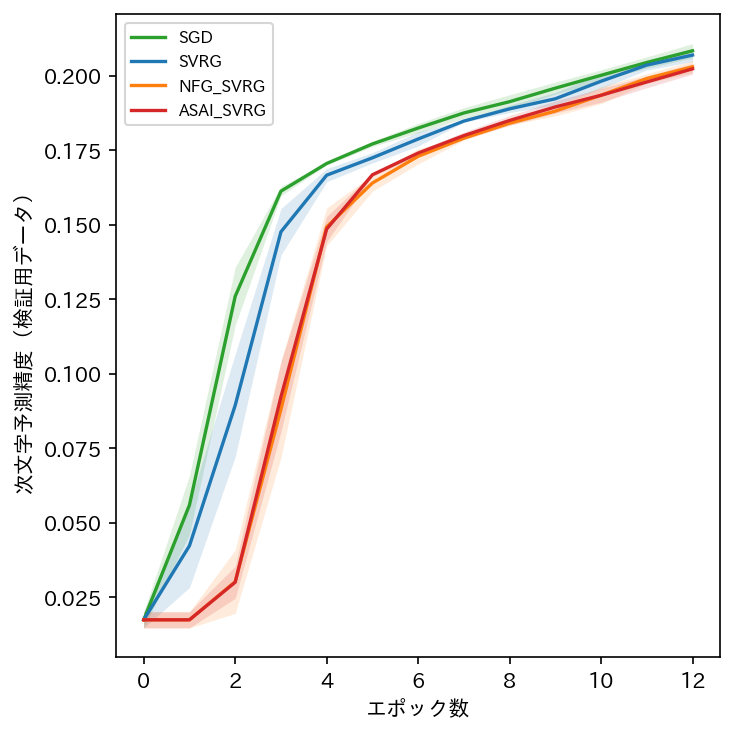

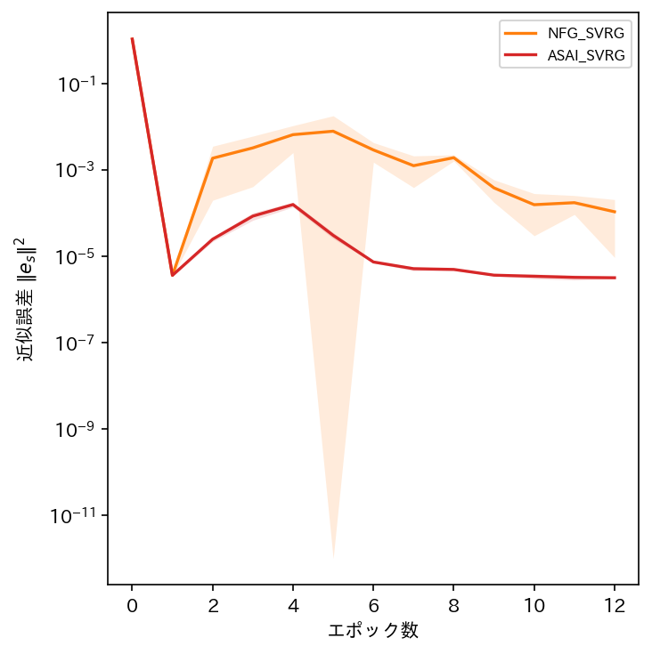

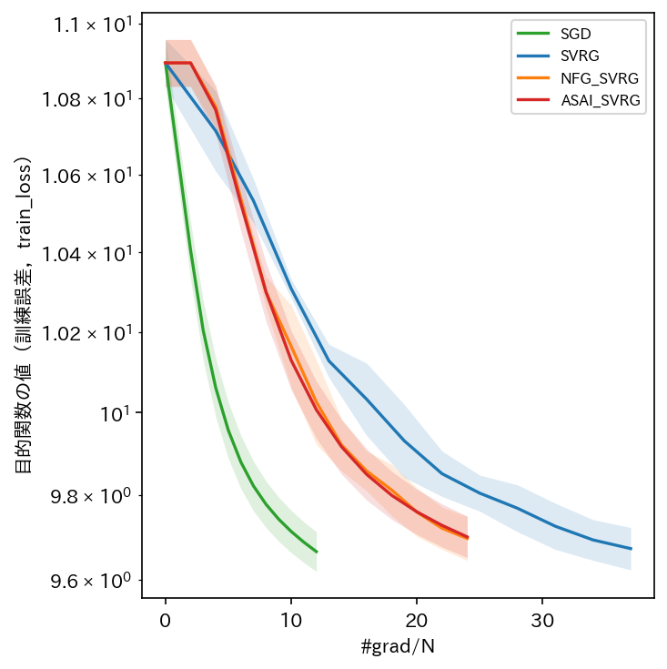

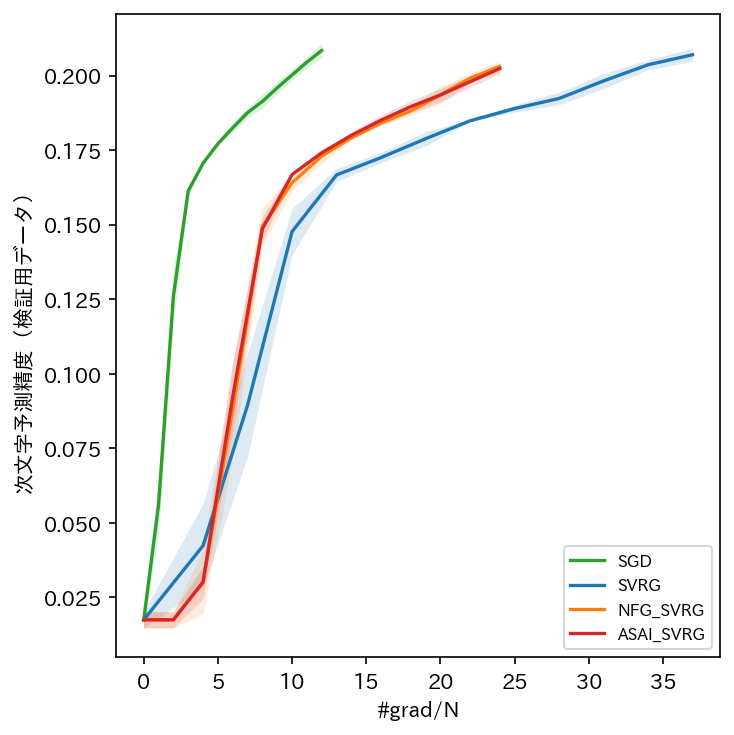

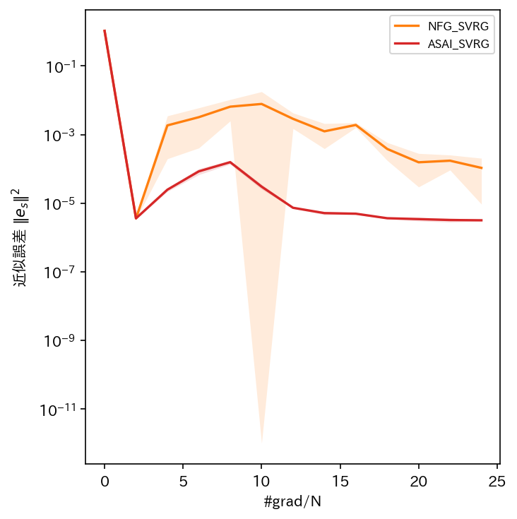

### 数値サマリー

| 手法 | 最終学習誤差(平均±std) | 最良学習誤差 | 最終検証精度(平均±std) | 最良検証精度 | 最終近似誤差(平均±std) | 最良近似誤差 | 発散Seed数 |
| :--- | ---: | ---: | ---: | ---: | ---: | ---: | ---: |
| SGD | 9.6656e+00 ± 4.69e-02 | 9.6656e+00 | 0.2084 ± 0.0024 | 0.2084 | 対象外 | 対象外 | 0/3 |
| SVRG | 9.6727e+00 ± 5.02e-02 | 9.6727e+00 | 0.2070 ± 0.0022 | 0.2070 | 0（定義上） | 0（定義上） | 0/3 |
| NFG_SVRG | 9.6968e+00 ± 5.23e-02 | 9.6968e+00 | 0.2030 ± 0.0020 | 0.2030 | 1.0676e-04 ± 9.74e-05 | 3.6064e-06 | 0/3 |
| ASAI_SVRG | 9.7005e+00 ± 4.93e-02 | 9.7005e+00 | 0.2023 ± 0.0018 | 0.2023 | 3.1713e-06 ± 1.91e-07 | 3.1713e-06 | 0/3 |

